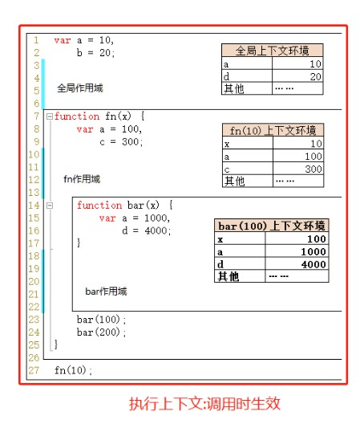

[TOC]


## 写在前面

这里是小飞侠Pan🥳，立志成为一名优秀的前端程序媛！！！

本篇文章收录于我的专栏：[前端精进之路](https://blog.csdn.net/weixin_52834435/category_11886356.html?spm=1001.2014.3001.5482)

同时收录于我的[github](https://github.com/mengqiuleo)前端笔记仓库中，持续更新中，欢迎star~

👉[https://github.com/mengqiuleo/myNote](https://github.com/mengqiuleo/myNote)

<hr/>

## 什么是执行上下文、执行栈？

> 执行上下文（简称 EC）是评估和执行 JavaScript 代码的环境的抽象概念。每当 Javascript 代码在运行的时候，它都是在执行上下文中运行。
>
> **执行上下文** 为我们的可执行代码块提供了执行前的必要准备工作，例如变量对象的定义、作用域链的扩展、提供调用者的对象引用等信息。

JavaScript 中有三种执行上下文类型。

- **全局执行上下文** — 这是默认或者说基础的上下文，任何不在函数内部的代码都在全局上下文中。它会执行两件事：创建一个全局的 window 对象（浏览器的情况下），并且设置 `this` 的值等于这个全局对象。一个程序中只会有一个全局执行上下文。
- **函数执行上下文** — 每当一个函数被调用时, 都会为该函数创建一个新的上下文。每个函数都有它自己的执行上下文，不过是在函数被调用时创建的。函数上下文可以有任意多个。每当一个新的执行上下文被创建，它会按定义的顺序（将在后文讨论）执行一系列步骤。
- **Eval 函数执行上下文** — 执行在 `eval` 函数内部的代码也会有它属于自己的执行上下文，但由于 JavaScript 开发者并不经常使用 `eval`，所以在这里我不会讨论它。


**执行上下文栈**，也就是在其它编程语言中所说的“调用栈”，是一种拥有 LIFO（后进先出）数据结构的栈，被**用来存储代码运行时创建的所有执行上下文**。

当 JavaScript 引擎第一次遇到你的脚本时，它会创建一个全局的执行上下文并且压入当前执行栈。每当引擎遇到一个函数调用，它会为该函数创建一个新的执行上下文并压入栈的顶部。

引擎会执行那些执行上下文位于栈顶的函数。当该函数执行结束时，执行上下文从栈中弹出，控制流程到达当前栈中的下一个上下文。


**注意：**

- 执行上下文是被调用时生效
- 作用域是在编写时就已经被确定好的


**一个demo**

```js
let a = 'Hello World!';

function first() {
  console.log('Inside first function');
  second();
  console.log('Again inside first function');
}

function second() {
  console.log('Inside second function');
}

first();
console.log('Inside Global Execution Context');
```


解释如下：

- 当上述代码在浏览器加载时，JavaScript 引擎创建了一个全局执行上下文并把它压入当前执行栈。当遇到 `first()` 函数调用时，JavaScript 引擎为该函数创建一个新的执行上下文并把它压入当前执行栈的顶部。

- 当从 `first()` 函数内部调用 `second()` 函数时，JavaScript 引擎为 `second()` 函数创建了一个新的执行上下文并把它压入当前执行栈的顶部。当 `second()` 函数执行完毕，它的执行上下文会从当前栈弹出，并且控制流程到达下一个执行上下文，即 `first()` 函数的执行上下文。

- 当 `first()` 执行完毕，它的执行上下文从栈弹出，控制流程到达全局执行上下文。一旦所有代码执行完毕，JavaScript 引擎从当前栈中移除全局执行上下文


## 创建一个执行上下文

执行上下文由JS引擎创建。

创建执行上下文有两个阶段：**1) 创建阶段** 和 **2) 执行阶段**。


### 创建阶段

在创建阶段会发生三件事：

1. **this** 值的决定，即**This 绑定**。
2. 创建**词法环境**组件。
3. 创建**变量环境**组件。

```js
// 用代码表示
ExecutionContext = {
  ThisBinding = <this value>,
  LexicalEnvironment = { ... },
  VariableEnvironment = { ... },
}
```


#### this绑定

在全局执行上下文中，`this` 的值指向全局对象。(在浏览器中，`this`引用 Window 对象)。

在函数执行上下文中，`this` 的值取决于该函数是如何被调用的。如果它被一个引用对象调用，那么 `this` 会被设置成那个对象，否则 `this` 的值被设置为全局对象或者 `undefined`（在严格模式下）。

```js
let foo = {
  baz: function() {
  console.log(this);
  }
}

foo.baz();   // 'this' 引用 'foo', 因为 'baz' 被对象 'foo' 调用

let bar = foo.baz;

bar();       // 'this' 指向全局 window 对象，因为没有指定引用对象
```


#### 词法环境

**词法环境**是一种持有**标识符—变量映射**的结构。（这里的**标识符**指的是变量/函数的名字，而**变量**是对实际对象[包含函数类型对象]或原始数据的引用）

例如下图中，对于函数fn(10)所在的上下文环境，有一个标识符为x，它的变量映射是10（因为它是基本数据类型，所以变量映射就是它的值，而对于引用数据类型，变量映射就是它的地址值）



在词法环境的**内部**有两个组件：(1) **环境记录器**和 (2) 一个**外部环境的引用**。

1. **环境记录器**是存储变量和函数声明的实际位置，例如上图中就是环境记录器。
2. **外部环境的引用**意味着它可以访问其父级词法环境（作用域）。


环境记录器分为对象环境记录器(用于全局执行上下文)和声明式环境记录器(用于函数执行上下文)

对于全局执行上下文中，是没有外部环境引用的词法环境。全局环境的外部环境引用是 **null**。在环境记录器内中，有原型函数（关联全局对象，比如 window 对象），并且 `this`的值指向全局对象。

对于函数执行上下文，函数内部用户定义的变量存储在**环境记录器**中。并且外部环境的引用可能是全局环境，或者任何包含此内部函数的外部函数。**注意，对于函数执行上下文，环境记录器还包含了一个传递给函数的 `arguments` 对象（此对象存储索引和参数的映射）和传递给函数的参数的 length **

```js
// 词法环境的伪代码

//全局执行上下文
GlobalExectionContext = {
  LexicalEnvironment: { //词法环境
    EnvironmentRecord: { //环境记录器
      Type: "Object",
      // 在这里绑定标识符
    }
    outer: <null> //外部环境的引用
  },
  VariableEnvironment = { ... }, //变量环境
}

//函数执行上下文
FunctionExectionContext = {
  LexicalEnvironment: {
    EnvironmentRecord: {
      Type: "Declarative",
      // 在这里绑定标识符
    }
    outer: <Global or outer function environment reference>
  }
}
```


#### 变量环境

同样是一个词法环境，其环境记录器持有**变量声明语句**在执行上下文中创建的绑定关系，因为也是一个词法环境，所以它有着上面定义的词法环境的所有属性。

> 在 ES6 中，**词法环境**组件和**变量环境**的一个不同就是词法环境被用来存储函数声明和变量（`let` 和 `const`）绑定，而变量环境只用来存储 `var` 变量绑定。

**一个demo**

```js
let a = 20;
const b = 30;
var c;

function multiply(e, f) {
 var g = 20;
 return e * f * g;
}

c = multiply(20, 30);
```

执行上下文如下：

```js
// 全局执行上下文
GlobalExectionContext = {

  ThisBinding: <Global Object>,//this绑定

  LexicalEnvironment: { //词法环境
    EnvironmentRecord: { //环境记录器
      Type: "Object",
      // 在这里绑定标识符
      a: < uninitialized >, // a,b是用let,const声明的，所以是在词法环境
      b: < uninitialized >,
      multiply: < func >
    }
    outer: <null> //外部环境的引用
  },

  VariableEnvironment: { //变量环境
    EnvironmentRecord: { //环境记录器
      Type: "Object",

      c: undefined, //c是用var声明的，所以在变量环境。并且，在创建阶段，JS引擎会检查代码找出变量和函数声明，虽然函数声明完全存储在环境中，但是变量最初设置为 undefined（var 情况下），或者未初始化（let 和 const 情况下）。
    
    }
    outer: <null> //外部环境的引用
  }
}

// 函数执行上下文
FunctionExectionContext = {
  ThisBinding: <Global Object>,//this绑定

  LexicalEnvironment: { //词法环境
    EnvironmentRecord: { //环境记录器
      Type: "Declarative",
      // 在这里绑定标识符
      Arguments: {0: 20, 1: 30, length: 2},
    },
    outer: <GlobalLexicalEnvironment> //因为是函数环境，环境记录器还包含了一个传递给函数的arguments对象
  },

  VariableEnvironment: { // 变量环境
    EnvironmentRecord: {
      Type: "Declarative",
      // 在这里绑定标识符
      g: undefined
    },
    outer: <GlobalLexicalEnvironment>
  }
}
```

**注意** 

- 只有遇到**调用**函数 `multiply` 时，函数执行上下文才会被创建（**即执行上下文是在JS引擎执行阶段创建的**）。

- `var` 定义的变量被设成了 `undefined`。这是因为在创建阶段时，引擎检查代码找出变量和函数声明，虽然函数声明完全存储在环境中，但是变量最初设置为 `undefined`（`var` 情况下），或者未初始化（`let` 和 `const` 情况下）。

这就是为什么你可以在声明之前访问 `var` 定义的变量（虽然是 `undefined`），但是在声明之前访问 `let` 和 `const` 的变量会得到一个引用错误。

这就是我们说的变量声明提升。


### 执行阶段

在此阶段，完成对所有这些变量的分配，最后执行代码。


## 完整的demo

这里会将举出一个完整的demo，继续将上面的demo写完，包括创建阶段和执行阶段

```js
let a = 20;
const b = 30;
var c;
function multiply(e, f) {
  var g = 20;
  return e * f * g;
}
c = multiply(20, 30);
```


当**执行上述代码**时(注意是在JS引擎的执行阶段)，JavaScript 引擎会创建一个全局执行上下文来执行全局代码。另外当遇到对函数 multiply(20, 30) 的调用时，会创建一个新的函数执行上下文来执行函数代码。因此，在创建阶段，全局执行上下文和函数执行上下文将如下所示：

```js
GlobalExectionContext = {
  LexicalEnvironment: {
    EnvironmentRecord: {
      Type: "Object",
      // Identifier bindings go here
      a: < uninitialized >,
      b: < uninitialized >,
      multiply: < func >
    }
    outer: <null>,
    ThisBinding: <Global Object>
  },
  VariableEnvironment: {
    EnvironmentRecord: {
      Type: "Object",
      // Identifier bindings go here
      c: undefined,
    }
    outer: <null>,
    ThisBinding: <Global Object>
  }
}

FunctionExectionContext = {
    LexicalEnvironment: {
        EnvironmentRecord: {
          Type: "Declarative",
          // Identifier bindings go here
          Arguments: {0: 20, 1: 30, length: 2},
        },
        outer: <GlobalLexicalEnvironment>,
        ThisBinding: <Global Object or undefined>,
      },
    VariableEnvironment: {
        EnvironmentRecord: {
          Type: "Declarative",
          // Identifier bindings go here
          g: undefined
        },
        outer: <GlobalLexicalEnvironment>,
        ThisBinding: <Global Object or undefined>
    }
}
```


在执行阶段，变量赋值完成。所以全局执行上下文在执行阶段看起来像这样。

另外，因为执行上下文进入执行阶段，这意味着对函数内部变量的赋值已经完成。所以函数执行上下文在执行阶段看起来像这样：

```js
GlobalExectionContext = {
    LexicalEnvironment: {
        EnvironmentRecord: {
          Type: "Object",
          // Identifier bindings go here
          a: 20,
          b: 30,
          multiply: < func >
        }
        outer: <null>,
        ThisBinding: <Global Object>
     },
    VariableEnvironment: {
        EnvironmentRecord: {
          Type: "Object",
          // Identifier bindings go here
          c: undefined,
        }
        outer: <null>,
        ThisBinding: <Global Object>
  	}
}
    
FunctionExectionContext = {
    LexicalEnvironment: {
        EnvironmentRecord: {
          Type: "Declarative",
          // Identifier bindings go here
          Arguments: {0: 20, 1: 30, length: 2},
        },
        outer: <GlobalLexicalEnvironment>,
        ThisBinding: <Global Object or undefined>,
      },
    VariableEnvironment: {
        EnvironmentRecord: {
          Type: "Declarative",
          // Identifier bindings go here
          g: 20
        },
        outer: <GlobalLexicalEnvironment>,
        ThisBinding: <Global Object or undefined>
   }
}
```

函数完成后，返回值存储在 c 中。所以全局词法环境被更新了。之后，全局代码完成，程序结束。


## ES5 执行上下文总结

程序执行的整个过程：

程序启动，全局上下文被创建

1. 创建全局上下文的词法环境

   - 创建 **对象环境记录器** ，它用来定义出现在 **全局上下文** 中的变量和函数的关系（负责处理 `let` 和 `const` 定义的变量）

   - 创建 **外部环境引用**，值为 **`null`**

2. 创建全局上下文的变量环境

   - 创建 **对象环境记录器**，它持有 **变量声明语句** 在执行上下文中创建的绑定关系（负责处理 `var` 定义的变量，初始值为 `undefined` 造成声明提升）

   - 创建 **外部环境引用**，值为 **`null`**

3. 确定 `this` 值为全局对象（以浏览器为例，就是 `window` ）


函数被调用，函数上下文被创建

1. 创建函数上下文的 词法环境

   - 创建  **声明式环境记录器** ，存储变量、函数和参数，它包含了一个传递给函数的 **`arguments`** 对象（此对象存储索引和参数的映射）和传递给函数的参数的 **length**。（负责处理 `let` 和 `const` 定义的变量）

   - 创建 **外部环境引用**，值为全局对象，或者为父级词法环境（作用域）

2. 创建函数上下文的变量环境

   - 创建  **声明式环境记录器** ，存储变量、函数和参数，它包含了一个传递给函数的 **`arguments`** 对象（此对象存储索引和参数的映射）和传递给函数的参数的 **length**。（负责处理 `var` 定义的变量，初始值为 `undefined` 造成声明提升）

   - 创建 **外部环境引用**，值为全局对象，或者为父级词法环境（作用域）

3. 确定 `this` 值


进入函数执行上下文的执行阶段：

1. 在上下文中运行/解释函数代码，并在代码逐行执行时分配变量值。


## ES3的执行上下文

上面介绍的是ES5的执行上下文。

很多文章在介绍执行上下文时都会说执行上下文包括this绑定、变量对象(VO)和作用域链这三个属性。

**scopeChain(作用域链)、variableObject(变量对象，简写VO)、活动对象来表示（activation object，简写AO）的这种说法是ES3规范中的内容，ES5之后就不再用了，上文介绍的是ES5中的执行上下文**

> `ES5` 规范又对 `ES3` 中执行上下文的部分概念做了调整，最主要的调整，就是去除了 `ES3` 中变量对象和活动对象，以 **词法环境组件（** **`LexicalEnvironment component`）** 和 **变量环境组件（** **`VariableEnvironment component`）** 替代。


### ES3执行上下文的内容

ES3中，一个执行上下文里包括以下内容：

1. 变量对象
2. 活动对象
3. 作用域链
4. this指向

> 变量对象VO和活动对象AO 在ES5中指的就是**环境记录器**
>
> 作用域链在ES5中指的就是**外部环境的引用**


#### 变量对象(VO)

变量对象是与执行上下文相关的数据作用域，存储了在上下文中定义的变量和函数声明。

全局执行环境的变量对象VO始终存在，

而对于函数局部环境的变量，只会在函数执行的过程中存在。在函数被创建声明时，且在具体的函数代码运行之前，JS 引擎会用当前函数的**参数列表**（`arguments`）初始化一个 “变量对象” 并将当前执行上下文与之关联 ，函数代码块中声明的 **变量** 和 **函数** 将作为属性添加到这个变量对象VO上。


#### 活动对象(AO)

函数进入执行阶段时，原本访问变量对象的值为undefined，此时被激活成为一个活动对象，自此，我们可以访问到其中的各种属性，并且对它们进行赋值。

**其实变量对象和活动对象是一个东西，只不过处于不同的状态和阶段而已**。


#### 作用域链

函数的作用域在函数创建时就已经确定了。

当函数创建时，会有一个名为 `[[scope]]` 的内部属性保存所有父变量对象到其中。

当函数执行时，会创建一个执行环境，然后通过复制函数的 `[[scope]]`  属性中的对象构建起执行环境的作用域链，然后，变量对象 `VO` 被激活生成 `AO` 并添加到作用域链的前端，完整作用域链创建完成：

```
Scope = [AO].concat([[Scope]]);
```


### ES3执行上下文伪代码

```js
// ES3的执行上下文
executionContext：{
    [variable object | activation object]：{ // VO 或 AO，当函数执行时，VO 被激活成 AO
        arguments,
        variables: [...],
        funcions: [...]
    },
    scope chain: variable object + all parents scopes //作用域链
    thisValue: context object //this指向
}
```


ES3 执行上下文的生命周期有三个阶段，分别是：

- 创建阶段
- 执行阶段
- 销毁阶段


### ES3上下文创建阶段

- 用当前函数的**参数列表**（`arguments`）初始化一个 “变量对象VO” 并将当前执行上下文与之关联 ，函数代码块中声明的 **变量** 和 **函数** 将作为属性添加到这个变量对象上。**在这一阶段，会进行变量和函数的初始化声明，变量统一定义为 `undefined` 需要等到赋值时才会有确值，而函数则会直接定义**。

- 构建作用域链

  **作用域** 规定了如何查找变量，也就是确定当前执行代码对变量的访问权限。当查找变量的时候，会先从当前上下文的变量对象中查找，如果没有找到，就会从父级（词法层面上的父级）执行上下文的变量对象中查找，一直找到全局上下文的变量对象，也就是全局对象。这样由多个执行上下文的变量对象构成的链表就叫做 **作用域链**。

  函数的作用域在函数创建时就已经确定了。当函数创建时，会有一个名为 `[[scope]]` 的内部属性保存所有父变量对象到其中。当函数执行时，会创建一个执行环境，然后通过复制函数的 `[[scope]]`  属性中的对象构建起执行环境的作用域链，然后，**变量对象 `VO` 被激活生成 `AO` 并添加到作用域链的前端**，完整作用域链创建完成

- 确定 `this` 的值


### 执行阶段

执行阶段中，JS 代码开始逐条执行，在这个阶段，JS 引擎开始对定义的变量赋值、开始顺着作用域链访问变量、如果内部有函数调用就创建一个新的执行上下文压入执行栈并把控制权交出……


### 销毁阶段

一般来讲当函数执行完成后，当前执行上下文（局部环境）会被弹出执行上下文栈并且销毁，控制权被重新交给执行栈上一层的执行上下文。

**如果有闭包**，当闭包的父包裹函数执行完成后，父函数本身执行环境的作用域链会被销毁，但是由于闭包的作用域链仍然在引用父函数的变量对象，导致了父函数的变量对象会一直驻存于内存，无法销毁，除非闭包的引用被销毁，闭包不再引用父函数的变量对象，这块内存才能被释放掉。

 


**参考文章**

[Understanding Execution Context and Execution Stack in Javascript](https://blog.bitsrc.io/understanding-execution-context-and-execution-stack-in-javascript-1c9ea8642dd0)

[面试官：说说执行上下文吧](https://juejin.cn/post/6844904158957404167#heading-9)