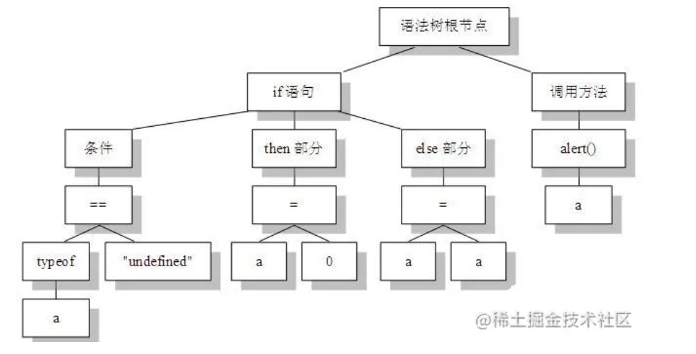

[TOC]


## 写在前面

这里是小飞侠Pan🥳，立志成为一名优秀的前端程序媛！！！

本篇文章收录于我的专栏：[前端精进之路](https://blog.csdn.net/weixin_52834435/category_11886356.html?spm=1001.2014.3001.5482)

同时收录于我的[github](https://github.com/mengqiuleo)前端笔记仓库中，持续更新中，欢迎star~

👉[https://github.com/mengqiuleo/myNote](https://github.com/mengqiuleo/myNote)

<hr/>

> **JS引擎线程的执行过程的三个阶段**
>
> 在了解变量提升和函数提升之前，我们需要了解一下**JavaScript代码是怎么执行的？**
>
> 首先，JavaScript代码执行一共分三个阶段：
>
> - 语法分析
> - 预编译
> - 解释执行


## 语法分析阶段

在语法分析阶段，我们会有：**词法分析，语法分析，代码生成，这三个过程统称为语法分析阶段**。

- **词法分析**（Tokenizing/Lexing）这个过程会将由字符组成的字符串分解成（对编程语言来说）有意义的代码块，这些代码块被称为词法单元（token）。

  例如，考虑程序var a = 2;。这段程序通常会被分解成为下面这些词法单元：var、a、=、2 、;。空格是否会被当作词法单元，取决于空格在这门语言中是否具有意义。

- **语法分析**（Parsing）这个过程是将词法单元流（数组）转换成一个由元素逐级嵌套所组成的代表了程序语法结构的树。这个树被称为“**抽象语法树**”（Abstract Syntax Tree, AST）。

  var a = 2；的抽象语法树中可能会有一个叫作VariableDeclaration的顶级节点，接下来是一个叫作Identifier（它的值是a）的子节点，以及一个叫作AssignmentExpression的子节点。AssignmentExpression节点有一个叫作NumericLiteral（它的值是2）的子节点。

- **代码生成** **将AST转换为可执行代码的过程被称为代码生成**。这个过程与语言、目标平台等息息相关。抛开具体细节，简单来说就是有某种方法可以将var a = 2；的AST转化为一组机器指令，用来创建一个叫作a的变量（包括分配内存等），并将一个值储存在a中。


**一个AST的例子**

```js
if(typeof a == "undefined" ){ 
    a = 0; 
} else { 
    a = a; 
} 
alert(a);
```




## 预编译阶段

该阶段会**进行执行上下文的创建**，包括创建变量对象VO、建立作用域链、确定 this 的指向等。每进入一个不同的运行环境时，V8 引擎都会创建一个新的执行上下文。

预编译，就是在内存中开辟一块空间，用来存放变量和函数。预编译发生在**函数创建时，函数执行前**；也就是说函数执行时，预编译已经结束。

在这个阶段会对变量，函数进行声明，赋值为undefined，**同时会利用变量提升和函数提升的两个规则进行声明（变量提升和函数提升的规则会在下一小节说明）**。

在预编译阶段，变量对象都是不能访问的，因为此时的**变量对象VO**中的变量属性尚未赋值，值仍为undefined。

只有进入执行阶段，变量对象中的变量属性进行赋值后，变量对象（Variable Object）转为活动对象（Active Object）后，才能进行访问，**这个过程就是VO –> AO过程**。

另外，在预编译阶段，函数的**作用域**就已经确定了。通俗理解，作用域链由当前执行环境的变量对象（未进入执行阶段前）与上层环境的一系列活动对象组成。当函数创建时，会有一个名为 `[[scope]]` 的内部属性保存当前环境的VO和所有父变量对象到其中。当函数执行时，然后通过**复制**函数的 `[[scope]]`  属性中的对象构建起执行环境的作用域链，然后，**变量对象 `VO` 被激活生成 `AO` 并添加到作用域链的前端**，完整作用域链创建完成。


## 执行阶段

在上下文中运行/解释函数代码，并在代码逐行执行时分配变量值。


## 一个完整的demo

```
var scope = "global scope";
function checkscope(){
    var scope2 = 'local scope';
    return scope2;
}
checkscope();
```

执行过程如下：

1.checkscope 函数被创建，保存**作用域链**到 内部属性[[scope]]

```
checkscope.[[scope]] = [
    globalContext.VO
];
```

2.执行 checkscope 函数，创建 checkscope 函数执行上下文，checkscope 函数执行上下文被压入执行上下文栈

```
ECStack = [
    checkscopeContext,
    globalContext
];
```

3.checkscope 函数并不立刻执行，开始做准备工作，第一步：**复制函数[[scope]]属性创建作用域链(从这里就可以看出作用域的创建时机是在函数被创建，即被声明时，发生在预编译阶段。在创建执行上下文的作用域链时，只是复制已经存在的作用域链)**

```
checkscopeContext = {
    Scope: checkscope.[[scope]],
}
```

4.第二步：用 arguments 创建活动对象，随后初始化活动对象，加入形参、函数声明、变量声明

```
checkscopeContext = {
    VO: {
        arguments: {
            length: 0
        },
        scope2: undefined
    }，
    Scope: checkscope.[[scope]],
}
```

5.第三步：执行该函数，将**活动对象AO压入 checkscope 作用域链顶端，VO 激活为 AO**

```
checkscopeContext = {
    AO: {
        arguments: {
            length: 0
        },
        scope2: undefined
    },
    Scope: [AO, [[Scope]]]
}
```

6.准备工作做完，开始执行函数，随着函数的执行，修改 AO 的属性值

```
checkscopeContext = {
    AO: {
        arguments: {
            length: 0
        },
        scope2: 'local scope'
    },
    Scope: [AO, [[Scope]]]
}
```

7.查找到 scope2 的值，返回后函数执行完毕，函数上下文从执行上下文栈中弹出

```
ECStack = [
    globalContext
];
```


## 从JS引擎的角度分析js代码执行过程

需要运行一段 `javascript` 代码，有两个必不可少的东西：**JS 引擎** 和 **编译器**。前者类似于总管的角色，负责整个程序运行时所需的各种资源的调度；后者只是前者的一部分，负责将 `javascript` 源码编译成机器能识别的机器指令，然后交给引擎运行。

从JS引擎的角度来看，一段代码分为编译和执行两个阶段。


这里以一个例子来分析JS引擎的执行过程：

介绍对程序 `var a = 2；`的处理

1．遇到var a，编译器会询问作用域是否已经有一个该名称的变量存在于同一个作用域的集合中。如果是，编译器会忽略该声明，继续进行编译；否则它会要求作用域在当前作用域的集合中声明一个新的变量，并命名为a。

2．接下来编译器会为引擎生成运行时所需的代码，这些代码被用来处理a = 2这个赋值操作。引擎运行时会首先询问作用域，在当前的作用域集合中是否存在一个叫作a的变量。如果是，引擎就会使用这个变量；如果否，引擎会继续**查找**该变量。

如果引擎最终找到了a变量，就会将2赋值给它。否则引擎就会举手示意并抛出一个异常！

总结：**变量的赋值操作会执行两个动作**，首先**在编译时**，编译器会在当前作用域中声明一个变量（如果之前没有声明过），然后在**运行时**引擎会在作用域中查找该变量，如果能够找到就会对它赋值。


### 编译阶段

- **分词 / 词法分析**：编译器会先将一连串字符打断成（对于语言来说）有意义的片段，称为 token（记号），例如  `var a = 2;`。这段程序很可能会被打断成如下 token：`var`，`a`，`=`，`2`，和 `;`。

- **解析 / 语法分析**：编译器将一个 `token` 的流（数组）转换为一个“抽象语法树”（`AST —— Abstract Syntax Tree`），它表示了程序的语法结构。

- **代码生成**：编译器将上一步中生成的抽象语法树转换为机器指令，等待引擎执行。


### 执行阶段

编译器一顿操作猛如虎，生成了一堆机器指令，JS 引擎开心地拿到这堆指令，开始执行，这个时候我们要说的 `LHS` 和 `RHS` 就登场了。

#### LHS查询 和 RHS查询

在上面对代码处理的第二步（即在编译时），最后提到：引擎会**查找**变量a来判断它是否已声明过，来判断是否需要声明一个变量a。那么，这里就将详细介绍一下引擎的查找规则：

查找分为 LHS查询 和 RHS查询。

“L”和“R”的含义，它们分别代表左侧和右侧。什么东西的左侧和右侧？是一个赋值操作的左侧和右侧。

更准确的来说，RHS并不是真正意义上的“赋值操作的右侧”，更准确地说是“非左侧”。

“赋值操作的左侧或右侧”并不一定意味着就是“=赋值操作符的左侧或右侧”。赋值操作还有其他几种形式，因此在概念上最好将其理解为“赋值操作的目标是谁（LHS）”以及“谁是赋值操作的源头（RHS）”。

> 如果查找的目的是对变量进行赋值，那么就会使用LHS查询；如果目的是获取变量的值，就会使用RHS查询。
>
> 像var a = 2这样的声明会被分解成两个独立的步骤：
>
> 1．首先，var a在其作用域中声明新变量。这会在最开始的阶段，也就是代码执行前进行。
>
> 2．接下来，a = 2会查询（LHS查询）变量a并对其进行赋值。

可以将RHS理解成retrieve his source value（取到它的源值），这意味着“得到某某的值”。

```js
// 举一个例子
function foo(a){
    console.log(a);//2
}
foo(2)
```

对于上面的程序，其中既有LHS也有RHS引用：

- 最后一行foo (..)函数的调用需要对foo进行**RHS引用**，意味着“去找到foo的值，并把它给我”。并且(..)意味着foo的值需要被执行。

- 代码中隐式的a=2操作可能很容易被你忽略掉。这个操作发生在2被当作参数传递给foo(..)函数时，2会被分配给参数a。为了给参数a（隐式地）分配值，需要进行一次**LHS查询**。

- 这里还有对a进行的RHS引用，并且将得到的值传给了console.log(..)。console. log(..)本身也需要一个引用才能执行，因此会对console对象进行**RHS查询**，并且检查得到的值中是否有一个叫作log的方法。

- 最后，在概念上可以理解为在LHS和RHS之间通过对值2进行交互来将其传递进log(..)（通过变量a的**RHS查询**）。假设在log(..)函数的原生实现中它可以接受参数，在将2赋值给其中第一个（也许叫作arg1）参数之前，这个参数需要进行**LHS引用查询**。


完整的查询过程：

引擎：我说作用域，我需要为foo进行RHS引用。你见过它吗？

作用域：别说，我还真见过，编译器那小子刚刚声明了它。它是一个函数，给你。

引擎：哥们太够意思了！好吧，我来执行一下foo。

引擎：作用域，还有个事儿。我需要为a进行LHS引用，这个你见过吗？

作用域：这个也见过，编译器最近把它声名为foo的一个形式参数了，拿去吧。

引擎：大恩不言谢，你总是这么棒。现在我要把2赋值给a。

引擎：哥们，不好意思又来打扰你。我要为console进行RHS引用，你见过它吗？

作用域：咱俩谁跟谁啊，再说我就是干这个。这个我也有，console是个内置对象。给你。

引擎：么么哒。我得看看这里面是不是有log(..)。太好了，找到了，是一个函数。

引擎：哥们，能帮我再找一下对a的RHS引用吗？虽然我记得它，但想再确认一次。

作用域：放心吧，这个变量没有变动过，拿走，不谢。

引擎：真棒。我来把a的值，也就是2，传递进log(..)。

……


**参考文章**

[JavaScript深入之作用域链](https://github.com/mqyqingfeng/Blog/issues/6)

《你不知道的js上》