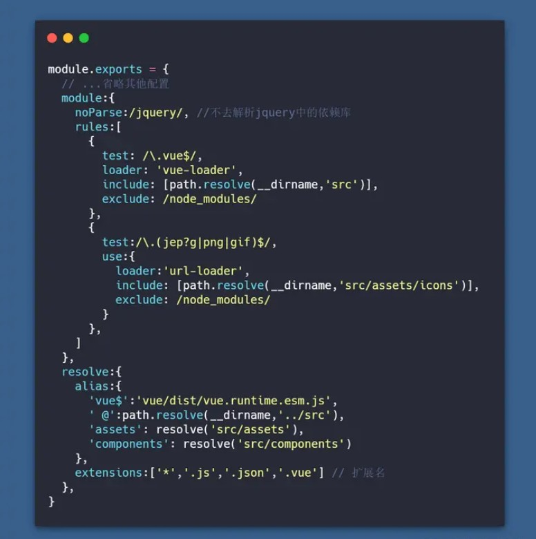

# 前端性能优化实践

[TOC]


## 优化分类概览

- 资源体积优化
  - 图片体积优化
  - webpack打包体积优化
- 打包速度优化
  - webpack打包速度优化
- 传输速度优化
  - OSS
  - 浏览器缓存
  - Gzip压缩
  - webpack打包分包优化
  - 网络层面http2
- 渲染页面优化(代码层面的实践) -> FCP指标
  - 白屏的loading
  - 骨架屏
  - 懒加载
  - 虚拟长列表
  - keep-alive
- 代码层面的优化
  - 注意区分 v-if 和 v-show
  - 注意区分 computed 和 watch
  - v-for 遍历为item添加key
  - 图片懒加载 vue-lazyload
  - ...


## 指标测试工具

首屏渲染速度(FCP) -> Lighthouse

webpack打包体积 -> webpack-bundle-analyzer

webpack打包速度 -> speed-measure-webpack-plugin


## 1.资源体积优化

### 图片体积压缩

`图像压缩`可在webpack中使用插件进行压缩。由于现在大部分`webpack`图像压缩工具不是安装失败就是各种环境问题，所以还是推荐在发布项目到生产服前使用图像压缩工具处理，这样运行稳定也不会增加打包时间。

👉[10 个免费的图像压缩优化工具和脚本推荐](https://juejin.cn/post/6844903475013222414)

在webpack中进行图片压缩：

使用**image-webpack-loader**，

install：

```
npm i image-webpack-loader -D
```

使用：

```js
// vue.config.js
chainWebpack: (config) => {
    if (isProd) {
        // 图片压缩处理
        const imgRule = config.module.rule('images')
        imgRule
            .test(/\.(png|jpe?g|gif|webp)(\?.*)?$/)
            .use('image-webpack-loader')
            .loader('image-webpack-loader')
            .options({ bypassOnDebug: true })
            .end()
    }
}
```

> 1. install或build时如果出现imagemin库下载失败，可以尝试 换源、配置github hosts、install时添加`--user=root`解决
> 2. 由于在图片下载后已经手动用在线工具压缩过，这部分提升不大


另外，也可以合理使用SVG图片，

SVG通常会有一些冗余信息导致影响体积，这里我们可以使用svgo-loader来进一步压缩。

```
// install
npm i svgo-loader -D

// vue.config.js
// 接上面svg的配置
...
.end()
.use('svgo-loader')
.loader('svgo-loader')
.end()
```


### webpack打包体积优化

#### CSS代码压缩

CSS代码压缩使用`css-minimizer-webpack-plugin`，效果包括压缩、去重

> 代码的压缩比较耗时间，所以只用在打包项目时，所以只需要在`webpack.prod.js`中配置

```
npm i css-minimizer-webpack-plugin -D
```

完整代码：

```js
// webpack.prod.js

const CssMinimizerPlugin = require('css-minimizer-webpack-plugin')

  optimization: {
    minimizer: [
      new CssMinimizerPlugin(), // 去重压缩css
    ],
  }
```


#### JS代码压缩

JS代码压缩使用`terser-webpack-plugin`，实现打包后JS代码的压缩

> 代码的压缩比较耗时间，所以只用在打包项目时，所以只需要在`webpack.prod.js`中配置

```
npm i terser-webpack-plugin -D
```

完整代码：

```js
// webpack.prod.js

const TerserPlugin = require('terser-webpack-plugin')

  optimization: {
    minimizer: [
      new CssMinimizerPlugin(), // 去重压缩css
      new TerserPlugin({ // 压缩JS代码
        terserOptions: {
          compress: {
            drop_console: true, // 去除console
          },
        },
      }), // 压缩JavaScript
    ],
  }
```


#### tree-shaking

`tree-shaking`简单说作用就是：只打包用到的代码，没用到的代码不打包，而`webpack5`默认开启`tree-shaking`，当打包的`mode`为`production`时，自动开启`tree-shaking`进行优化

```js
module.exports = {
  mode: 'production'
}
```


#### sideEffects

通过 package.json 的 `"sideEffects"` 属性，来实现这种方式。

```javascript
{
  "name": "your-project",
  "sideEffects": false
}
```

需注意的是，当代码有副作用时，需要将 `sideEffects` 改为提供一个数组，添加有副作用代码的文件路径：

```javascript
{
  "name": "your-project",
  "sideEffects": ["./src/some-side-effectful-file.js"]
}
```

添加 TreeShaking 后，未引用的代码，将不会被打包


#### source-map类型

`source-map`的作用是：方便你报错的时候能定位到错误代码的位置。它的体积不容小觑，所以对于不同环境设置不同的类型是很有必要的。

- **开发环境**

开发环境的时候我们需要能精准定位错误代码的位置

```js
// webpack.dev.js

module.exports = {
  mode: 'development',
  devtool: 'eval-cheap-module-source-map'
}
```

- **生产环境**

生产环境，我们想开启`source-map`，但是又不想体积太大，那么可以换一种类型

```js
// webpack.prod.js

module.exports = {
  mode: 'production',
  devtool: 'nosources-source-map'
}
```


#### 抽离重复代码

[SplitChunksPlugin](https://link.juejin.cn?target=https%3A%2F%2Fwebpack.docschina.org%2Fplugins%2Fsplit-chunks-plugin) 插件开箱即用，可以将公共的依赖模块提取到已有的入口 chunk 中，或者提取到一个新生成的 chunk。

将公共的模块单独打包，不再重复引入。

webpack 将根据以下条件自动拆分 chunks：

- 新的 chunk 可以被共享，或者模块来自于 `node_modules` 文件夹；
- 新的 chunk 体积大于 20kb（在进行 min+gz 之前的体积）；
- 当按需加载 chunks 时，并行请求的最大数量小于或等于 30；
- 当加载初始化页面时，并发请求的最大数量小于或等于 30； 通过 splitChunks 把 react 等公共库抽离出来，不重复引入占用体积。

`webpack.prod.js` 配置方式如下：

```javascript
module.exports = {
    splitChunks: {
      // include all types of chunks
      chunks: 'all',
      // 重复打包问题
      cacheGroups:{
        vendors:{ // node_modules里的代码
          test: /[\\/]node_modules[\\/]/,
          chunks: "all",
          // name: 'vendors', 一定不要定义固定的name
          priority: 10, // 优先级
          enforce: true 
        }
      }
    },
}
```


#### Scope Hoisting

Scope Hoisting 即作用域提升，原理是将多个模块放在同一个作用域下，并重命名防止命名冲突，**通过这种方式可以减少函数声明和内存开销**。

- webpack 默认支持，在生产环境下默认开启
- 只支持 es6 代码


## 2.打包速度优化 -> webpack打包

### 构建区分环境

`webpack.dev.js`   开发环境配置文件

> 开发环境主要实现的是热更新,不要压缩代码，完整的sourceMap

`webpack.prod.js`  生产环境配置文件

> 生产环境主要实现的是压缩代码、提取css文件、合理的sourceMap、分割代码
> 需要安装以下模块:
> npm i -D  webpack-merge copy-webpack-plugin optimize-css-assets-webpack-plugin uglifyjs-webpack-plugin

- `webpack-merge` 合并配置
- `copy-webpack-plugin` 拷贝静态资源
- `optimize-css-assets-webpack-plugin` 压缩css
- `uglifyjs-webpack-plugin` 压缩js

> `webpack mode`设置`production`的时候会自动压缩js代码。原则上不需要引入`uglifyjs-webpack-plugin`进行重复工作。但是`optimize-css-assets-webpack-plugin`压缩css的同时会破坏原有的js压缩，所以这里我们引入`uglifyjs`进行压缩


### 缩小文件的搜索范围

配置include，exclude，alias，noParse，extensions

- `alias`: 当我们代码中出现 `import 'vue'`时， webpack会采用向上递归搜索的方式去`node_modules` 目录下找。为了减少搜索范围我们可以直接告诉webpack去哪个路径下查找。也就是别名(`alias`)的配置。

- `include exclude` 同样配置`include exclude`也可以减少`webpack loader`的搜索转换时间。

- `noParse ` 当我们代码中使用到`import jq from 'jquery'`时，webpack会去解析jq这个库是否有依赖其他的包。但是我们对类似`jquery`这类依赖库，一般会认为不会引用其他的包(特殊除外,自行判断)。增加`noParse`属性,告诉webpack不必解析，以此增加打包速度。

- `extensions`  webpack会根据`extensions`定义的后缀查找文件(频率较高的文件类型优先写在前面)




### 优化代码的压缩时间

使用 **webpack-parallel-uglify-plugin** 增强代码压缩

```
npm i -D webpack-parallel-uglify-plugin
```

在使用 Webpack 构建出用于发布到线上的代码时，都会有压缩代码这一流程。 最常见的 JavaScript 代码压缩工具是 [UglifyJS](https://github.com/mishoo/UglifyJS2)，并且 Webpack 也内置了它。

用过 UglifyJS 的你一定会发现在构建用于开发环境的代码时很快就能完成，但在构建用于线上的代码时构建一直卡在一个时间点迟迟没有反应，其实卡住的这个时候就是在进行代码压缩。

由于压缩 JavaScript 代码需要先把代码解析成用 Object 抽象表示的 AST 语法树，再去应用各种规则分析和处理 AST，导致这个过程计算量巨大，耗时非常多。

为什么不把**多进程并行处理**的思想也引入到代码压缩中呢？

[ParallelUglifyPlugin](https://github.com/gdborton/webpack-parallel-uglify-plugin) 就做了这个事情。 当 Webpack 有多个 JavaScript 文件需要输出和压缩时，原本会使用 UglifyJS 去一个个挨着压缩再输出， 但是 ParallelUglifyPlugin 则会开启多个子进程，把对多个文件的压缩工作分配给多个子进程去完成，每个子进程其实还是通过 UglifyJS 去压缩代码，但是变成了并行执行。 所以 ParallelUglifyPlugin 能更快的完成对多个文件的压缩工作。

使用 ParallelUglifyPlugin 也非常简单，把原来 Webpack 配置文件中内置的 UglifyJsPlugin 去掉后，再替换成 ParallelUglifyPlugin，相关代码如下：

```js
const path = require('path');
const DefinePlugin = require('webpack/lib/DefinePlugin');
const ParallelUglifyPlugin = require('webpack-parallel-uglify-plugin');

module.exports = {
  plugins: [
    // 使用 ParallelUglifyPlugin 并行压缩输出的 JS 代码
    new ParallelUglifyPlugin({
      // 传递给 UglifyJS 的参数
      uglifyJS: {
        output: {
          // 最紧凑的输出
          beautify: false,
          // 删除所有的注释
          comments: false,
        },
        compress: {
          // 在UglifyJs删除没有用到的代码时不输出警告
          warnings: false,
          // 删除所有的 `console` 语句，可以兼容ie浏览器
          drop_console: true,
          // 内嵌定义了但是只用到一次的变量
          collapse_vars: true,
          // 提取出出现多次但是没有定义成变量去引用的静态值
          reduce_vars: true,
        }
      },
    }),
  ],
};
```

在通过 `new ParallelUglifyPlugin()` 实例化时，支持以下参数：

- `test`：使用正则去匹配哪些文件需要被 ParallelUglifyPlugin 压缩，默认是 `/.js$/`，也就是默认压缩所有的 .js 文件。
- `include`：使用正则去命中需要被 ParallelUglifyPlugin 压缩的文件。默认为 `[]`。
- `exclude`：使用正则去命中不需要被 ParallelUglifyPlugin 压缩的文件。默认为 `[]`。
- `cacheDir`：缓存压缩后的结果，下次遇到一样的输入时直接从缓存中获取压缩后的结果并返回。cacheDir 用于配置缓存存放的目录路径。默认不会缓存，想开启缓存请设置一个目录路径。
- `workerCount`：开启几个子进程去并发的执行压缩。默认是当前运行电脑的 CPU 核数减去1。
- `sourceMap`：是否输出 Source Map，这会导致压缩过程变慢。
- `uglifyJS`：用于压缩 ES5 代码时的配置，Object 类型，直接透传给 UglifyJS 的参数。
- `uglifyES`：用于压缩 ES6 代码时的配置，Object 类型，直接透传给 UglifyES 的参数。

其中的 `test`、`include`、`exclude` 与配置 Loader 时的思想和用法一样。


### 抽离第三方模块

> 对于开发项目中不经常会变更的静态依赖文件。类似于我们的`elementUi、vue`全家桶等等。因为很少会变更，所以我们不希望这些依赖要被集成到每一次的构建逻辑中去。 这样做的好处是每次更改我本地代码的文件的时候，`webpack`只需要打包我项目本身的文件代码，而不会再去编译第三方库。以后只要我们不升级第三方包的时候，那么`webpack`就不会对这些库去打包，这样可以快速的提高打包的速度。

`Dllplugin`插件可以帮助我们把这些不做修改的包抽取为动态链接库，并且会生成一个名为manifest.json的文件，这个文件是用来让`DLLReferencePlugin`映射到相关的依赖上去的。

webpack5 开箱即用的持久缓存是比 dll 更优的解决方案，所以，不用再配置 dll了。


### cache

通过配置 [webpack 持久化缓存](https://link.juejin.cn?target=https%3A%2F%2Fwebpack.docschina.org%2Fconfiguration%2Fcache%2F%23root) `cache: filesystem`，来缓存生成的 webpack 模块和 chunk，改善构建速度。

简单来说，通过 `cache: filesystem` 可以将构建过程的 webpack 模板进行缓存，大幅提升二次构建速度、打包速度，当构建突然中断，二次进行构建时，可以直接从缓存中拉取，可提速 **90%** 左右。

`webpack.common.js` 配置方式如下：

```javascript
module.exports = {
    cache: {
      type: 'filesystem', // 使用文件缓存
    },
}
```


### cache-loader

缓存资源，提高二次构建的速度，使用方法是将`cache-loader`放在比较费时间的loader之前，比如`babel-loader`

> 由于启动项目和打包项目都需要加速，所以配置在`webpack.base.js`

```
npm i cache-loader -D
```

使用：

```js
// webpack.base.js

{
        test: /\.js$/,
        use: [
          'cache-loader',
          'thread-loader',
          'babel-loader'
        ],
},
```


[cache-loader](https://link.juejin.cn/?target=https%3A%2F%2Fwebpack.docschina.org%2Floaders%2Fcache-loader%2F) 也不需要引入了，上面的 cache 已经帮助我们缓存了。


### thread-loader

由于有大量文件需要解析和处理，构建是文件读写和计算密集型的操作，特别是当文件数量变多后，`Webpack` 构建慢的问题会显得严重。文件读写和计算操作是无法避免的，那能不能让 `Webpack` 同一时刻处理多个任务，发挥多核 CPU 电脑的威力，以提升构建速度呢？

> 把任务分解给多个子进程去并发的执行，子进程处理完后再把结果发送给主进程。

把 `thread-loader` 放置在其它 `loader` 之前，那么放置在这个 `loader` 之后的 `loader` 就会在一个单独的 `worker` 池中运行。

在 worker 池(worker pool)中运行的 loader 是受到限制的。例如：

- 这些 `loader` 不能产生新的文件。
- 这些 `loader` 不能使用定制的 `loader` API（也就是说，通过插件）。
- 这些 `loader` 无法获取 `webpack` 的选项设置。

首先安装依赖：

```arduino
npm install thread-loader -D
```

修改配置:

```java
module.exports = {
    module: {
        //我的项目中,babel-loader耗时比较长，所以我给它配置 thread-loader
        rules: [
            {
                test: /\.jsx?$/,
                use: ['thread-loader', 'cache-loader', 'babel-loader']
            }
        ]
    }
}
```


## 3.传输速度优化

### splitChunks 分包配置 -> 提取第三方库进行长期缓存

optimization.splitChunks 是基于 [SplitChunksPlugin](https://link.juejin.cn/?target=https%3A%2F%2Fwebpack.docschina.org%2Fplugins%2Fsplit-chunks-plugin%2F) 插件实现的

默认情况下，**它只会影响到按需加载的 chunks**，因为修改 initial chunks 会影响到项目的 HTML 文件中的脚本标签。

一个demo：

```js
const config = {
  //...
  optimization: {
    splitChunks: {
      cacheGroups: { // 配置提取模块的方案
        default: false,
        styles: {
            name: 'styles',
            test: /\.(s?css|less|sass)$/,
            chunks: 'all',
            enforce: true,
            priority: 10,
          },
          common: {
            name: 'chunk-common',
            chunks: 'all',
            minChunks: 2,
            maxInitialRequests: 5,
            minSize: 0,
            priority: 1,
            enforce: true,
            reuseExistingChunk: true,
          },
          vendors: {
            name: 'chunk-vendors',
            test: /[\\/]node_modules[\\/]/,
            chunks: 'all',
            priority: 2,
            enforce: true,
            reuseExistingChunk: true,
          },
         // ... 根据不同项目再细化拆分内容
      },
    },
  },
}
```


### 路由懒加载

SPA中一个很重要的提速手段就是路由懒加载，当打开页面时才去加载对应文件，我们利用Vue的异步组件和webpack的代码分割（`import()`）就可以轻松实现懒加载了。

但当路由过多时，请合理地用webpack的魔法注释对路由进行分组，太多的chunk会影响构建时的速度

```css
{
    path: 'register',
    name: 'register',
    component: () => import(/* webpackChunkName: "user" */ '@/views/user/register'),
}
```

> 请只在生产时懒加载，否则路由多起来后，开发时的构建速度感人


### Gzip压缩传输

Gzip压缩是一种强力压缩手段，针对文本文件时通常能减少2/3的体积。

HTTP协议中用头部字段`Accept-Encoding` 和 `Content-Encoding`对「采用何种编码格式传输正文」进行了协定，请求头的`Accept-Encoding`会列出客户端支持的编码格式。当响应头的` Content-Encoding`指定了gzip时，浏览器则会进行对应解压

一般浏览器都支持gzip，所以`Accept-Encoding`也会自动带上`gzip`，所以我们需要让资源服务器在`Content-Encoding`指定gzip，并返回gzip文件

**Nginx配置Gzip**

```conf
#开启和关闭gzip模式
gzip on;
#gizp压缩起点，文件大于1k才进行压缩
gzip_min_length 1k;
# gzip 压缩级别，1-9，数字越大压缩的越好，也越占用CPU时间
gzip_comp_level 6;
# 进行压缩的文件类型。
gzip_types text/plain application/javascript application/x-javascript text/css application/xml text/javascript ;
# nginx对于静态文件的处理模块，开启后会寻找以.gz结尾的文件，直接返回，不会占用cpu进行压缩，如果找不到则不进行压缩
gzip_static on
# 是否在http header中添加Vary: Accept-Encoding，建议开启
gzip_vary on;
# 设置gzip压缩针对的HTTP协议版本
gzip_http_version 1.1;
```


**构建时生成gzip文件**

虽然上面配置后Nginx已经会在响应请求时进行压缩并返回Gzip了，但是压缩操作本身是会占用服务器的CPU和时间的，压缩等级越高开销越大，所以我们通常会一并上传gzip文件，让服务器直接返回压缩后文件

```javascript
// vue.config.js
const CompressionPlugin = require('compression-webpack-plugin')
// gzip压缩处理
chainWebpack: (config) => {
    if(isProd) {
        config.plugin('compression-webpack-plugin')
            .use(new CompressionPlugin({
                test: /\.js$|\.html$|\.css$/, // 匹配文件名
                threshold: 10240, // 对超过10k的数据压缩
                deleteOriginalAssets: false // 不删除源文件
            }))
    }
}
```

> 1. 插件的默认压缩等级是9，最高级的压缩
> 2. 图片文件不建议使用gzip压缩，效果较差


### Prefetch、Preload

> <link>标签的rel属性的两个可选值。
>  **Prefetch**，预请求，是为了提示浏览器，用户未来的浏览有可能需要加载目标资源，所以浏览器有可能通过事先获取和缓存对应资源，优化用户体验。
>  **Preload**，预加载，表示用户十分有可能需要在当前浏览中加载目标资源，所以浏览器必须预先获取和缓存对应资源。

Prefetch、Preload可以在某些场景下可以有效优化用户体验。 举些场景

- 首屏字体、大图加载，CSS中引入字体需要等CSS解析后才会加载，这之前浏览器会使用默认字体，当加载后会替换为自定义字体，导致`字体样式闪动`，而我们使用`Preload`提前加载字体后这种情况就好很多了，大图也是如此
- 优惠券的背景图加载，同样CSS中url引用在DOM没挂载之前是不会加载图片的，进入卡包页/收银台时可以提前使用Prefetch加载，这样用户在进行优惠券页就可以立马看到加载完成的图片了

Vue-Cli3默认会使用preload-webpack-plugin对chunk资源做preload、prefetch处理，入口文件preload，路由chunk则是prefetch。

一般来说不需要做特别处理，如果判断不需要或者需要调整在`vue.config.js`中配置即可

> 1. 理论上prefetch不会影响加载速度，但实际测试中，是有轻微影响的，不过这个见仁见智，我认为总体体验上还是有所提升的，
> 2. 类似字体文件这种隐藏在脚本、样式中的首屏关键资源，建议使用preload
> 3. 移动端流量访问时慎用


### 托管至OSS + CDN加速

OSS的特点：

- 稳定，服务可用性高，多重备份保障数据安全
- 安全，多层次安全防护，防DDoS
- 大规模，高性能，从容应对高并发

另外，OSS还提供一些方便的服务

- 图片处理，支持压缩、裁剪、水印、格式转换等
- 传输加速，优化传输链路和协议策略实现高速传输


### 开启HTTP2

HTTP2是HTTP协议的第二个版本，相较于HTTP1 速度更快、延迟更低，功能更多。 目前来看[兼容性](https://link.juejin.cn?target=https%3A%2F%2Fcaniuse.com%2F%3Fsearch%3Dhttp2)方面也算过得去，在国内有超过50%的覆盖率。

通常浏览器在传输时并发请求数是有限制的，超过限制的请求需要排队，以往我们通过域名分片、资源合并来避开这一限制，而使用HTTP2协议后，其可以在一个TCP连接分帧处理多个请求（多路复用），不受此限制。（其余的头部压缩等等也带来了一定性能提升）

如果网站支持HTTPS，请一并开启HTTP2，成本低收益高，对于请求多的页面提升很大，尤其是在网速不佳时


**Nginx开启HTTP2（>V1.95）**

- 调整Nginx配置

```arduino
// nginx.conf
listen 443 http2;
```

- 重启Nginx

```arduino
nginx -s stop && nginx
```


### 使用浏览器缓存

为了提高用户加载页面的速度，对静态资源进行缓存是非常必要的，根据是否需要重新向服务器发起请求来分类。

为了避免用户每次访问网站都得请求文件，我们可以通过添加 Expires 或 max-age 来控制这一行为。Expires 设置了一个时间，只要在这个时间之前，浏览器都不会请求文件，而是直接使用缓存。而 max-age 是一个相对时间，建议使用 max-age 代替 Expires 。

不过这样会产生一个问题，当文件更新了怎么办？怎么通知浏览器重新请求文件？

可以通过更新页面中引用的资源链接地址，让浏览器主动放弃缓存，加载新资源。

具体做法是把资源地址 URL 的修改与文件内容关联起来，也就是说，只有文件内容变化，才会导致相应 URL 的变更，从而实现文件级别的精确缓存控制。什么东西与文件内容相关呢？我们会很自然的联想到利用[数据摘要要算法](https://link.juejin.cn?target=https%3A%2F%2Fbaike.baidu.com%2Fitem%2F%E6%B6%88%E6%81%AF%E6%91%98%E8%A6%81%E7%AE%97%E6%B3%95%2F3286770%3Ffromtitle%3D%E6%91%98%E8%A6%81%E7%AE%97%E6%B3%95%26fromid%3D12011257)对文件求摘要信息，摘要信息与文件内容一一对应，就有了一种可以精确到单个文件粒度的缓存控制依据了。


## 4.渲染页面优化

### 白屏时的loading动画

首屏优化，在JS没解析执行前，让用户能看到Loading动画，减轻等待焦虑。通常会在index.html上写简单的CSS动画，直到Vue挂载后替换挂载节点的内容，但这种做法实测也会出现短暂的白屏，建议手动控制CSS动画关闭


### 首屏骨架加载

首屏优化，APP内常见的加载时各部分灰色色块


### SSR服务端渲染

客户端渲染: 获取 HTML 文件，根据需要下载 JavaScript 文件，运行文件，生成 DOM，再渲染。

服务端渲染：服务端返回 HTML 文件，客户端只需解析 HTML。

- 优点：首屏渲染快，SEO 好。
- 缺点：配置麻烦，增加了服务器的计算压力。


### 虚拟长列表


## 5.代码层面的实践

- 注意区分 v-if 和 v-show
- 注意区分 computed 和 watch
- v-for 遍历为item添加key
- 图片懒加载 vue-lazyload
- 第三方插件的按需引入

- 使用图标库，降低资源请求次数

- 防抖节流


参考文章：

[🐢11s到⚡1s，性能优化之首屏加载🚀](https://juejin.cn/post/6949896020788690958#heading-52)

[Vue 项目性能优化 — 实践指南（网上最全 / 详细）](https://juejin.cn/post/6844903913410314247#heading-10)