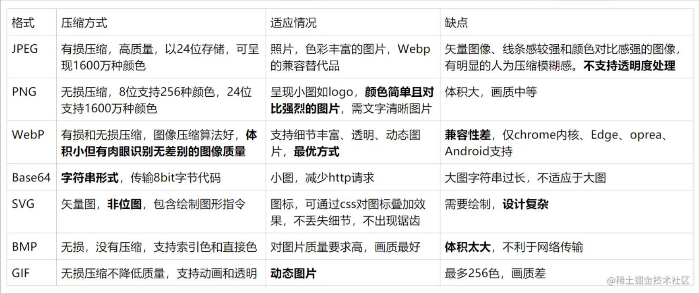

# 常见的图片格式及使用场景

[TOC]

## 无压缩, 无损压缩, 有损压缩

- 无压缩。无压缩的图片格式不对图片数据进行压缩处理，能准确地呈现原图片。BMP格式就是其中之一。
- 无损压缩。压缩算法对图片的所有的数据进行编码压缩，能在保证图片的质量的同时降低图片的尺寸。png是其中的代表。**无损压缩代表格式 png、gif**。
- 有损压缩。压缩算法不会对图片所有的数据进行编码压缩，而是在压缩的时候，去除了人眼无法识别的图片细节。因此有损压缩可以在同等图片质量的情况下大幅降低图片的尺寸。其中的代表是**jpg**。

## 光栅图和矢量图

对于图片，一般分光栅图和矢量图。

- 光栅图：是基于 pixel像素构成的图像。JPEG、PNG，webp等都属于此类
- 矢量图：使用点，线和多边形等几何形状来构图，具有高分辨率和缩放功能. SVG就是一种矢量图。

## gif

由于采用了无损压缩，相比古老的bmp格式，尺寸较小，而且支持透明和动画。缺点是由于gif只存储8位索引（也就是最多能表达2^8=256种颜色），色彩复杂、细节丰富的图片不适合保存为gif格式。色彩简单的logo、icon、线框图适合采用gif格式。

## JPG/JPEG

最常用的静态图片格式之一。这种格式的图片能比较好的表现各种色彩，主要在压缩的时候会有所失真，也正因为如此，造就了这种图片格式体积的轻量。

**优点：**

1.兼容性强

2.色彩丰富

3.压缩率高，图片小

4.支持渐进

**缺点：**

- 不支持动画、透明
- 不适合存储企业类logo,线框类高清图片

### JPG 和 JPEG 之间的不同

实际上，JPG 和 JPEG 是完全相同的图像格式。全称是 Joint Photographic Experts Group，最初发布与 1992 年。那个时候，Windows 电脑只支持三个字符的文件格式，因此，JPEG 被简称为 JPG 来适配 Windows。另一方面，Mac 和 Linux 系统仍然保持使用 JPEG。

现在，Windows、Mac 和几个其他操作系统同时使用 JPEG 和 JPG。你甚至可以看见 JPE、JIF 和 JFIF，这些都是 JPEG 的其他名字。

## PNG

PNG格式是有三种版本的，分别为PNG-8，PNG-24，PNG-32，所有这些版本都不支持动画的。PNG-8跟GIF类似的属性是相似的，都是索引色模式，而且都支持背景透明。**相对比GIF格式好的特点在与背景透明时，图像边缘没有什么噪点，颜色表现更优秀。PNG-24其实就是无损压缩的JPEG**。而PNG-32就是在PNG-24的基础上，增加了透明度的支持。
 如果没有动画需求推荐使用png-8来替代gif，png-8属性基本与gif一致。

**优点：**

1.支持透明

2.压缩时几乎不失真

3.像素丰富

4.支持交错

5.兼容性强

**缺点：**

- 文件较大

## webp

WebP图片是一种新的图像格式，由Google开发。与png、jpg相比，相同的视觉体验下，WebP图像的尺寸缩小了大约30％。另外，WebP图像格式还支持有损压缩、无损压缩、透明和动画。理论上完全可以替代png、jpg、gif等图片格式，当然目前webp的还没有得到全面的支持。

## BASE64

base64 本身不属于图片格式，是以字符串格式来保存图片数据的一种方式。

图片的 base64 编码就是可以将一副图片数据编码成一串字符串，使用该字符串代替图像地址，图片随着 HTML 的下载同时下载到本地，不再单独消耗一个http来请求图片。

**优点：**

1.不需要额外的HTTP请求

2.适用于极小或简单图片

3.没有跨域问题，无需考虑缓存、文件头或者cookies问题

**缺点：**

- 相对于其他图片格式，要大至少1/3
- 不适用于中等以上图片

## SVG

使用点和线来描述图形的图片格式。

它是基于 XML，由万维网联盟进行开发的。一种开放标准的矢量图形语言，可任意放大图形显示，边缘异常清晰，文字在 SVG 图像中保留可编辑和可搜寻的状态，没有字体的限制，生成的文件很小，下载很快，十分适合用于设计高分辨率的 Web 图形页面

- SVG 文件的大小通常是极小的，即使它们看起来的样子真的很大。然而，值得注意的是，
- SVG 文件的大小也取决于要展示图形的复杂度。
- SVG 在渲染的时候需要比像素图更多的计算能力，这也就意味着性能的损耗。

如果你的 logo 是特别复杂的，它可能会很耗费性能，甚至文件大小也非常大。

所以尽可能简化你的矢量形状的复杂度是很重要也很有必要的。 此外，SVG 文件是用 XML 编写的，因此可以在文本编辑器中打开和编辑。这意味着它展示的效果在运行时是可以改变的。你可以使用 JavaScript 来改变图片。

**优点：**

- 矢量图片，放大不影响质量
- 显示效果好，不存在锯齿等情况
- 可以支持动画效果

**缺点：**

- 查看十分不方便
- 不适合表示复杂图形
- 兼容性（显示（< ie8)；动画效果（更多））

**应用场景**

- logo、图标

## iconfont

Iconfont 是采用字体的方式来做图标。它的原理就是将很多 icon 做成字体库，通过样式或者字体对应的字符集来显示这个 icon。

- 优点
  - 减少请求次数，将多个 icon 合并到一个字体文件中，从而提高网页性能；
  - 自由的变化大小和颜色
  - 矢量图不失真
  - 兼容性好
- 缺点
  - 单色（可以彩色，但是失去了图片字体的优势）
  - 维护成本高
  - 不适合表示复杂图形，仅适用于图标
  - 不利于首屏显示
- 适用场景
  - 图标

## 总结

| 格式 | 优点                                       | 缺点                               | 适用场景                   |
| ---- | ------------------------------------------ | ---------------------------------- | -------------------------- |
| gif  | 文件小，支持动画、透明，无兼容性问题       | 只支持256种颜色                    | 色彩简单的logo、icon、动图 |
| jpg  | 色彩丰富，文件小                           | 有损压缩，反复保存图片质量下降明显 | 色彩丰富的图片/渐变图像    |
| png  | 无损压缩，支持透明，简单图片尺寸小         | 不支持动画，色彩丰富的图片尺寸大   | logo/icon/透明图           |
| webp | 文件小，支持有损和无损压缩，支持动画、透明 | 浏览器兼容性不好                   | 支持webp格式的app和webview |

参考文章：

[前端图片格式如何选择](https://juejin.cn/post/7118948952249991205)