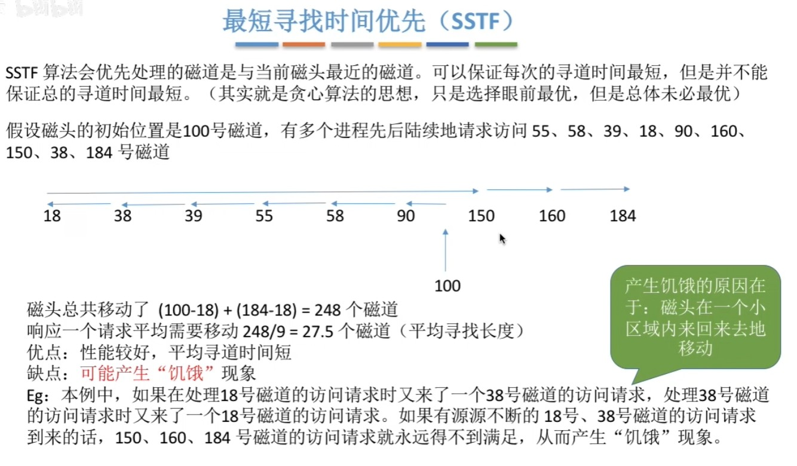
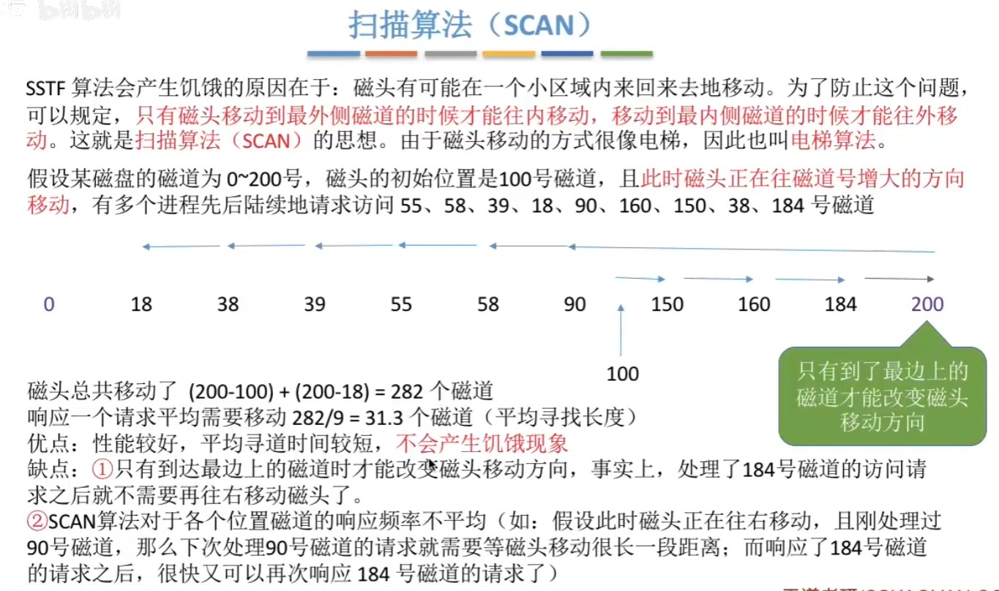
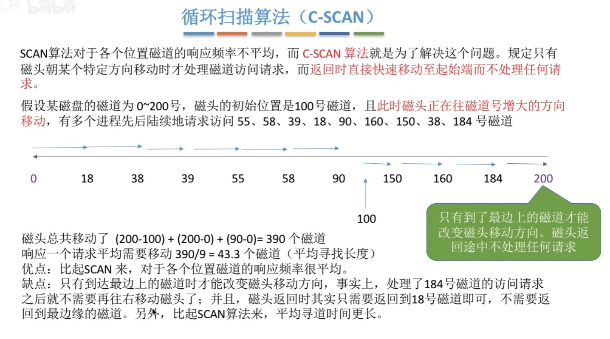

# OS(三)文件管理

[TOC]

## 一、文件

### 1.文件的逻辑结构

文件可以分为：

- 无结构文件
- 有结构文件
  - 顺序文件
  - 索引文件
  - 索引顺序文件

#### 无结构文件

无结构文件：文件内部的数据就是一系列二进制流或字符流组成。又称“流式文件”。如：Windows 操作系统中的.txt 文件。

文件内部的数据其实就是一系列字符流，没有明显的结构特性。因此也不用探讨无结构文件的“逻辑结构”问题。

#### 有结构文件

有结构文件：由一组相似的记录组成，又称“记录式文件”。每条记录又若干个数据项组成。如：数据库表文件。一般来说，每条记录有一个数据项可作为关键字（作为识别不同记录的ID）。一般来说，每条记录有一个数据项可作为关键字。根据各条记录的长度（占用的存储空间）是否相等，又可分为定长记录和可变长记录两种。

#### 顺序文件

顺序文件：文件中的记录一个接一个地顺序排列（逻辑上），记录可以是定长的或可变长的。各个记录在物理上可以顺序存储或链式存储。

#### 索引文件

#### 索引顺序文件

思考索引文件的缺点：每个记录对应一个索引表项，因此索引表可能会很大。比如：文件的每个记录平均只占8B，而每个索引表项占32个字节，那么索引表都要比文件内容本身大4倍，这样对存储空间的利用率就太低了。

**索引顺序文件**是索引文件和顺序文件思想的结合。索引顺序文件中，同样会为文件建立一张索引表，但不同的是：并不是每个记录对应一个索引表项，而是**一组记录对应一个索引表项**。

#### 多级索引顺序文件

### 2.文件目录

#### 文件控制块（实现文件目录的关键数据结构）

目录文件中的一条记录就是一个“文件控制块（FCB）

FCB的有序集合称为“文件目录”，一个FCB就是一个文件目录项。FCB中包含了文件的基本信息（文件名、物理地址、逻辑结构、物理结构等），存取控制信息（是否可读/可写、禁止访问的用户名单等），使用信息（如文件的建立时间、修改时间等）。最重要，最基本的还是文件名、文件存放的物理地址。

#### 目录结构--单级目录结构

#### 目录结构--两级目录结构

#### 目录结构--多级目录结构

用户（或用户进程）要访问某个文件时要用文件路径名标识文件，文件路径名是个字符串。各级目录之间用“/”隔开。从根目录出发的路径称为绝对路径。例如：自拍.jpg的绝对路径是“/照片/2015-08/自拍.jpg”

每次都从根目录开始查找，是很低效的。因此可以设置一个“当前目录”。例如，此时已经打开了“照片”的目录文件，也就是说，这张目录表已调入内存，那么可以把它设置为“当前目录”。当用户想要访问某个文件时，可以使用从当前目录出发的“相对路径”。在Linux中，“.”表示当前目录，因此如果“照片”是当前目录，则”自拍.jpg”的相对路径为：“./2015-08/自拍.jpg”。

树形目录结构可以很方便地对文件进行分类，层次结构清晰，也能够更有效地进行文件的管理和保护。但是，树形结构不便于实现文件的共享。为此，提出了“无环图目录结构”。

#### 目录结构--无环图目录结构

#### 索引节点（FCB的改进）

### 3.文件的物理结构(一) -- 对非空闲磁盘块的管理（存放了文件数据的磁盘）

#### 文件块、磁盘块

#### 文件分配方式——连续分配

连续分配方式要求每个文件在磁盘上占有一组连续的块。

优点：支持顺序访问和直接访问（即随机访问）；连续分配的文件在顺序访问时速度最快

缺点：不方便文件拓展；存储空间利用率低，会产生磁盘碎片

不方便文件拓展，举例：

#### 文件分配方式——链接分配

链接分配采取离散分配的方式，可以为文件分配离散的磁盘块。分为隐式链接和显式链接两种。

##### 链接分配——隐式链接

1. 采用链式分配（隐式链接）方式的文件，只支持顺序访问，不支持随机访问，查找效率低。另外，指向下一个盘块的指针也需要耗费少量的存储空间。

2. 是否方便拓展文件？
   若此时要拓展文件，则可以随便找一个空闲磁盘块，挂到文件的磁盘块链尾，并修改文件的FCB

3. 采用隐式链接的链接分配方式，很方便文件拓展。另外，所有的空闲磁盘块都可以被利用，不会有碎片问题，外存利用率高。

##### 链接分配——显式链接

显式链接——把用于链接文件各物理块的指针显式地存放在一张表中，即文件分配表（FAT，FileAllocation Table）。一个磁盘只会建立一张文件分配表。开机时文件分配表放入内存，并常驻内存。

优点：很方便文件拓展，不会有碎片问题，外存利用率高，并且支持随机访问。相比于隐式链接来说，地址转换时不需要访问磁盘，因此文件的访问效率更高。

缺点：文件分配表的需要占用一定的存储空间。

#### 文件分配方式——索引分配

索引分配方式可以支持随机访问。文件拓展也很容易实现（只需要给文件分配一个空闲块，并增加一个索引表项即可）
但是索引表需要占用一定的存储空间

##### 一个问题：

若每个磁盘块1KB，一个索引表项4B，则一个磁盘块只能存放256 个索引项。

如果一个文件的大小超过了256块，那么一个磁盘块是装不下文件的整张索引表的，如何解决这个问题？

①链接方案
②多层索引
③混合索引

##### 链接方案

如果索引表太大，一个索引块装不下，那么可以将多个索引块链接起来存放。

##### 多层索引

##### 混合索引

### 4.文件的物理结构(二) -- 对空闲磁盘块的管理

#### 存储空间的划分与初始化

#### 空闲表法

#### 空闲链表法

- 空闲盘块链 - 以盘块为单位组成一条空闲链
- 空闲盘区链 - 以盘区为单位组成一条空闲链

##### 空闲盘块链

##### 空闲盘区链

#### 位示图法

位示图：每个二进制位对应一个盘块。在本例中，“0”代表盘块空闲，“1”代表盘块已分配。

如何分配：若文件需要K个块，①顺序扫描位示图，找到K个相邻或不相邻的“0”；②根据字号、位号算出对应的盘块号，将相应盘块分配给文件；③将相应位设置为“1”。

如何回收：①根据回收的盘块号计算出对应的字号、位号；②将相应二进制位设为“0

### 5.文件共享

两种方式：

- 基于索引节点的共享方式（硬链接）
- 基于符号链接的共享方式（软链接）

#### 基于索引节点的共享方式（硬链接）

#### 基于符号链接的共享方式（软链接）

### 6.文件保护

- 口令保护
- 加密保护
- 访问保护

#### 口令保护

为文件设置一个“口令”（如：abc112233），用户请求访问该文件时必须提供“口令”。

口令一般存放在文件对应的FCB或索引结点中。用户访问文件前需要先输入“口令”，操作系统会将用户提供的口令与FCB中存储的口令进行对比，如果正确，则允许该用户访问文件。

优点：保存口令的空间开销不多，验证口令的时间开销也很小。

缺点：正确的“口令”存放在系统内部，不够安全。

#### 加密保护

使用某个“密码”对文件进行加密，在访问文件时需要提供正确的“密码”才能对文件进行正确的解密。

#### 访问保护

有的计算机可能会有很多个用户，因此访问控制列表可能会很大，可以用精简的访问列表解决这个问题

## 二、磁盘

### 1.磁盘的结构

#### 磁盘的物理地址

### 2.磁盘调度算法

磁盘调度算法有：

- 先来先服务（FCFS）
- 最短寻找时间优先（SSTF）
- 扫描算法（SCAN）
- 循环扫描算法（C-SCAN）

#### 一次磁盘读/写操作需要的时间

- 寻道时间
- 延迟时间
- 传输时间

#### 先来先服务（FCFS）

#### 最短寻找时间优先（SSTF）

#### 扫描算法（SCAN）

#### LOOK调度算法

#### 循环扫描算法（C-SCAN）

### 3.减少磁盘延迟时间的方法

磁头读入一个扇区数据后需要一小段时间处理，如果逻辑上相邻的扇区在物理上也相邻，则读入几个连续的逻辑扇区，可能需要很长的“延迟时间”

#### 方法一：交替编号

#### 方法二：错位命名

让相邻盘面的扇区编号“错位”。

原理：与“交替编号”的原理相同，“错位命名法”可降低延迟时间

