# OS(二)内存管理

[TOC]

## 一、内存的基础知识

### 1.什么是内存

内存可存放数据。程序执行前需要先放到内存中才能被CPU处理——缓和CPU与硬盘之间的速度矛盾

### 2.从写程序到程序运行

>  编辑源代码文件 -> 编译 -> 链接 -> 装入

#### 编译

由源代码文件生成目标模块（高级语言“翻译“为及其语言）

#### 链接

由目标模块生成输入模块，**链接后形成完整的逻辑地址（相对地址）**

三种链接方式：

- 静态链接：装入前链接成一个完整装入模块

- 装入时动态链接：运行前边装入边链接

- 运行时动态链接：运行时需要目标模块才装入并链接

#### 装入

- 绝对装入：编译时产生绝对地址
- 静态重定位（可重定位装入）：装入时将逻辑地址转换为物理地址
- 动态重定位（动态运行时装入）：运行时将逻辑地址转换为物理地址，需设置重定位寄存器

> **静态重定位**
>
> ​	特点是在一个作业装入内存时，必须分配其要求的全部内存空间，如果没有足够的内存，就不能装入该作业。作业一旦进入内存后，在运行期间就不能再移动，也不能再申请内存空间。
>
> 
>
> **动态重定位**
>
> 重定位寄存器：存放装入模块存放的起始位置
>
> 采用动态重定位时允许程序在内存中发生移动。

### 3.内存管理

#### 内存空间的分配与回收

- 连续分配管理方式：指为用户进程分配的必须是一个连续的内存空间。

  - 单一连续分配
  - 固定分区分配
  - 动态分区分配

- 非连续分配管理方式

  - 基本分页式存储管理
  - 基本分段存储管理
  - 段页式存储管理

  

##### ① 单一连续分配（连续分配管理方式）

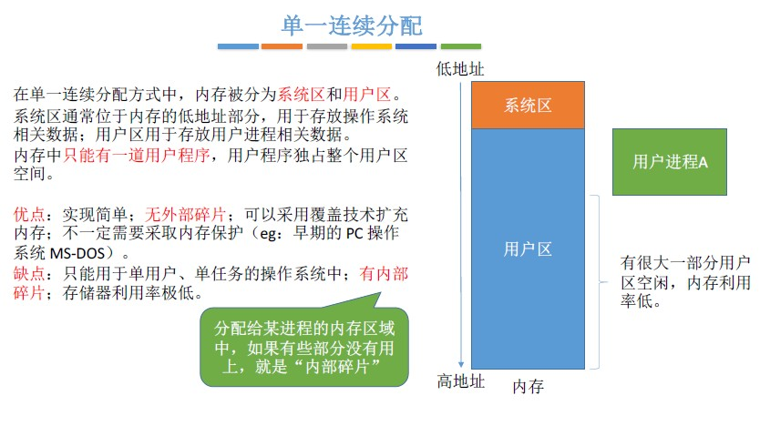

##### ② 固定分区分配（连续分配管理方式）

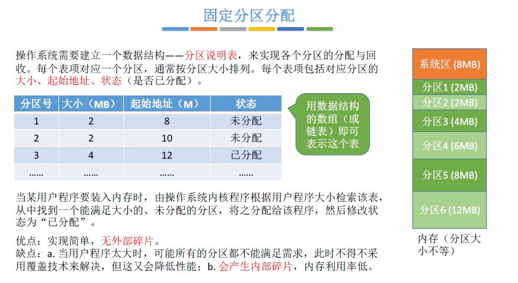

##### ③ 动态分区分配（连续分配管理方式）

动态分区分配又称为可变分区分配。这种分配方式不会预先划分内存分区，而是在进程装入内存时，根据进程的大小动态地建立分区，并使分区的大小正好适合进程的需要。因此系统分区的大小和数目是可变的。

- 系统要用什么样的数据结构记录内存的使用情况？空闲分区表，空闲分区链

- 当很多个空闲分区都能满足需求时，应该选择哪个分区进行分配？**动态分区分配算法**

- 如何进行分区的分配与回收操作？相邻的空闲分区要合并

> 动态分区分配没有内部碎片，但是有外部碎片。
>
> 内部碎片，分配给某进程的内存区域中，如果有些部分没有用上。
> 外部碎片，是指内存中的某些空闲分区由于太小而难以利用
>
> 如果内存中空闲空间的总和本来可以满足某进程的要求，但由于进程需要的是一整块连续的内存空间，因此这些“碎片”不能满足进程的需求。可以通过紧凑（拼凑，Compaction）技术来解决外部碎片。

#### 内存空间的扩充：覆盖与交换

##### 覆盖技术：

用来解决“程序大小超过物理内存总和”的问题

覆盖技术的思想：将程序分为多个段（多个模块）。

常用的段常驻内存，不常用的段在需要时调入内存。

内存中分为一个“固定区”和若干个“覆盖区”。
需要常驻内存的段放在“固定区”中，调入后就不再调出（除非运行结束）
不常用的段放在“覆盖区”，需要用到时调入内存，用不到时调出内存。

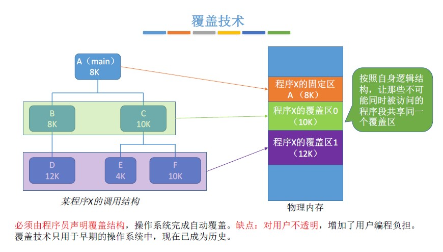

##### 交换技术

交换（对换）技术的设计思想：内存空间紧张时，系统将内存中某些进程暂时换出外存，把外存中某些已具备运行条件的进程换入内存（进程在内存与磁盘间动态调度）

中级调度（内存调度），就是要决定将哪个处于挂起状态的进程重新调入内存。

暂时换出外存等待的进程状态为挂起状态（挂起态，suspend）
挂起态又可以进一步细分为就绪挂起、阻塞挂起两种状态

#### 地址转换

采用三种装入方式，实现逻辑地址到绝对地址的转换

- 绝对装入：编译时产生绝对地址
- 静态重定位（可重定位装入）：装入时将逻辑地址转换为物理地址
- 动态重定位（动态运行时装入）：运行时将逻辑地址转换为物理地址，需设置重定位寄存器

 

#### 内存保护

- 方式一：在CPU中设置一对上、下限寄存器，存放进程的上、下限地址。进程的指令要访问某个地址时，CPU检查是否越界。

- 方式二：采用重定位寄存器（又称基址寄存器）和界地址寄存器（又称限长寄存器）进行越界检查。重定位寄存器中存放的是进程的起始物理地址。界地址寄存器中存放的是进程的最大逻辑地址。

### 4.动态分区分配算法（连续分配管理方式）

#### 首次适应算法

算法思想：每次都从低地址开始查找，找到第一个能满足大小的空闲分区。

如何实现：**空闲分区以地址递增的次序排列**。每次分配内存时顺序查找空闲分区链（或空闲分区表），找到大小能满足要求的第一个空闲分区。

#### 最佳适应算法

算法思想：由于动态分区分配是一种连续分配方式，为各进程分配的空间必须是连续的一整片区域。因此为了保证当“大进程”到来时能有连续的大片空间，可以尽可能多地留下大片的空闲区，即，优先使用更小的空闲区。

如何实现：空闲分区**按容量递增次序链接**。每次分配内存时顺序查找空闲分区链（或空闲分区表），找到大小能满足要求的第一个空闲分区，并且进行空闲分区分配后又重新进行分区容量的排序。

缺点：每次都选最小的分区进行分配，会留下越来越多的、很小的、难以利用的内存块。因此这种方法会产生很多的外部碎片。

#### 最坏适应算法

又称最大适应算法（Largest Fit）
算法思想：为了解决最佳适应算法的问题——即留下太多难以利用的小碎片，可以在每次分配时优先使用最大的连续空闲区，这样分配后剩余的空闲区就不会太小，更方便使用。

如何实现：空闲分区**按容量递减次序链接**。每次分配内存时顺序查找空闲分区链（或空闲分区表），找到大小能满足要求的第一个空闲分区，并且进行空闲分区分配后又重新进行分区容量的排序。

缺点：每次都选最大的分区进行分配，虽然可以让分配后留下的空闲区更大，更可用，但是这种方式会导致较大的连续空闲区被迅速用完。如果之后有“大进程”到达，就没有内存分区可用了。

#### 邻近适应算法

算法思想：首次适应算法每次都从链头开始查找的。这可能会导致低地址部分出现很多小的空闲分区，而每次分配查找时，都要经过这些分区，因此也增加了查找的开销。如果每次都从上次查找结束的位置开始检索，就能解决上述问题。

如何实现：空闲分区以地址递增的顺序排列（可排成一个循环链表）。每次分配内存时从上次查找结束的位置开始查找空闲分区链（或空闲分区表），找到大小能满足要求的第一个空闲分区。

> **首次适应算法**每次都要从头查找，每次都需要检索低地址的小分区。但是这种规则也决定了当低地址部分有更小的分区可以满足需求时，会更有可能用到低地址部分的小分区，也会更有可能把高地址部分的大分区保留下来（最佳适应算法的优点）
>
> **邻近适应算法**的规则可能会导致无论低地址、高地址部分的空闲分区都有相同的概率被使用，也就导致了高地址部分的大分区更可能被使用，划分为小分区，最后导致无大分区可用（最大适应算法的缺点）
>
> 综合来看，四种算法中，首次适应算法的效果反而更好

### 5.基本分页式存储管理（非连续分配管理方式）

#### 分页

将内存空间分为一个个大小相等的分区（比如：每个分区4KB），每个分区就是一个“页框”（页框=页帧=内存块=物理
块=物理页面）。每个页框有一个编号，即“页框号”（页框号=页帧号=内存块号=物理块号=物理页号），页框号从0开始。

将进程的逻辑地址空间也分为与页框大小相等的一个个部分，每个部分称为一个“页”或“页面” 。每个页面也有一个编号，即“页号”，页号也是从0开始。

> 操作系统**以页框为单位为各个进程分配**内存空间。进程的每个页面分别放入一个页框中。也就是说，**进程的页面与内存的页框有一一对应的关系**。
> 各个页面不必连续存放，可以放到不相邻的各个页框中。
>
> (注：进程的最后一个页面可能没有一个页框那么大。也就是说，分页存储有可能产生内部碎片，因此页框不能太大，否则可能产生过大的内部碎片造成浪)

#### 页表

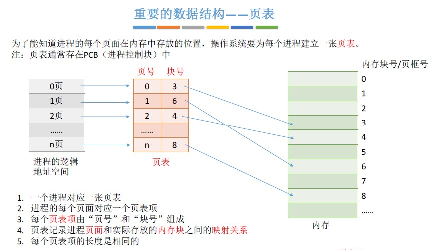

#### 如何实现地址的转换

如果要访问逻辑地址A，则

1. 确定逻辑地址A 对应的“页号”P
2. 找到P号页面在内存中的起始地址（需要查页表）
3. 确定逻辑地址A 的“页内偏移量”W

逻辑地址A 对应的物理地址= P号页面在内存中的起始地址+页内偏移量W

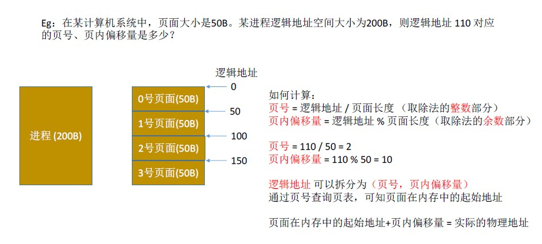

如果每个页面大小为2KB，用二进制数表示逻辑地址，则末尾K 位即为页内偏移量，其余部分就是页号

### 6.基本分段存储管理方式（非连续分配管理方式）

#### 分段

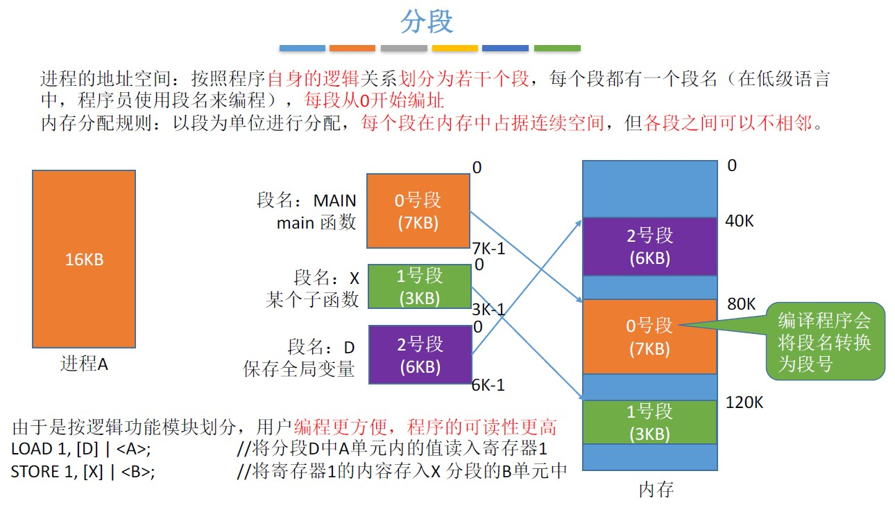

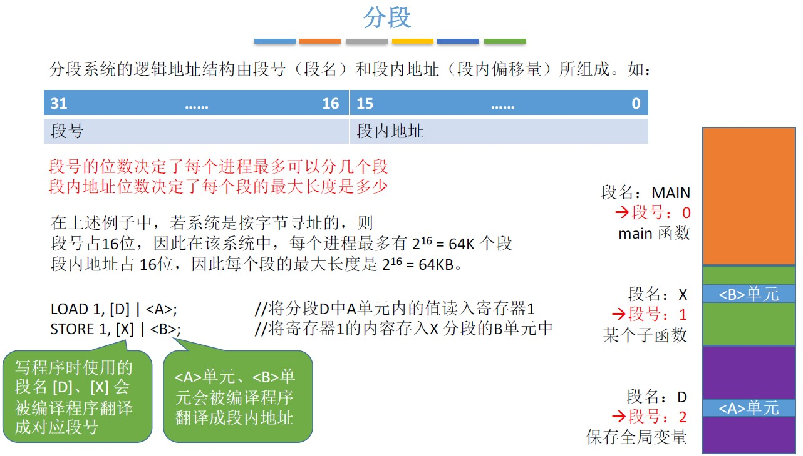

#### 段表

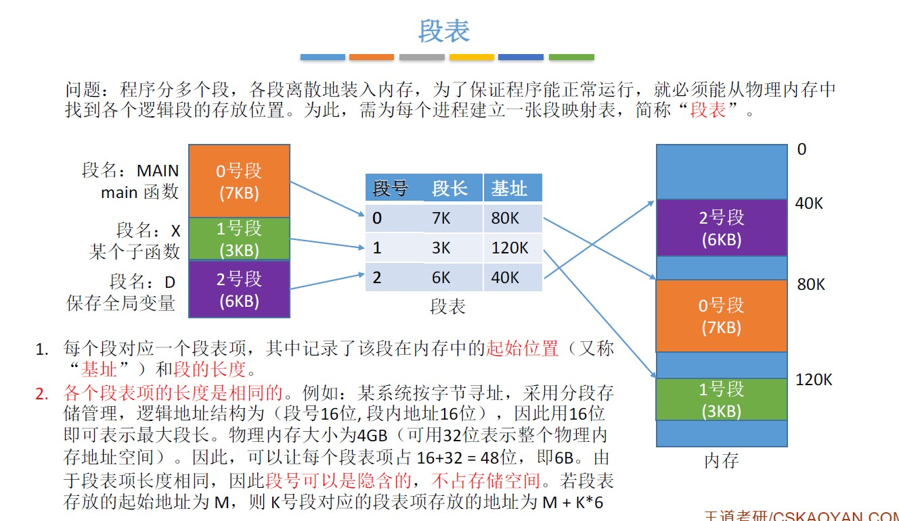

### 7.分段、分页管理的对比

- 页是信息的物理单位。分页的主要目的是为了实现离散分配，提高内存利用率。分页仅仅是系统管理上的需要，完全是系统行为，对用户是不可见的。

- 段是信息的逻辑单位。分段的主要目的是更好地满足用户需求。一个段通常包含着一组属于一个逻辑模块的信息。分段对用户是可见的，用户编程时需要显式地给出段名。

页的大小固定且由系统决定。段的长度却不固定，决定于用户编写的程序。

- 分页的用户进程地址空间是一维的，程序员只需给出一个记忆符即可表示一个地址。
- 分段的用户进程地址空间是二维的，程序员在标识一个地址时，既要给出段名，也要给出段内地址。

## 二、虚拟内存

### 1.什么是虚拟内存

基于局部性原理，在程序装入时，可以将程序中很快会用到的部分装入内存，暂时用不到的部分留在外存，就可以让程序开始执行。

在程序执行过程中，当所访问的信息不在内存时，由操作系统负责将所需信息从外存调入内存，然后继续执行程序。

若内存空间不够，由操作系统负责将内存中暂时用不到的信息换出到外存。

在操作系统的管理下，在用户看来似乎有一个比实际内存大得多的内存，这就是虚拟内存

易混知识点：

- 虚拟内存的最大容量是由计算机的地址结构（CPU寻址范围）确定的

- 虚拟内存的实际容量= min（内存和外存容量之和，CPU寻址范围）

  

如：某计算机地址结构为32位，按字节编址，内存大小为512MB，外存大小为2GB。
则虚拟内存的最大容量为232 B = 4GB
虚拟内存的实际容量= min (232B, 512MB+2GB) = 2GB+512MB

#### 虚拟内存的实现

- 请求分页存储管理
- 请求分段存储管理
- 请求段页式存储管理

### 2.请求分页存储管理

请求分页存储管理：①页表机制，②缺页中断机构，③地址变换机构

请求分页存储管理与基本分页存储管理的主要区别：

- 在程序执行过程中，当所访问的信息不在内存时，由操作系统负责将所需信息从外存调入内存，然后继续执行程序。
- 若内存空间不够，由操作系统负责将内存中暂时用不到的信息换出到外存

#### 页表机制

与基本分页管理相比，请求分页管理中，为了实现“请求调页”，操作系统需要知道每个页面是否已经调入内存；如果还没调入，那么也需要知道该页面在外存中存放的位置。

当内存空间不够时，要实现“页面置换”，操作系统需要通过某些指标来决定到底换出哪个页面；当换出到外存时，有的页面没有被修改过，就不用再浪费时间写回外存。有的页面修改过，就需要将外存中的旧数据覆盖，因此，操作系统也需要记录各个页面是否被修改的信息。

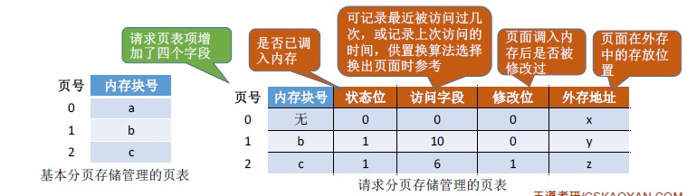

#### 缺页中断机构

在请求分页系统中，每当要访问的页面不在内存时，便产生一个**缺页中断**，然后由操作系统的缺页中断处理程序处理中断。

此时缺页的进程阻塞，放入阻塞队列，调页完成后再将其唤醒，放回就绪队列。

如果内存中有空闲块，则为进程分配一个空闲块，将所缺页面装入该块，并修改页表中相应的页表项。

如果内存中没有空闲块，则由页面置换算法选择一个页面淘汰，若该页面在内存期间被修改过，则要将其写回外存。未修改过的页面不用写回外存。

#### 地址变换机构

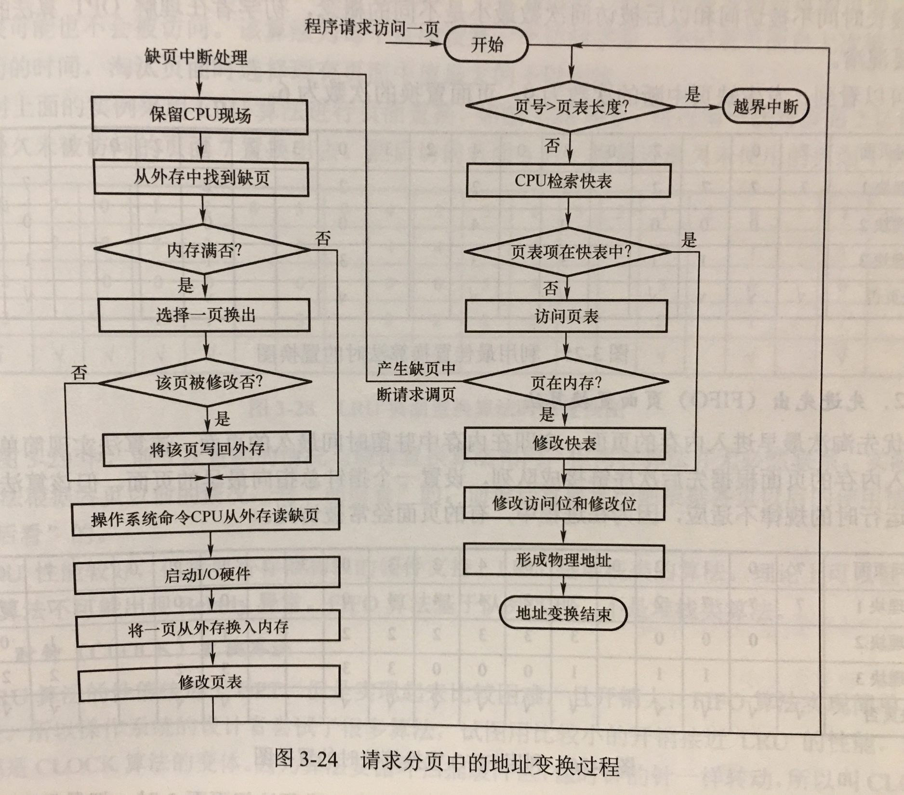

页面调入内存后，需要修改慢表，同时也需要将表项复制到快表中

在具有快表机构的请求分页系统中，访问一个逻辑地址时，若发生缺页，则地址变换步骤是：

​	查快表(未命中)——查慢表(发现未调入内存)——调页(调入的页面对应的表项会直接加入快表)——查快表(命中)——访问目标内存单元

### 3.页面置换算法

- 最佳置换算法（OPT）
- 先进先出置换算法（FIFO）
- 最近最久未使用置换算法（LRU）
- 时钟置换算法（CLOCK）
- 改进型的时钟置换算法

#### 最佳置换算法

在当前页面向后查找，找到最后才会访问的那个页面（或者永远不会被访问的页面）

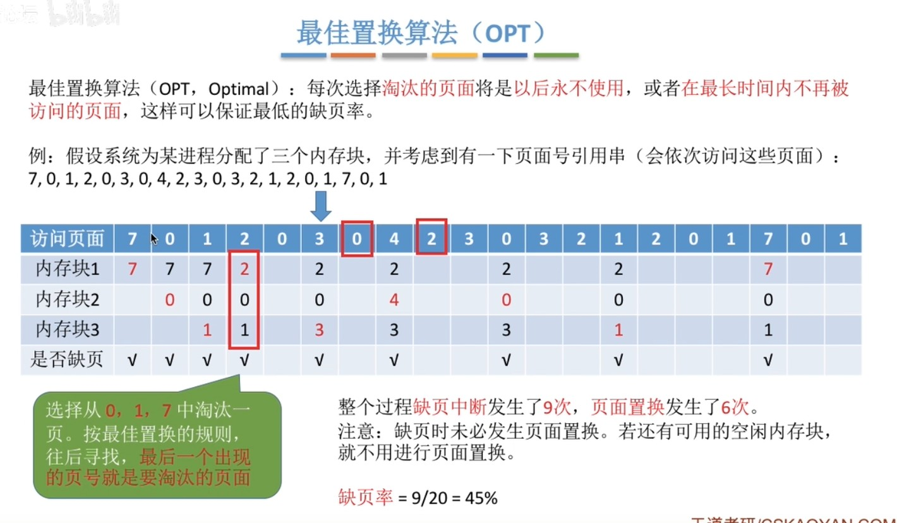

#### 先进先出置换算法（FIFO）

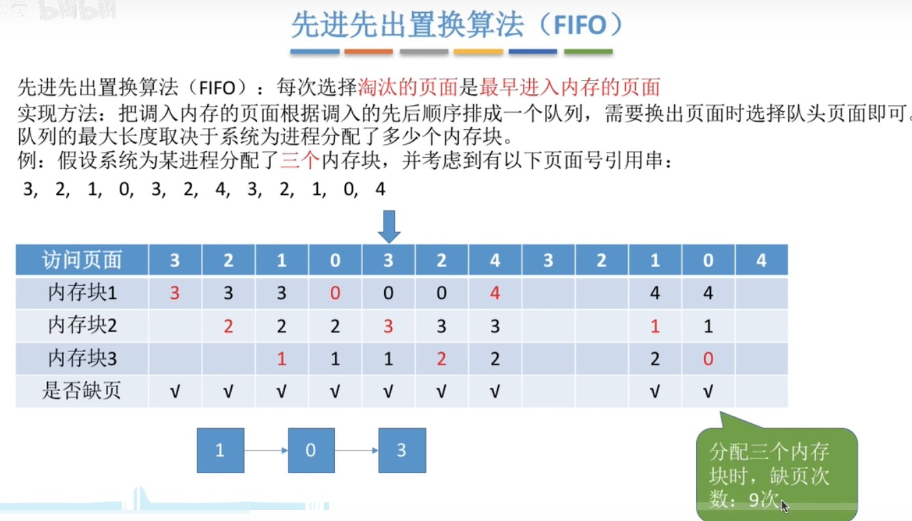

#### 最近最久未使用置换算法（LRU）

在当前页面向前访问，找到最久之前被访问的页面。

注意要区分：最佳置换算法（向后找） 和 最近最久未使用置换算法（向前找）

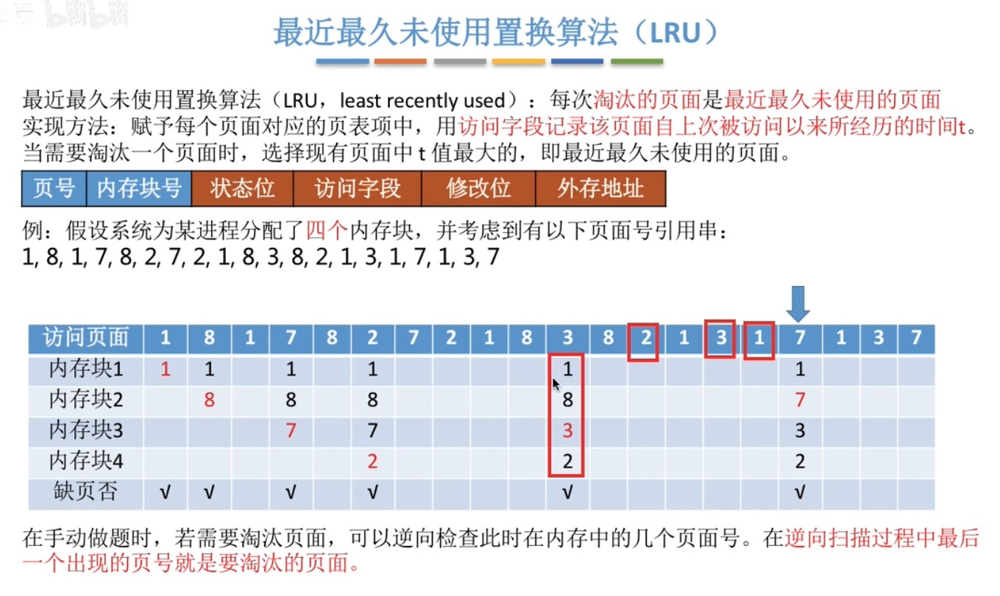

#### 时钟置换算法（CLOCK）

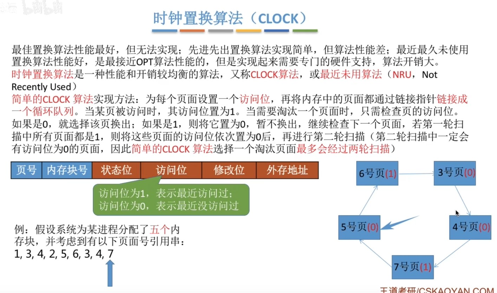

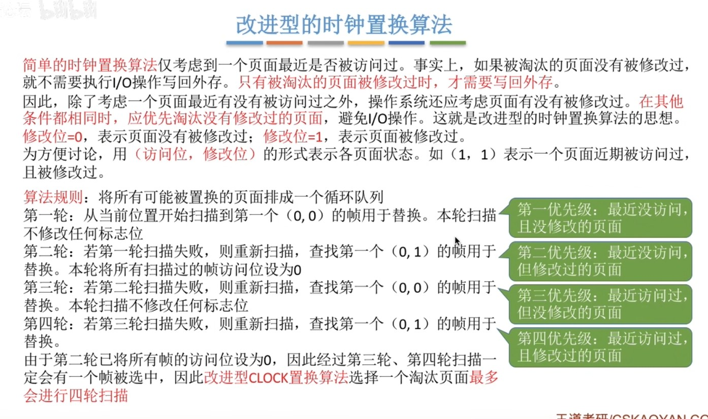