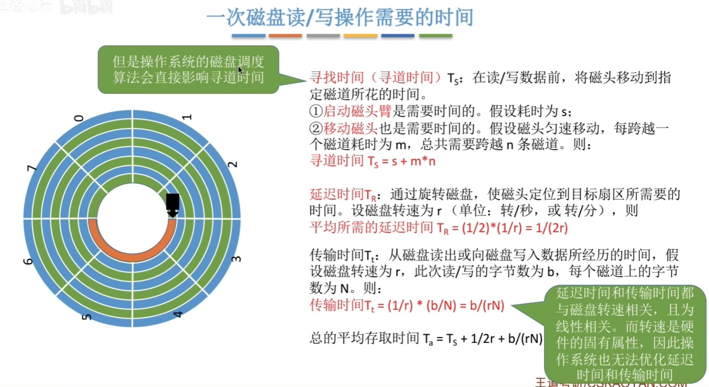
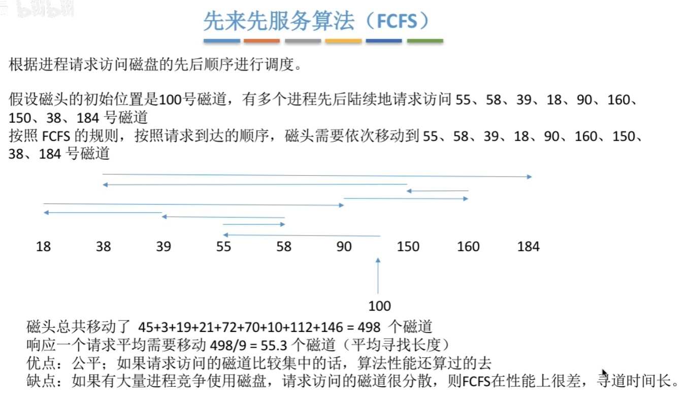
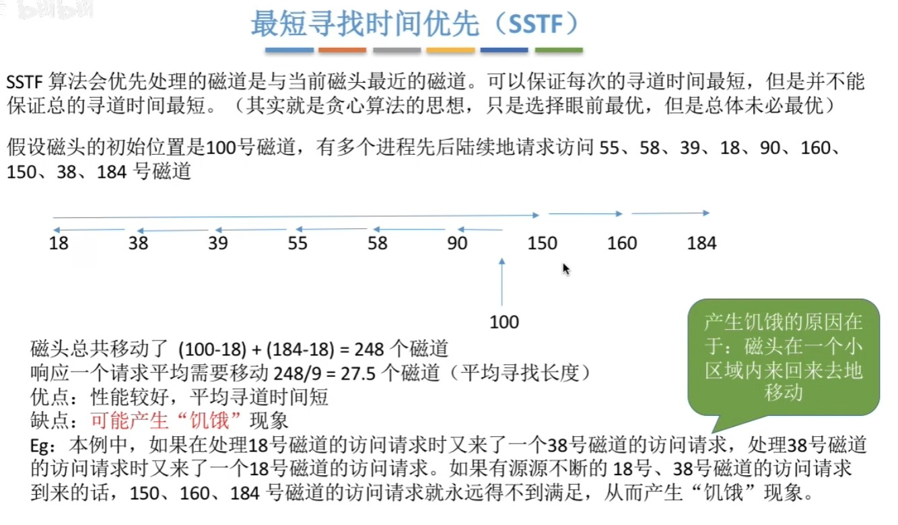
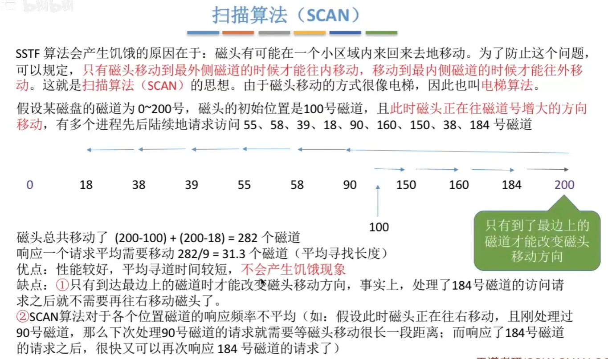
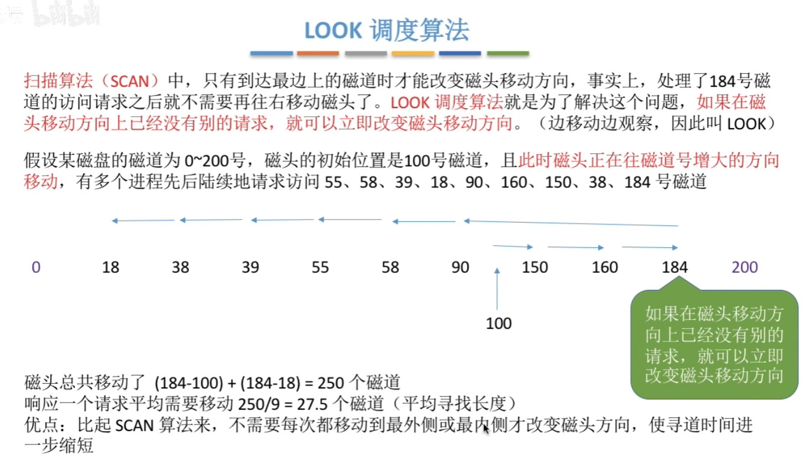
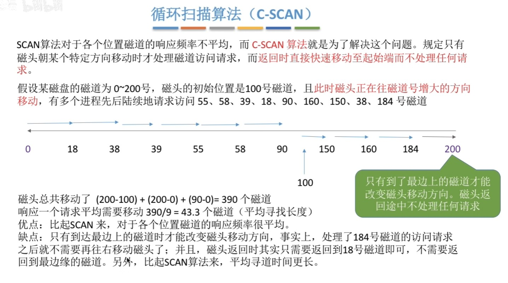
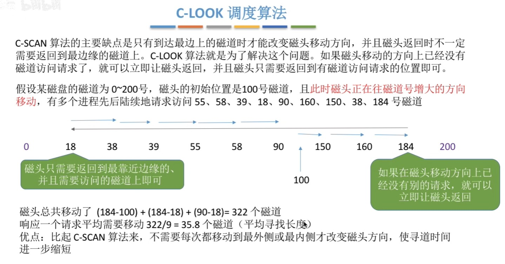

# 磁盘调度算法

[TOC]

## 介绍

一次磁盘读/写操作需要的时间

- 寻道时间
- 延迟时间
- 传输时间

**对于传输时间Tt**：每个磁道要可存N字节的数据，因此b字节的数据需要b/N个磁道才能存储。而读/写一个磁道所需的时间刚好又是转一圈所需要的时间1/r.

因为延迟时间和传输时间都与硬件有关，所以**操作系统唯一能影响的是寻道时间**。

## 先来先服务（FCFS）

## 最短寻找时间优先（SSTF）

## 扫描算法（SCAN）

## LOOK调度算法

LOOK 算法，它的工作方式，磁头在每个方向上仅仅**移动到最远的请求位置**，然后立即反向移动，而**不需要移动到磁盘的最始端或最末端**

## 循环扫描算法（C-SCAN）

**扫描算法和循环扫描算法，都是磁头移动到磁盘「最始端或最末端」才开始调换方向。**

## C-LOOK调度算法

