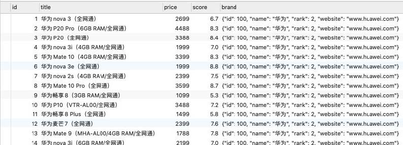
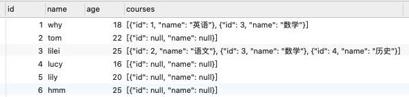

[TOC]

## 写在前面

这里是小飞侠Pan🥳，立志成为一名优秀的前端程序媛！！！

本篇博客收录于我的[github](https://github.com/mengqiuleo)前端笔记仓库中，持续更新中，欢迎star~

👉[https://github.com/mengqiuleo/myNote](https://github.com/mengqiuleo/myNote)

## 将查询结果转为对象或者数组

在真实开发中，实际上某些查询结果应该放入到一个对象中

**JSON_OBJECT：（）中是key-value的形式**

```mysql
SELECT products.id as id, products.title as title, products.price as price, products.score as score,
	JSON_OBJECT('id', brand.id, 'name', brand.name, 'rank', brand.phoneRank, 'website', brand.website) as brand
FROM products LEFT JOIN brand ON products.brand_id = brand.id;
```




在多对多关系中，我们希望查询到的是一个数组：

- 比如一个学生的多门课程信息，应该是放到一个数组中的；
- 数组中存放的是课程信息的一个个对象；
- 这个时候我们要**JSON_ARRAYAGG**和**JSON_OBJECT**结合来使用；



```sql
SELECT stu.id, stu.name, stu.age,
	JSON_ARRAYAGG(JSON_OBJECT('id', cs.id, 'name', cs.name)) as courses
FROM students stu
LEFT JOIN students_select_courses ssc ON stu.id = ssc.student_id
LEFT JOIN courses cs ON ssc.course_id = cs.id
GROUP BY stu.id;
```


## mysql2的使用

安装mysql2: 

```
npm install mysql2
```


简单使用：

```js
const mysql = require('mysql2');

// 1.创建数据库连接
const connection = mysql.createConnection({
  host: 'localhost',
  port: 3306,
  database: 'coderhub',
  user: 'root',
  password: 'Coderwhy888.'
});

// 2.执行SQL语句
const statement = `
  SELECT * FROM products WHERE price > 6000;
`
connection.query(statement, (err, results, fields) => {
  console.log(results);
});
```

如果我们想要在拿到数据后停止服务，可以在回调函数中写上：

```
connection.end()
```

完整代码：

```js
connection.query(statement, (err, results, fields) => {
  console.log(results);
  connection.end();
});
```


### Prepared Statement(预处理语句)

提高性能：将创建的语句模块发送给MySQL，然后MySQL编译（解析、优化、转换）语句模块，并且存储
它但是不执行，之后我们在真正执行时会给`?`提供实际的参数才会执行；就算多次执行，也只会编译一次，所以性能是更高的；

强调：如果再次执行该语句，它将会从LRU（Least Recently Used） Cache中获取获取，省略了编译statement的时间来提高性能。

```js
// 2.执行SQL语句: 使用 ？来对参数进行占位
const statement = `
  SELECT * FROM products WHERE price > ? AND score > ?;
`
connection.execute(statement, [6000, 7], (err, results) => {
  console.log(results);
});
```


### Connection Pools(连接池)

前面我们是创建了一个连接（connection），但是如果我们有多个请求的话，该连接很有可能正在被占用，那么我们是否需要每次一个请求都去创建一个新的连接呢？

- 事实上，mysql2给我们提供了连接池（connection pools）；
- 连接池可以在需要的时候自动创建连接，并且创建的连接不会被销毁，会放到连接池中，后续可以继续使用；
- 我们可以在创建连接池的时候设置LIMIT，也就是最大创建个数；

```js
const mysql = require('mysql2');

// 1.创建连接池
const connections = mysql.createPool({
  host: 'localhost',
  port: 3306,
  database: 'coderhub',
  user: 'root',
  password: 'Coderwhy888.',
  connectionLimit: 10
});

// 2.使用连接池
const statement = `
  SELECT * FROM products WHERE price > ? AND score > ?;
`
connections.execute(statement, [6000, 7], (err, results) => {
  console.log(results);
});

```


### Promise方式

```js
const mysql = require('mysql2');

// 1.创建连接池
const connections = mysql.createPool({
  host: 'localhost',
  port: 3306,
  database: 'coderhub',
  user: 'root',
  password: 'Coderwhy888.',
  connectionLimit: 10
});

// 2.使用连接池
const statement = `
  SELECT * FROM products WHERE price > ? AND score > ?;
`
connections.promise().execute(statement, [6000, 7]).then(([results,fields]) => {
  console.log(results);
}).catch(err => {
  console.log(err);
});

```


## sequelize

**对象关系映射(ORM)**:是一种程序设计的方案：

- 从效果上来讲，它提供了一个可在编程语言中，**使用虚拟对象数据库的效果**；

Node当中的ORM我们通常使用的是sequelize;

- Sequelize是用于Postgres，MySQL，MariaDB，SQLite和Microsoft SQL Server的基于Node.js 的ORM；
- 它支持非常多的功能；

如果我们希望将Sequelize和MySQL一起使用，那么我们需要先安装两个东西：

- mysql2：sequelize在操作mysql时使用的是mysql2；

- sequelize：使用它来让对象映射到表中；

  ```
  npm install sequelize mysql2
  ```

  

### Sequelize的使用

Sequelize的连接数据库：

- 第一步：创建一个Sequelize的对象，并且指定数据库、用户名、密码、数据库类型、主机地址等；
- 第二步：测试连接是否成功；

```js
const { Sequelize } = require('sequelize');

const sequelize = new Sequelize('coderhub', 'root', 'Coderwhy888.', {
  host: 'localhost',
  dialect: 'mysql'//连接的数据库类型：mysql，mongoose
});

sequelize.authenticate().then(() => {
  console.log("连接数据库成功~");
}).catch(err => {
  console.log("连接数据库失败~", err);
});

```


### Sequelize的单表操作

```js
const { Sequelize, DataTypes, Model, Op } = require('sequelize');

const sequelize = new Sequelize("coderhub", 'root', 'Coderwhy888.', {
  host: 'localhost',
  dialect: 'mysql'
})

//1.首先我们需要将数据库中的一张表映射成一个class类
class Product extends Model {}
Product.init({
  id: {
    type: DataTypes.INTEGER,
    primaryKey: true,//主键
    autoIncrement: true//自动增长
  },
  title: {
    type: DataTypes.STRING,
    allowNotNull: false//是否可以为空
  },
  price: DataTypes.DOUBLE,
  score: DataTypes.DOUBLE
}, {//与数据库的表进行映射的配置
  tableName: 'products',
  createdAt: false,
  updatedAt: false,
  sequelize
});

//存放操作数据库的代码
async function queryProducts() {
  //1.查询数据库中product表中所有的内容
  const result1 = await Product.findAll({
    where: {//在这里配置条件
      price: {
        [Op.gte]: 5000//意思是价格大于等于5000
        //gte:大于等于，gt:大于，lt:小于，lte:小于等于
      }
    }
  });
  console.log(result1);

  // 2.插入数据
  const result2 = await Product.create({
    title: "三星Nova",
    price: 8888,
    score: 5.5
  });
  console.log(result2);

  // 3.更新数据
  const result3 = await Product.update({
    price: 3688
  }, {
    where: {
      id: 1
    }
  });
  console.log(result3);
}

queryProducts();//执行这个函数可以实现对数据库的操作
```


### Sequelize的一对多操作

```js
const { Sequelize, DataTypes, Model, Op } = require('sequelize');

const sequelize = new Sequelize("coderhub", 'root', 'Coderwhy888.', {
  host: 'localhost',
  dialect: 'mysql'
});

//数据库的第一个表: 主表
class Brand extends Model {};
Brand.init({
  id: {
    type: DataTypes.INTEGER,
    primaryKey: true,
    autoIncrement: true
  },
  name: {
    type: DataTypes.STRING,
    allowNotNull: false
  },
  website: DataTypes.STRING,
  phoneRank: DataTypes.INTEGER
}, {
  tableName: 'brand',
  createdAt: false,
  updatedAt: false,
  sequelize
});

//数据库的第二个表：附表
class Product extends Model {}
Product.init({
  id: {
    type: DataTypes.INTEGER,
    primaryKey: true,
    autoIncrement: true
  },
  title: {
    type: DataTypes.STRING,
    allowNotNull: false
  },
  price: DataTypes.DOUBLE,
  score: DataTypes.DOUBLE,
  brandId: {
    field: 'brand_id',
    type: DataTypes.INTEGER,
    references: {//这张表使用了Brand的id作为外键
      model: Brand,//product这张表使用了Brand这个表，所以product必须放在下面
      key: 'id'
    }
  }
}, {
  tableName: 'products',
  createdAt: false,
  updatedAt: false,
  sequelize
});

// 将两张表联系在一起
Product.belongsTo(Brand, {
  foreignKey: 'brandId'//外键
});

async function queryProducts() {
  const result = await Product.findAll({
    include: { //这里是联合查询：意思是包含别的表的信息
      model: Brand
    }
  });
  console.log(result);
}

queryProducts();
```


### Sequelize的多对多操作

```js
const { Sequelize, DataTypes, Model, Op } = require('sequelize');

const sequelize = new Sequelize("coderhub", 'root', 'Coderwhy888.', {
  host: 'localhost',
  dialect: 'mysql'
});

// Student表
class Student extends Model {}
Student.init({
  id: {
    type: DataTypes.INTEGER,
    primaryKey: true,
    autoIncrement: true
  },
  name: {
    type: DataTypes.STRING,
    allowNotNull: false
  },
  age: DataTypes.INTEGER
}, {
  tableName: 'students',
  createdAt: false,
  updatedAt: false,
  sequelize
});

// Course表
class Course extends Model {}
Course.init({
  id: {
    type: DataTypes.INTEGER,
    primaryKey: true,
    autoIncrement: true
  },
  name: {
    type: DataTypes.STRING,
    allowNotNull: false
  },
  price: DataTypes.DOUBLE
}, {
  tableName: 'courses',
  createdAt: false,
  updatedAt: false,
  sequelize
});

// StudentCourse表：关系表
class StudentCourse extends Model {}
StudentCourse.init({
  id: {
    type: DataTypes.INTEGER,
    primaryKey: true,
    autoIncrement: true
  },
  studentId: {//与Student表建立关系
    type: DataTypes.INTEGER,
    references: {
      model: Student,
      key: 'id'
    },
    field: 'student_id'
  },
  courseId: {//与Course表建立关系
    type: DataTypes.INTEGER,
    references: {
      model: Course,
      key: 'id'
    },
    field: 'course_id'
  }
}, {
  tableName: 'students_select_courses',
  createdAt: false,
  updatedAt: false,
  sequelize
});

// 多对多关系的联系：Student StudentCourse Course
Student.belongsToMany(Course, {
  through: StudentCourse,
  foreignKey: 'studentId',//这里是Student与StudentCourse，所以外键是studentId
  otherKey: 'courseId'//StudentCourse与Course，所以外键是courseId
});

//与上面类似
Course.belongsToMany(Student, {
  through: StudentCourse,
  foreignKey: 'courseId',
  otherKey: 'studentId'
});

async function queryProducts() {
  const result = await Student.findAll({
    include: {//所有学生的选课情况
      model: Course
    }
  });
  console.log(result);
}

queryProducts();

```

