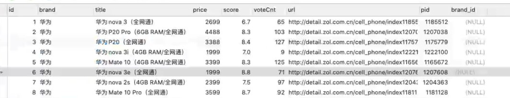
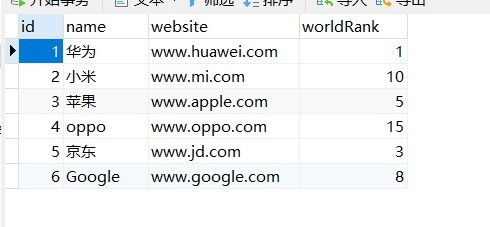
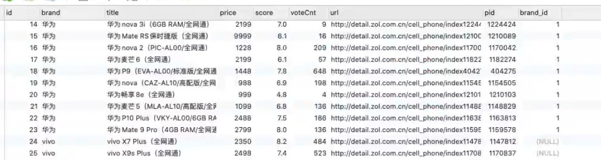
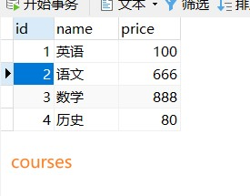
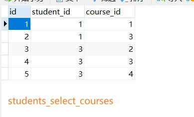
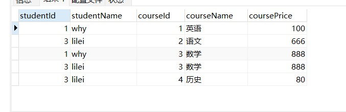
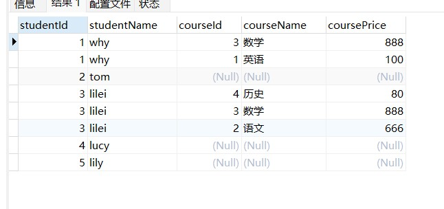
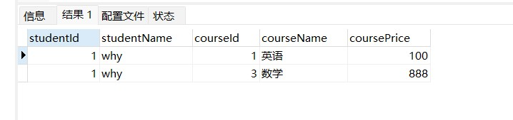
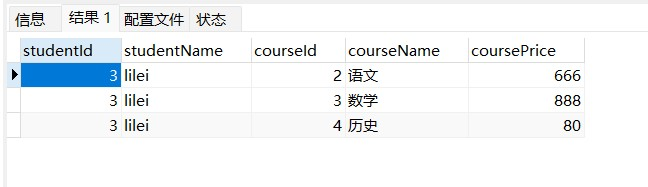
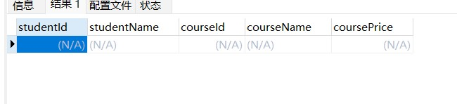

[TOC]


## 写在前面

这里是小飞侠Pan🥳，立志成为一名优秀的前端程序媛！！！

本篇博客收录于我的[github](https://github.com/mengqiuleo)前端笔记仓库中，持续更新中，欢迎star~

👉https://github.com/mengqiuleo/myNote

<hr>

## 多表外键

**我们可以使用外键将两个表连接起来**

比如现在有两张表，一张是products



一张是brand：



**此时我们使用外键将两个表连接起来**

语法：

- 首先创建一个键用于当做外键
- 然后修改这个键为外键

```mysql
# 2.给brand_id设置引用brand中的id的外键约束
# 添加一个brand_id字段
ALTER TABLE `products` ADD `brand_id` INT;

# 修改brand_id为外键
ALTER TABLE `products` ADD FOREIGN KEY(brand_id) REFERENCES brand(id);
```


然后我们现在给新增的外键`brand_id`赋值

```mysql
# 设置brand_id的值
UPDATE `products` SET `brand_id` = 1 WHERE `brand` = '华为';
UPDATE `products` SET `brand_id` = 2 WHERE `brand` = '苹果';
UPDATE `products` SET `brand_id` = 3 WHERE `brand` = '小米';
UPDATE `products` SET `brand_id` = 4 WHERE `brand` = 'oppo';
```

此时我们的products表中的外键就有了值




## 外键存在时更新和删除数据

我们来思考一个问题：

- 如果products中引用的外键被更新了或者删除了，这个时候会出现什么情况呢？

我们来进行一个更新操作：比如将华为的id更新为100

```mysql
UPDATE `brand` SET id = 100 WHERE id = 1;
```

这个时候执行代码是**报错**的。

如何进行更新呢？

先查看外键的表


我们需要修改on delete或者on update的值；

我们可以给更新或者删除时设置几个值：

- RESTRICT（默认属性）：当更新或删除某个记录时，会检查该记录是否有关联的外键记录，有的话会报错的，**不允许**更新或删除；
- NO ACTION：和RESTRICT是一致的，是在SQL标准中定义的；
- CASCADE：当更新或删除某个记录时，会检查该记录是否有关联的外键记录，有的话：
  - 更新：那么会**更新对应的记录**；
  - 删除：那么关联的记录会被一起删除掉；
- SET NULL：当更新或删除某个记录时，会检查该记录是否有关联的外键记录，有的话，将对应的值设置为NULL；


## 修改外键的更新时的动作

第一步：查看表结构：

- 这个时候，我们可以知道外键的名称是products_ibfk_1。

```mysql
# 4.1.获取到目前的外键的名称
SHOW CREATE TABLE `products`;
```

表结构如下：

```mysql
CREATE TABLE `products` (
   `id` int NOT NULL AUTO_INCREMENT,
   `brand` varchar(20) DEFAULT NULL,
   `title` varchar(100) NOT NULL,
   `price` double NOT NULL,
   `score` decimal(2,1) DEFAULT NULL,
   `voteCnt` int DEFAULT NULL,
   `url` varchar(100) DEFAULT NULL,
   `pid` int DEFAULT NULL,
   `brand_id` int DEFAULT NULL,
   PRIMARY KEY (`id`),
   KEY `brand_id` (`brand_id`),
   CONSTRAINT `products_ibfk_1` FOREIGN KEY (`brand_id`) REFERENCES `brand` (`id`)
 ) ENGINE=InnoDB AUTO_INCREMENT=109 DEFAULT CHARSET=utf8mb4 COLLATE=utf8mb4_0900_ai_ci
```

第二步：删除之前的外键：

```mysql
# 删除之前的外键
ALTER TABLE `products` DROP FOREIGN KEY products_ibfk_1;
```

第三步：添加新的外键，并且设置新的action：

```mysql
# 4.2.重新添加外键约束
ALTER TABLE `products` ADD FOREIGN KEY (brand_id) REFERENCES brand(id)
										 ON UPDATE CASCADE 
										 ON DELETE RESTRICT;
```

此时我们修改外键就成功了：

```mysql
UPDATE `brand` SET `id` = 100 WHERE `id` = 1;
```


## 什么是多表查询？

我们现在有两张表，一张是products，一张是brand

在products表中，我们存放了每个产品，并且有一个键用来存放它的品牌

在brand表中，我们存放了每个品牌的相关信息

**如果我们希望查询到产品的同时，显示对应的品牌相关的信息，因为数据是存放在两张表中，所以这个时候就需要进行多表查询**。

在这里我们来看一个demo


在开发中我们会遇到多对多的关系：

- 比如学生可以选择多门课程，一个课程可以被多个学生选择；
- 这种情况我们应该在开发中如何处理呢？

我们先建立好两张表：

```mysql
# 创建学生表
CREATE TABLE IF NOT EXISTS `students`(
  id INT PRIMARY KEY AUTO_INCREMENT,
  name VARCHAR(20) NOT NULL,
  age INT
);

# 创建课程表
CREATE TABLE IF NOT EXISTS `courses`(
  id INT PRIMARY KEY AUTO_INCREMENT,
  name VARCHAR(20) NOT NULL,
  price DOUBLE NOT NULL
);


INSERT INTO `students` (name, age) VALUES('why', 18);
INSERT INTO `students` (name, age) VALUES('tom', 22);
INSERT INTO `students` (name, age) VALUES('lilei', 25);
INSERT INTO `students` (name, age) VALUES('lucy', 16);
INSERT INTO `students` (name, age) VALUES('lily', 20);

INSERT INTO `courses` (name, price) VALUES ('英语', 100);
INSERT INTO `courses` (name, price) VALUES ('语文', 666);
INSERT INTO `courses` (name, price) VALUES ('数学', 888);
INSERT INTO `courses` (name, price) VALUES ('历史', 80);
```





### 创建关系表

我们需要一个关系表来记录两张表中的数据关系：

```mysql
# 创建关系表
CREATE TABLE IF NOT EXISTS `students_select_courses`(
  id INT PRIMARY KEY AUTO_INCREMENT,
  student_id INT NOT NULL,
  course_id INT NOT NULL,
  FOREIGN KEY (student_id) REFERENCES students(id) ON UPDATE CASCADE,
  FOREIGN KEY (course_id) REFERENCES courses(id) ON UPDATE CASCADE
 );
 
# 插入数据 
# why 选修了英文和数学
INSERT INTO `students_select_courses` (student_id, course_id) VALUES (1, 1);
INSERT INTO `students_select_courses` (student_id, course_id) VALUES (1, 3);

# lilei选修了语文和数学和历史
INSERT INTO `students_select_courses` (student_id, course_id) VALUES (3, 2);
INSERT INTO `students_select_courses` (student_id, course_id) VALUES (3, 3);
INSERT INTO `students_select_courses` (student_id, course_id) VALUES (3, 4);
```



- 这里的id是自增的，方便查询
- student_id 是students表中的键
- courses_id 是courses表中的键


### 查询多对多数据(一)

- 起别名时我们可以不加as，直接使用，eg：`stu.id studentId`

```mysql
# 查询所有的学生选择的所有课程
SELECT
  stu.id studentId, stu.name studentName, cs.id courseId, cs.name courseName, 	cs.price coursePrice
FROM `students` stu
JOIN `students_select_courses` ssc
	ON stu.id = ssc.student_id
JOIN `courses` cs
	ON ssc.course_id = cs.id;
```



```mysql
# 查询所有的学生选课情况
SELECT
	stu.id studentId, stu.name studentName, cs.id courseId, cs.name courseName, 	cs.price coursePrice
FROM `students` stu
LEFT JOIN `students_select_courses` ssc
	ON stu.id = ssc.student_id
LEFT JOIN `courses` cs
	ON ssc.course_id = cs.id;
```



### 查询多对多数据(二)

```mysql
# why同学选择了哪些课程
SELECT
	stu.id studentId, stu.name studentName, cs.id courseId, cs.name courseName, 	cs.price coursePrice
FROM `students` stu
JOIN `students_select_courses` ssc
	ON stu.id = ssc.student_id
JOIN `courses` cs
	ON ssc.course_id = cs.id
	WHERE stu.id = 1;
```



```mysql
# lilei同学选择了哪些课程(注意，这里必须用左连接，事实上上面也应该使用的是左连接)
SELECT
	stu.id studentId, stu.name studentName, cs.id courseId, cs.name courseName, 	cs.price coursePrice
FROM `students` stu
LEFT JOIN `students_select_courses` ssc
	ON stu.id = ssc.student_id
LEFT JOIN `courses` cs
	ON ssc.course_id = cs.id
	WHERE stu.id = 3;
```



### 查询多对多数据(三)

```mysql
# 哪些学生是没有选课的
SELECT
	stu.id studentId, stu.name studentName, cs.id courseId, cs.name courseName, 	cs.price coursePrice
FROM `students` stu
LEFT JOIN `students_select_courses` ssc
	ON stu.id = ssc.student_id
LEFT JOIN `courses` cs
	ON ssc.course_id = cs.id
	WHERE cs.id IS NULL;
```


```mysql
# 查询哪些课程没有被学生选择
SELECT
	stu.id studentId, stu.name studentName, cs.id courseId, cs.name courseName, 	cs.price coursePrice
FROM `students` stu
RIGHT JOIN `students_select_courses` ssc
	ON stu.id = ssc.student_id
RIGHT JOIN `courses` cs
	ON ssc.course_id = cs.id
	WHERE stu.id IS NULL;
```



