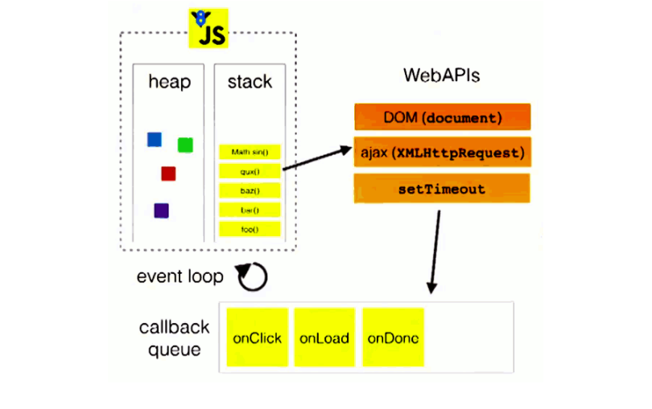
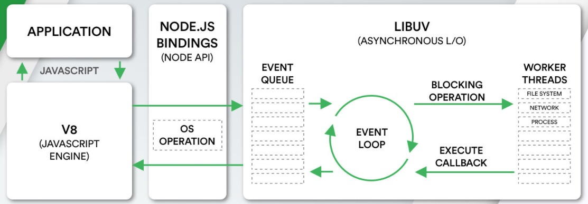

## Event Loop(事件循环)

[TOC]


### Ⅰ基本概念

`javascript从诞生之日起就是一门单线程的非阻塞的脚本语言`。这是由其最初的用途来决定的：`与浏览器交互`。

单线程意味着，javascript代码在执行的任何时候，都只有一个主线程来处理所有的任务。

> `非阻塞`:
>
> 而非阻塞则是当代码需要进行一项异步任务（无法立刻返回结果，需要花一定时间才能返回的任务，如I/O事件）的时候，主线程会挂起（pending）这个任务，然后在异步任务返回结果的时候再根据一定规则去执行相应的回调。


> `单线程是必要的`:
>
> 也是javascript这门语言的基石，原因之一在其最初也是最主要的执行环境——浏览器中，我们需要进行各种各样的dom操作。试想一下 如果javascript是多线程的，那么当两个线程同时对dom进行一项操作，例如一个向其添加事件，而另一个删除了这个dom，此时该如何处理呢？因此，为了保证不会 发生类似于这个例子中的情景，javascript选择只用一个主线程来执行代码，这样就保证了程序执行的一致性。


前面提到javascript的另一个特点是“`非阻塞`”，那么javascript引擎到底是如何实现的这一点呢？

>答案就是——event loop（事件循环）。


#### 事件队列（Task Queue）

JS引擎遇到一个异步事件后并不会一直等待其返回结果，而是会将这个事件挂起，继续执行执行栈中的其他任务,当一个异步事件返回结果后，js会将这个事件加入与当前执行栈不同的另一个队列，我们称之为`事件队列`。

被放入事件队列不会立刻执行其回调，而是`等待当前执行栈中的所有任务都执行完毕， 主线程处于闲置状态时，主线程会去查找事件队列是否有任务`。如果有，那么主线程会从中取出排在第一位的事件，并把这个事件对应的回调放入执行栈中，然后执行其中的同步代码...，如此反复，`这样就形成了一个无限的循环。这就是这个过程被称为“事件循环（Event Loop）”的原因。`



图中的stack表示我们所说的执行栈，web apis则是代表一些异步事件，而callback queue即事件队列。

以上的事件循环过程是一个宏观的表述，实际上因为异步任务之间并不相同，因此他们的执行优先级也有区别。`不同的异步任务被分为两类：微任务（micro task）和宏任务（macro task）`。


### Ⅱ 宏任务(**macro task**)和微任务(**micro task**)

1.JS中用来存储待执行回调函数的队列包含2个不同特定的列队

##### MacroTask（宏任务）

`script`全部代码、`setTimeout`、`setInterval`、`setImmediate`（浏览器暂时不支持，只有IE10支持，具体可见[`MDN`](https://link.juejin.cn?target=https%3A%2F%2Fdeveloper.mozilla.org%2Fzh-CN%2Fdocs%2FWeb%2FAPI%2FWindow%2FsetImmediate)）、`I/O`、`UI Rendering`。


##### MicroTask（微任务）

`Process.nextTick（Node独有）`、`Promise.then catch finally`、`Object.observe(废弃)`、`MutationObserver`、`Async/Await(实际就是promise)`


2.JS执行时会区别这2个队列:

- JS执行引擎首先必须执行所有的`初始化同步任务`代码
- 每次准备取出第一个`宏任务执行前`,都要将所有的`微任务`一个一个取出来执行


> 在一个事件循环中，异步事件返回结果后会被放到一个任务队列中。然而，根据这个异步事件的类型，这个事件实际上会被对应的宏任务队列或者微任务队列中去。并且在当前执行栈为空的时候，主线程会 查看微任务队列是否有事件存在。如果不存在，那么再去宏任务队列中取出一个事件并把对应的回到加入当前执行栈；如果存在，则会依次执行队列中事件对应的回调，直到微任务队列为空，然后去宏任务队列中取出最前面的一个事件，把对应的回调加入当前执行栈...如此反复，进入循环。

**当前执行栈执行完毕时会立刻先处理所有微任务队列中的事件，然后再去宏任务队列中取出一个事件。同一次事件循环中，微任务永远在宏任务之前执行**


代码实例：

```js
setTimeout(() => { 
   console.log('timeout callback1（）')//立即放入宏队列
   Promise.resolve(3).then(
     value => { 
       console.log('Promise onResolved3()', value)//当这个宏任务执行后 立马放入微队列,所以这个微任务执行完后下个宏任务才能执行 
     }
   )
 }, 0)

 setTimeout(() => { 
   console.log('timeout callback2（）') //立即放入宏队列,
 }, 0)

 Promise.resolve(1).then(
   value => { 
     console.log('Promise onResolved1()', value)//立即放入微队列
     setTimeout(() => {
       console.log('timeout callback3（）', value) //立即放入宏任务
     }, 0)
   }
 )

 Promise.resolve(2).then(
   value => { 
     console.log('Promise onResolved2()', value)//立即放入微队列
   }
 )
console.log('同步代码') //同步代码立即执行
```

结果：

```js
'同步代码',
'Promise onResolved1()',
'Promise onResolved2()',
'timeout callback1（）',
'Promise onResolved3()',
'timeout callback2（）',
'timeout callback3（）'
```


### Ⅲ -**node环境下的事件循环机制**

#### ① **与浏览器环境有何不同?**

> 在node中，事件循环表现出的状态与浏览器中大致相同。不同的是node中有一套自己的模型。node中事件循环的实现是依靠的libuv引擎。我们知道node选择chrome v8引擎作为js解释器，v8引擎将js代码分析后去调用对应的node api，而这些api最后则由libuv引擎驱动，执行对应的任务，并把不同的事件放在不同的队列中等待主线程执行。 `因此实际上node中的事件循环存在于libuv引擎中`。

这里我们来给出一个Node的架构图：

- 我们会发现libuv中主要维护了一个EventLoop和worker threads（线程池）；
- EventLoop负责调用系统的一些其他操作：文件的IO、Network、child-processes等



事件循环像是一个桥梁，是连接着应用程序的JavaScript和系统调用之间的通道：

- 无论是我们的文件IO、数据库、网络IO、定时器、子进程，在完成对应的操作后，都会将对应的结果和回调函数放到事件循环（任务队列）中；
  事件循环会不断的从任务队列中取出对应的事件（回调函数）来执行；
-  但是一次完整的事件循环Tick分成很多个阶段：
  - 定时器（Timers）：本阶段执行已经被setTimeout() 和setInterval() 的调度回调函数。
  - 待定回调（Pending Callback）：对某些系统操作（如TCP错误类型）执行回调，比如TCP连接时接收到ECONNREFUSED。
  - idle, prepare：仅系统内部使用。
  - 轮询（Poll）：检索新的I/O 事件；执行与I/O 相关的回调；
  - 检测（check）：setImmediate() 回调函数在这里执行。
  - 关闭的回调函数：一些关闭的回调函数，如：socket.on('close', ...)。


#### ② Node的宏任务和微任务

- 我们会发现从一次事件循环的Tick来说，Node的事件循环更复杂，它也分为微任务和宏任务：
  - 宏任务（macrotask）：setTimeout、setInterval、IO事件、setImmediate、close事件；
  - 微任务（microtask）：Promise的then回调、process.nextTick、queueMicrotask；
- 但是，Node中的事件循环不只是微任务队列和宏任务队列：
  - 微任务队列：
    - next tick que ue：process.nextTick；
    -  other queue：Promise的then回调、queueMicrotask；
  - 宏任务队列：
    - timer queue：setTimeout、setInterval；
    - poll queue：IO事件；
    - check queue：setImmediate；
    - close queue：close事件；


#### ③ Node事件循环的顺序

所以，在每一次事件循环的tick中，会按照如下顺序来执行代码：

- next tick microtask queue；
- other microtask queue；
- timer queue；
- poll queue；
- check queue；
- close queue；
