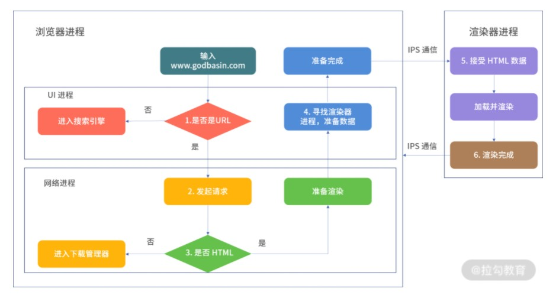

# 【再学浏览器页面渲染】

[TOC]

## 浏览器的内部结构

从结构上来说，浏览器主要包括了八个子系统：用户界面、浏览器引擎、渲染引擎、网络子系统、JavaScript 解释器、XML 解析器、显示后端、数据持久性子系统。

这些子系统组合构成了我们的浏览器。页面的加载和渲染过程，离不开网络子系统、渲染引擎、JavaScript 解释器和浏览器引擎。

## Chrome 多进程架构

Chrome 浏览器采用的多进程架构，主要包括四个进程：

- **浏览器进程**：选项卡之外的所有内容都由浏览器进程处理，浏览器进程则主要用于控制和处理用户可见的 UI 部分（包括地址栏，书签，后退和前进按钮）和用户不可见的隐藏部分（例如网络请求和文件访问）。
- **GPU 进程**：该进程用于完成图像处理任务，同时还支持分解成多个进程进行处理。
- **渲染器进程(浏览器内核,Render进程)**：Chrome 浏览器中支持多个选项卡，其中每个选项卡在单独的渲染器进程中运行，渲染器进程主要用于控制和处理选项卡中的网站内容显示。
- **插件进程**：管理 Chrome 浏览器中的各个插件。

其中，最重要的是**渲染进程**，页面的渲染，JS的执行，事件的循环，都在这个进程内进行。

对于“在浏览器的地址栏中输入 URL，按下回车键，到浏览器渲染页面”这个过程，浏览器内部会通过**浏览器进程和渲染器进程**，进行很多交互逻辑，最终才得以将页面内容显示在屏幕上。

其中，浏览器进程和渲染器进程同样支持多线程，包括以下这些线程。

1. **GUI渲染线程**
   - 负责渲染浏览器界面，解析HTML，CSS，构建DOM树和RenderObject树，布局和绘制等。
   - 当界面需要重绘（Repaint）或由于某种操作引发回流(reflow)时，该线程就会执行
   - 注意，**GUI渲染线程与JS引擎线程是互斥的**，当JS引擎执行时GUI线程会被挂起（相当于被冻结了），GUI更新会被保存在一个队列中**等到JS引擎空闲时**立即被执行。
2. **JS引擎线程**
   - 也称为JS内核，负责处理Javascript脚本程序。（例如V8引擎）
   - JS引擎线程负责解析Javascript脚本，运行代码。
   - JS引擎一直等待着任务队列中任务的到来，然后加以处理，一个Tab页（renderer进程）中无论什么时候都只有一个JS线程在运行JS程序
   - 同样注意，**GUI渲染线程与JS引擎线程是互斥的**，所以如果JS执行的时间过长，这样就会造成页面的渲染不连贯，导致页面渲染加载阻塞。
3. **事件触发线程**
   - 归属于浏览器而不是JS引擎，用来控制事件循环（可以理解，JS引擎自己都忙不过来，需要浏览器另开线程协助）
   - 当JS引擎执行代码块如setTimeOut时（也可来自浏览器内核的其他线程,如鼠标点击、AJAX异步请求等），会将对应任务添加到事件线程中
   - 当对应的事件符合触发条件被触发时，该线程会把事件添加到待处理队列的队尾，等待JS引擎的处理
   - 注意，由于JS的单线程关系，所以这些待处理队列中的事件都得排队等待JS引擎处理（当JS引擎空闲时才会去执行）
4. **定时触发器线程**
   - 传说中的`setInterval`与`setTimeout`所在线程
   - 浏览器定时计数器并不是由JavaScript引擎计数的,（因为JavaScript引擎是单线程的, 如果处于阻塞线程状态就会影响记计时的准确）
   - 因此通过单独线程来计时并触发定时（计时完毕后，添加到事件队列中，等待JS引擎空闲后执行）
   - 注意，W3C在HTML标准中规定，规定要求setTimeout中低于4ms的时间间隔算为4ms。
5. **异步http请求线程**
   - 在XMLHttpRequest在连接后是通过浏览器新开一个线程请求
   - 将检测到状态变更时，如果设置有回调函数，异步线程就**产生状态变更事件**，将这个回调再放入事件队列中。再由JavaScript引擎执行。

## 浏览器多进程的优势

**如果浏览器是单进程，那么某个Tab页崩溃了，就影响了整个浏览器，体验有多差；同理如果是单进程，插件崩溃了也会影响整个浏览器**

相比于单进程浏览器，多进程有如下优点：

- 避免单个page crash影响整个浏览器
- 避免第三方插件crash影响整个浏览器
- 多进程充分利用多核优势
- 方便使用沙盒模型隔离插件等进程，提高浏览器稳定性

## 浏览器中页面的渲染过程

浏览器中页面的渲染过程分为两部分。

- 页面导航：用户输入 URL，浏览器进程进行请求和准备处理。

- 页面渲染：获取到相关资源后，渲染器进程负责选项卡内部的渲染处理。

**页面导航主要依赖浏览器进程。页面的渲染部分，该过程依赖渲染器进程**

### 1. 页面导航过程

当用户在地址栏中输入内容时，浏览器内部会进行以下处理。

1. 首先**浏览器进程的 UI 线程**会进行处理：如果是 URI，则会发起网络请求来获取网站内容；如果不是，则进入搜索引擎。

2. 如果需要发起网络请求，请求过程由**网络线程**（浏览器进程中的）来完成。HTTP 请求响应如果是 HTML 文件，则将数据传递到**渲染器进程**；如果是其他文件则意味着这是下载请求，此时会将数据传递到下载管理器。

3. 如果请求响应为 HTML 内容，此时浏览器应导航到请求站点，**网络线程**便通知 **UI 线程**数据准备就绪。

4. 接下来，UI 线程会寻找一个**渲染器进程**来进行网页渲染。当数据和渲染器进程都准备好后，HTML 数据通过 IPC 从浏览器进程传递到渲染器进程中。

5. 渲染器进程接收 HTML 数据后，将开始加载资源并渲染页面。（这个步骤是页面的渲染部分）

6. 渲染器进程完成渲染后，通过 IPC 通知浏览器进程页面已加载。

如果当前页面跳转到其他网站，浏览器将调用一个单独的渲染进程来处理新导航，同时保留当前渲染进程来处理像unload这类事件。

### 2. 页面渲染过程

整体上，渲染器进程渲染页面的流程基本如下。

- 解析(Parser)：解析 HTML/CSS/JavaScript 代码。

- 布局(Layout)：定位坐标和大小、是否换行、各种position/overflow/z-index属性等计算。

- 绘制(Paint)：判断元素渲染层级顺序。

- 光栅化(Raster)：将计算后的信息转换为屏幕上的像素。

大致流程如下图：

具体渲染过程，在这里👉[【浏览器工作原理与实践笔记一】：宏观视角上的浏览器](https://blog.csdn.net/weixin_52834435/article/details/123625348?spm=1001.2014.3001.5501)

## 注意点：

- 如果浏览器中装了扩展，一个扩展对应一个进程
- 如果两个页面属于同一站点，并且从a页面中打开b页面，那么他们会公用一个渲染进程

> 同一站点(same-site): 根域名+协议，比如baidu.com加上协议https, 包含了该根域名下的所有子域名和不同端口

Chrome的默认策略是，**每个标签对应一个渲染进程，但如果从一个页面打开了新页面，新页面与原页面属于同一站点，那么新页面会复用父页面的渲染进程**，官方把这个默认策略叫 process-per-site-instance. 在这种情况下，一个页面崩溃，会导致同一站点的页面同时崩溃，因为他们使用了同一个渲染进程。

- **在浏览器中打开一个网页相当于新起了一个进程（进程内有自己的多线程）**

  但是，浏览器有时会将多个进程合并（譬如打开多个空白标签页后，会发现多个空白标签页被合并成了一个进程）

- **浏览器渲染进程**（浏览器内核）（内部是多线程的）：**默认每个Tab页面一个进程**，互不影响。主要作用为页面渲染，脚本执行，事件处理等

- GPU进程：最多一个，用于3D绘制等

  

以上笔记均来自拉钩教育的《前端进阶笔记》课程的学习。

笔记参考：[从浏览器多进程到JS单线程，JS运行机制最全面的一次梳理](https://segmentfault.com/a/1190000012925872)