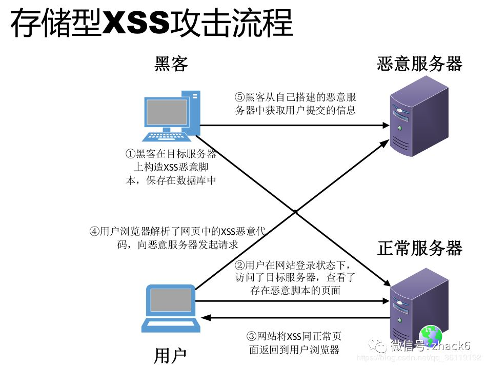

## 浏览器安全

## XSS攻击

### 1.什么是XSS攻击？

**概念**

XSS全程是Cross Site Scripting,为了和"CSS"区分开来，故简称XSS。翻译过来就是"跨站脚本"。XSS攻击是指黑客往HTML文件中或DOM中注入恶意脚本，从而在用户浏览页面时，利用**注入的恶意脚本对用户实施攻击的一种手段**。

最开始的时候，这种攻击是通过跨域实现的，所以叫"跨域脚本"。但是发展到如今，往HTML文件注入恶意代码的方式越来越多，所以是否跨域注入脚本已经不是唯一的注入手段了，但是XSS这个名字却一直保留至今。

XSS 的本质是因为网站没有对恶意代码进行过滤，与正常的代码混合在一起了，浏览器没有办法分辨哪些脚本是可信的，从而导致了恶意代码的执行。

攻击者可以通过这种攻击方式可以进行以下操作：

- 获取页面的数据，如DOM、cookie、localStorage；
- DOS攻击，发送合理请求，占用服务器资源，从而使用户无法访问服务器；
- 破坏页面结构；
- 流量劫持（将链接指向某网站）；
- 可以**窃取Cookie信息**，恶意代码通过document.cookie获取Cookie信息，然后通过XMLHttpRequest加上Cors功能将数据发送给恶意服务器。恶意服务器拿到用户的Cookie信息之后，就可以在其他电脑上模拟用户的登录，然后进行转账等操作。
- 可以**监听用户行为**，恶意JavaScript可以使用"addEventListener"接口监听键盘事件，比如可以获取用户输入的信用卡等信息，将其发送到恶意服务器。黑客掌握了这些信息之后，又可以做很多违法的事情。

- 可以通过**修改DOM**，伪造假的登录窗口，用来欺骗用户输入用户名和密码等信息。
- 还可以**在页面内生成浮窗广告**，这些广告会严重的影响用户体验。

###  2.攻击类型

常见的恶意脚本注入有以下几种，存储型XSS攻击，反射型XSS攻击，基于DOM的XSS攻击。

##### 1）存储型XSS攻击

存储型指的是恶意脚本会存储在目标服务器上，当浏览器请求数据时，脚本从服务器传回并执行。

这种攻击常⻅于带有⽤户保存数据的⽹站功能，如论坛发帖、商品评论、⽤户私信等。

存储型XSS攻击大致需要经过如下步骤:

- 攻击者将恶意代码提交到⽬标⽹站的数据库中。 
- ⽤户打开⽬标⽹站时，⽹站服务端将恶意代码从数据库取出，拼接在 HTML 中返回给浏览器。 
- ⽤户浏览器接收到响应后解析执⾏，混在其中的恶意代码也被执⾏。 
- 恶意代码窃取⽤户数据并发送到攻击者的⽹站，或者冒充⽤户的⾏为，调⽤⽬标⽹站接⼝执⾏攻击者指定的操作。 

##### 2）反射型XSS攻击

反射型指的是攻击者诱导用户访问一个带有恶意代码的 URL 后，服务器端接收数据后处理，然后把带有恶意代码的数据发送到浏览器端，浏览器端解析这段带有 XSS 代码的数据后当做脚本执行，最终完成 XSS 攻击。 

反射型 **XSS** **的攻击步骤：** 

1. 攻击者构造出特殊的 URL，其中包含恶意代码。 
2. ⽤户打开带有恶意代码的 URL 时，⽹站服务端将恶意代码从 URL 中取出，拼接在 HTML 中返回给浏览器。 
3. ⽤户浏览器接收到响应后解析执⾏，混在其中的恶意代码也被执⾏。 
4. 恶意代码窃取⽤户数据并发送到攻击者的⽹站，或者冒充⽤户的⾏为，调⽤⽬标⽹站接⼝执⾏攻击者指定的操作。 

反射型 XSS 漏洞常⻅于通过 URL 传递参数的功能，如⽹站搜索、跳转等。 由于需要⽤户主动打开恶意的 URL 才能⽣效，攻击者往往会结合多种⼿段诱导⽤户点击。  

反射型 XSS 跟存储型 XSS 的区别是：存储型 XSS 的恶意代码存在数据库⾥，反射型 XSS 的恶意代码存在 URL ⾥，Web服务器不会存储反射型XSS攻击的恶意脚本。 

##### 3）基于DOM的XSS攻击

DOM 型指的通过修改页面的 DOM 节点形成的 XSS。

基于DOM的XSS攻击是不会牵涉到页面Web服务器的。具体来说，黑客通过各种手段将恶意脚本注入用户的页面中，比如通过网络劫持在页面，修改页面。这种劫持类型很多，有通过WiFi路由器劫持的，有通过本地恶意软件来劫持的，它们的共同点是在**Web资源传输过程或者在用户使用页面的过程中**修改Web页面的数据。

DOM**型** **XSS** **的攻击步骤：** 

1. 攻击者构造出特殊的 URL，其中包含恶意代码。 
2. ⽤户打开带有恶意代码的 URL。 
3. ⽤户浏览器接收到响应后解析执⾏，前端 JavaScript 取出 URL 中的恶意代码并执⾏。 
4. 恶意代码窃取⽤户数据并发送到攻击者的⽹站，或者冒充⽤户的⾏为，调⽤⽬标⽹站接⼝执⾏攻击者指定的操作。 

对于Dom型XSS跨站脚本攻击的更详细的解释👉，[Dom型XSS跨站脚本攻击和防御](https://blog.csdn.net/stpeace/article/details/107135942?ops_request_misc=%257B%2522request%255Fid%2522%253A%2522164799638416780274169272%2522%252C%2522scm%2522%253A%252220140713.130102334..%2522%257D&request_id=164799638416780274169272&biz_id=0&utm_medium=distribute.pc_search_result.none-task-blog-2~all~sobaiduend~default-2-107135942.142^v3^pc_search_quality_down,143^v4^register&utm_term=dom%E5%9E%8Bxss%E6%94%BB%E5%87%BB&spm=1018.2226.3001.4187)

DOM 型 XSS 跟前两种 XSS 的区别：DOM 型 XSS 攻击中，取出和执⾏恶意代码由浏览器端完成，属于前端JavaScript ⾃身的安全漏洞，⽽其他两种 XSS 都属于服务端的安全漏洞。 

### 3.如何防御XSS攻击

存储型XSS攻击和反射型XSS攻击都需要经过Web服务器来处理，因此可以认为这两种类型的漏洞是服务端的安全漏洞。

而基于DOM的XSS攻击全部都是在浏览器端完成的，因此**基于DOM的XSS攻击是属于前端的安全漏洞。**

- 无论是何种类型的XSS攻击，它们都是要首先**在浏览器中注入恶意脚本，然后再通过恶意脚本将用户信息发送至黑客部署的恶意服务器上。**

  所以要阻止XSS攻击，我们可以通过阻止**恶意脚本的注入**和**恶意消息的发送**来实现。

  服务器对输入的脚本进行过滤和转码

  不管是反射还是存储型XSS攻击，我们都可以在服务器将一些关键的字符进行转码。

  经过转码之后的内容，即使返回页面，脚本也不会执行。

- 可以从浏览器的执行来进行预防，一种是使用纯前端的方式，不用服务器端拼接后返回（不使用服务端渲染）。另一种是对需要插入到 HTML 中的代码做好充分的转义。对于 DOM 型的攻击，主要是前端脚本的不可靠而造成的，对于数据获取渲染和字符串拼接的时候应该对可能出现的恶意代码情况进行判断。

- 使用 CSP ，CSP 的本质是建立一个白名单，告诉浏览器哪些外部资源可以加载和执行，从而防止恶意代码的注入攻击。

  

  实施严格的 CSP 可以有效地防范 XSS 攻击，具体来讲 CSP 有如下几个功能：

  - 限制加载其他域下的资源文件，这样即使黑客插入了一个 JavaScript 文件，这个 JavaScript 文件也是无法被加载的；
  - 禁止向第三方域提交数据，这样用户数据也不会外泄；
  - 禁止执行内联脚本和未授权的脚本；
  - 还提供了上报机制，这样可以帮助我们尽快发现有哪些 XSS 攻击，以便尽快修复问题。

> 1. CSP 指的是内容安全策略，它的本质是建立一个白名单，告诉浏览器哪些外部资源可以加载和执行。我们只需要配置规则，如何拦截由浏览器自己来实现。
> 2. 通常有两种方式来开启 CSP，一种是设置 HTTP 首部中的 Content-Security-Policy，一种是设置 meta 标签的方式 <meta http-equiv="Content-Security-Policy">

- 对一些敏感信息进行保护，比如 cookie 使用 http-only，使得脚本无法获取。也可以使用验证码，避免脚本伪装成用户执行一些操作。

## CSRF攻击

### 1.什么是CSRF攻击

CSRF 攻击指的是**跨站请求伪造攻击**，顾名思义，是伪造请求，冒充用户在站内的正常操作；攻击者诱导用户进入一个第三方网站，然后该网站向被攻击网站发送跨站请求。如果用户在被攻击网站中保存了登录状态，那么攻击者就可以利用这个登录状态，绕过后台的用户验证，冒充用户向服务器执行一些操作。

举例：

​	用户登录微博账号，这时黑客给你一个美女图片的链接，你点击之后进入黑客的网站，他获取你的登录状态，利用你的账号传播一些乱七八糟的信息。

和XSS不同的是，CSRF攻击不需要将恶意代码注入用户的页面，仅仅是利用服务器的漏洞和用户的登录状态来实施攻击。

你这可以这么理解CSRF攻击：攻击者盗用了你的身份，以你的名义发送恶意请求。CSRF能够做的事情包括：以你名义发送邮件，发消息，盗取你的账号，甚至于购买商品，虚拟货币转账......造成的问题包括：个人隐私泄露以及财产安全。

### 2.攻击类型

常见的 CSRF 攻击有三种：

-  GET 类型的 CSRF 攻击，比如在网站中的一个 img 标签里构建一个请求，当用户打开这个网站的时候就会自动发起提交。
-  POST 类型的 CSRF 攻击，比如构建一个表单，然后隐藏它，当用户进入页面时，自动提交这个表单。
-  链接类型的 CSRF 攻击，比如在 a 标签的 href 属性里构建一个请求，然后诱导用户去点击。

### 3.如何防御 CSRF 攻击？

发起CSRF攻击的三个必要条件

1、目标站点一定要有CSRF**漏洞**

2、用户要登录过目标站点，并且在浏览器上**保持有该站点的登录状态。**

3、用户需要打开第三方站点，可以是黑客网站，也可以是一些论坛。

满足三个条件，黑客就可以进行CSRF攻击了，这里需要注意的是，与XSS不同，CSRF攻击不需要注入脚本，因此黑客无法通过CSRF攻击来获取用户页面数据；其最关键一点是要找到服务器的漏洞，所以说对于CSRF攻击我们主要的防护手段是提升服务器的安全性。

**CSRF 攻击可以使用以下方法来防护：**

- **进行同源检测**，服务器根据 http 请求头中 origin 或者 referer 信息来判断请求是否为允许访问的站点，从而对请求进行过滤。当 origin 或者 referer 信息都不存在的时候，直接阻止请求。这种方式的缺点是有些情况下 referer 可以被伪造，同时还会把搜索引擎的链接也给屏蔽了。所以一般网站会允许搜索引擎的页面请求，但是相应的页面请求这种请求方式也可能被攻击者给利用。（Referer 字段会告诉服务器该网页是从哪个页面链接过来的）
- **使用 CSRF Token 进行验证**，服务器向用户返回一个随机数 Token ，当网站再次发起请求时，在请求参数中加入服务器端返回的 token ，然后服务器对这个 token 进行验证。这种方法解决了使用 cookie 单一验证方式时，可能会被冒用的问题，但是这种方法存在一个缺点就是，我们需要给网站中的所有请求都添加上这个 token，操作比较繁琐。还有一个问题是一般不会只有一台网站服务器，如果请求经过负载平衡转移到了其他的服务器，但是这个服务器的 session 中没有保留这个 token 的话，就没有办法验证了。这种情况可以通过改变 token 的构建方式来解决。
- **对** **Cookie 进行**双重验证，服务器在用户访问网站页面时，向请求域名注入一个Cookie，内容为随机字符串，然后当用户再次向服务器发送请求的时候，从 cookie 中取出这个字符串，添加到 URL 参数中，然后服务器通过对 cookie 中的数据和参数中的数据进行比较，来进行验证。使用这种方式是利用了攻击者只能利用 cookie，但是不能访问获取 cookie 的特点。并且这种方法比 CSRF Token 的方法更加方便，并且不涉及到分布式访问的问题。这种方法的缺点是如果网站存在 XSS 漏洞的，那么这种方式会失效。同时这种方式不能做到子域名的隔离。
- **在设置 cookie 属性的时候设置 Samesite ，限制 cookie 不能作为被第三方使用**，从而可以避免被攻击者利用。Samesite 一共有两种模式，一种是严格模式，在严格模式下 cookie 在任何情况下都不可能作为第三方 Cookie 使用，在宽松模式下，cookie 可以被请求是 GET 请求，且会发生页面跳转的请求所使用。

关于CSRF攻击防护的更详细的解释，[点击这里👉](https://blog.csdn.net/weixin_52834435/article/details/123674736?spm=1001.2014.3001.5501)，在这篇文章的第五、六点。