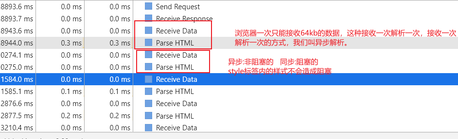

[TOC]


## 一.浏览器组成

浏览器的主要功能是将用户选择的 web 资源呈现出来，它需要从服务器请求资源，并将其显示在浏览器窗口中，资源的格式通常是 HTML，也包括 PDF、image 及其他格式。用户用 URI（Uniform Resource Identifier 统一资源标识符）来指定所请求资源的位置。

### 1. 对浏览器内核的理解

浏览器内核主要分成两部分：

- 渲染引擎的职责就是渲染，即在浏览器窗口中显示所请求的内容。默认情况下，渲染引擎可以显示 html、xml 文档及图片，它也可以借助插件显示其他类型数据，例如使用 PDF 阅读器插件，可以显示 PDF 格式。
- JS 引擎：解析和执行 javascript 来实现网页的动态效果。


最开始渲染引擎和 JS 引擎并没有区分的很明确，后来 JS 引擎越来越独立，内核就倾向于只指渲染引擎。


### 2. 浏览器的主要组成部分

- **⽤户界⾯** - 包括地址栏、前进/后退按钮、书签菜单等。除了浏览器主窗⼝显示的您请求的⻚⾯外，其他显示的各个部分都属于⽤户界⾯。 
- **浏览器引擎** - 在⽤户界⾯和呈现引擎之间传送指令。 
- **呈现引擎** - 负责显示请求的内容。如果请求的内容是 HTML，它就负责解析 HTML 和 CSS 内容，并将解析后的内容显示在屏幕上。 
- **⽹络** - ⽤于⽹络调⽤，⽐如 HTTP 请求。其接⼝与平台⽆关，并为所有平台提供底层实现。 
- **⽤户界⾯后端** - ⽤于绘制基本的窗⼝⼩部件，⽐如组合框和窗⼝。其公开了与平台⽆关的通⽤接⼝，⽽在底层使⽤操作系统的⽤户界⾯⽅法。 
- **JavaScript** **解释器**。⽤于解析和执⾏ JavaScript 代码。 
- **数据存储** - 这是持久层。浏览器需要在硬盘上保存各种数据，例如 Cookie。新的 HTML 规范 (HTML5) 定义了“⽹络数据库”，这是⼀个完整（但是轻便）的浏览器内数据库。 


值得注意的是，和⼤多数浏览器不同，Chrome 浏览器的每个标签⻚都分别对应⼀个呈现引擎实例。每个标签⻚都是⼀个独⽴的进程。


## 二、浏览器渲染原理

### 1.浏览器的渲染过程


浏览器渲染主要有以下步骤：

##### 步骤一：

- ***首先解析收到的文档，根据文档定义构建一棵 DOM 树，DOM 树是由 DOM 元素及属性节点组成的。***


##### 步骤二：

- ***然后对 CSS 进行解析，生成 CSSOM 规则树。***

​		1、把css转换为浏览器内容理解的结构

​			**当渲染引擎接收到CSS文本的时，会执行一个转换操作，将css文本转换为浏览器可以理解的结构--styleSheets。**

​		2、转换样式表中的属性值，使其标准化

​	什么是标准化：

```css
body { font-size: 2em }
p {color:blue;}
span {display: none}
div {font-weight: bold}
div p {color:green;}
div {color:red; }
```

可以看到上面的 CSS 文本中有很多属性值，如 2em、blue、bold，这些类型数值不容易被渲染引擎理解，所以需要将所有值转换为渲染引擎容易理解的、标准化的计算值，这个过程就是属性值标准化。


​		3、计算出DOM树中每一个节点的具体样式

​		涉及到CSS的继承规则和层叠规则。

​		样式计算阶段的目的是为了计算出 DOM 节点中每个元素的具体样式，在计算过程中需要遵守 CSS 的继承和层叠两个规则。这个阶段最终输出的内容是每个 DOM 节点的样式，并被保存在 ComputedStyle 的结构内。


##### 步骤三：

- 根据 DOM 树和 CSSOM 规则树构建渲染树。渲染树的节点被称为渲染对象，渲染对象是一个包含有颜色和大小等属性的矩形，渲染对象和 DOM 元素相对应，但这种对应关系不是一对一的，不可见的 DOM 元素不会被插入渲染树。还有一些 DOM元素对应几个可见对象，它们一般是一些具有复杂结构的元素，无法用一个矩形来描述。


##### 步骤四：

- 当渲染对象被创建并添加到树中，它们并没有位置和大小，所以当浏览器生成渲染树以后，就会根据渲染树来进行布局（也可以叫做回流）。这一阶段浏览器要做的事情是要弄清楚各个节点在页面中的确切位置和大小。通常这一行为也被称为“自动重排”。

**详细过程：**
	因为页面中有很多复杂的效果，如一些复杂的3D转换，页面滚动，或者使用z-index，为了更方便的实现这些效果，**渲染引擎还需要为特定的节点生成专门的图层，并生成一棵对应的图层树(LayerTree)**。这和PS的图层类似，正是这些图层叠加在一起才最终构成了页面图像。

​	

**实际上，浏览器的页面被分成了很多图层，这些图层叠加在一起后，最终合成了页面。**

布局树和图层树的关系


通常情况下，并不是布局树中的每一个节点都包含一个图层，如果一个节点没有对应的图层，那么这个节点就从属于父节点的图层。那么什么情况满足，渲染引擎才会为特定的节点创建新的图层呢?满足一下两个条件中的任意一个，元素就可以被单独提升为一个图层。

1、拥有层叠上下文属性的元素会被提升为单独的一层。

页面是一个二维平面，但层叠上下文能够上HTML元素拥有三维概念，这些HTML元素按自身属性的优先级分布在垂直于这个二维平面的Z轴上,以下情况会作为单独的图层

```css
1、position:fixed
2、css 3d   例如:transform:rotateX(30deg)
3、video
4、canvas
5、有css3动画的节点
```

2、需要剪裁的地方也会被创建为图层

文字内容溢出div的情况

把div的大小限定为200*200像素，而div里面的文字内容比较多，文字所显示的区域肯定会超过200*200的面积，这时候就产生了剪裁，渲染引擎会把裁剪文字内容的一部分用于显示在div区域，下面是运行时的执行结果:


出现这种裁剪情况时，渲染引擎会为文字单独为文字创建一层，如出现滚动条，滚动条也会被提升为单独的层。


##### 步骤五：

- 布局阶段结束后是绘制阶段，遍历渲染树并调用渲染对象的 paint 方法将它们的内容显示在屏幕上，绘制使用 UI 基础组件。


**注意：**这个过程是逐步完成的，为了更好的用户体验，渲染引擎将会尽可能早的将内容呈现到屏幕上，并不会等到所有的html 都解析完成之后再去构建和布局 render 树。它是解析完一部分内容就显示一部分内容，同时，可能还在通过网络下载其余内容。


### 2.相关概念

"重排"，"重绘"和"合成"。

##### ①重排(更新元素的几何属性)

如果你**通过JS或css修改元素的几何位置属性**，如width,height等，那么会触发浏览器的重新布局，解析之后的一系列子阶段，这个过程就叫**重排**。**重排需要更新完整的渲染流水线，所以开销也最大的。**


##### ②重绘(更细元素的绘制属性)

修改元素的背景色，布局阶段不会执行，因为**没有引起几何位置的变换**，所以直接进入绘制，然后执行之后的一系列子阶段，这个过程就叫**重绘**。相较重排操作，**重绘省去了布局和分层阶段，所以执行效率会比重排效率高。**


##### ③直接合成阶段

那如果你更改一个既不要布局也不要绘制的属性，渲染引擎将跳过布局和绘制，只执行后续的合成操作，我们把这个过程叫做**合成。**


使用CSS的transform来实现动画效果，可以避开重排和重绘阶段，直接在非主线程上执行合成动画操作。这样的效率最高，因为是在非主线程上合成的，并没有占用主线程的资源。


## 三.浏览器渲染优化

### **(1)针对JavaScript：**

JavaScript既会阻塞HTML的解析，也会阻塞CSS的解析。因此我们可以对JavaScript的加载方式进行改变，来进行优化：

（1）尽量将JavaScript文件放在body的最后

（2） body中间尽量不要写`<script>`标签

（3）`<script>`标签的引入资源方式有三种，有一种就是我们常用的直接引入，还有两种就是使用 async 属性和 defer 属性来异步引入，两者都是去异步加载外部的JS文件，不会阻塞DOM的解析（尽量使用异步加载）。三者的区别如下：

- **script** 立即停止页面渲染去加载资源文件，当资源加载完毕后立即执行js代码，js代码执行完毕后继续渲染页面；
- **async** 是在下载完成之后，立即异步加载，加载好后立即执行，多个带async属性的标签，不能保证加载的顺序；
- **defer** 是在下载完成之后，立即异步加载。加载好后，如果 DOM 树还没构建好，则先等 DOM 树解析好再执行；如果DOM树已经准备好，则立即执行。多个带defer属性的标签，按照顺序执行。


### **(2)针对CSS：**

css要放在顶部，它不会阻塞html的解析

使用CSS有三种方式：使用**link、@import、内联样式**，其中link和@import都是导入外部样式。它们之间的区别：

- **link**：浏览器会派发一个新的线程(HTTP线程)去加载资源文件，与此同时GUI渲染线程会继续向下渲染代码
- **@import**：GUI渲染线程会暂时停止渲染，去服务器加载资源文件，资源文件没有返回之前不会继续渲染(阻碍浏览器渲染)
- **style**：GUI直接渲染


外部样式如果长时间没有加载完毕，浏览器为了用户体验，会使用浏览器会默认样式，确保首次渲染的速度。所以CSS一般写在headr中，让浏览器尽快发送请求去获取css样式。


所以，在开发过程中，导入外部样式使用link，而不用@import。如果css少，尽可能采用内嵌样式，直接写在style标签中。


**style样式解析**

浏览器一次是加载64kb,现在我们加载的页面过大，所有会分段接收。



Tips: style中的样式不解析完毕，页面不会渲染。

1、由html解析器解析

2、不会阻塞浏览器渲染，但可能出现闪屏现象

3、不会阻塞DOM解析

通过style标签引入会一般解析，一边渲染。


**link引入**

1、link进来的样式，由css解析器去解析，并且是同步解析的。

2、css解析器会阻塞页面的渲染。(link引入的外部样式会阻塞页面渲染)

​		(可以利用这种阻塞避免"闪屏现象")

3、推荐使用link引入样式。

4.阻塞后面的js语句的执行


### **(3)针对DOM树、CSSOM树：**

可以通过以下几种方式来减少渲染的时间：

- HTML文件的代码层级尽量不要太深
- 使用语义化的标签，来避免不标准语义化的特殊处理
- 减少CSSD代码的层级，因为选择器是从左向右进行解析的


### **(4)减少回流与重绘：**

- 操作DOM时，尽量在低层级的DOM节点进行操作
- 不要使用`table`布局， 一个小的改动可能会使整个`table`进行重新布局
- 使用CSS的表达式
- 不要频繁操作元素的样式，对于静态页面，可以修改类名，而不是样式。
- 使用absolute或者fixed，使元素脱离文档流，这样他们发生变化就不会影响其他元素
- 避免频繁操作DOM，可以创建一个文档片段`documentFragment`，在它上面应用所有DOM操作，最后再把它添加到文档中
- 将元素先设置`display: none`，操作结束后再把它显示出来。因为在display属性为none的元素上进行的DOM操作不会引发回流和重绘。
- 将DOM的多个读操作（或者写操作）放在一起，而不是读写操作穿插着写。这得益于**浏览器的渲染队列机制**。


浏览器针对页面的回流与重绘，进行了自身的优化——**渲染队列**


**浏览器会将所有的回流、重绘的操作放在一个队列中，当队列中的操作到了一定的数量或者到了一定的时间间隔，浏览器就会对队列进行批处理。这样就会让多次的回流、重绘变成一次回流重绘。**


将多个读操作（或者写操作）放在一起，就会等所有的读操作进入队列之后执行，这样，原本应该是触发多次回流，变成了只触发一次回流。