# 浏览器缓存 && 浏览器本地存储（总结）

[TOC]

# 一、浏览器缓存

### 相关术语

- 缓存命中率：从缓存中得到数据的请求数与所有请求数的比率。理想状态是越高越好。
- 过期内容：超过设置的有效时间，被标记为“陈旧”的内容。通常过期内容不能用于回复客户端的请求，必须重新向源服务器请求新的内容或者验证缓存的内容是否仍然准备。
- 验证：验证缓存中的过期内容是否仍然有效，验证通过的话刷新过期时间。
- 失效：失效就是把内容从缓存中移除。当内容发生改变时就必须移除失效的内容。

### 1. 对浏览器的缓存机制的理解

**浏览器缓存的全过程：**

- 浏览器第一次加载资源，服务器返回 200，浏览器从服务器下载资源文件，并缓存资源文件与 response header，以供下次加载时对比使用；
- 下一次加载资源时，由于强制缓存优先级较高，先比较当前时间与上一次返回 200 时的时间差，如果没有超过 cache-control 设置的 max-age，则没有过期，并命中强缓存，直接从本地读取资源。如果浏览器不支持HTTP1.1，则使用 expires 头判断是否过期；
- 如果资源已过期，则表明强制缓存没有被命中，则开始协商缓存，向服务器发送带有 If-None-Match 和 If-Modified-Since 的请求；
- 服务器收到请求后，优先根据 Etag 的值判断被请求的文件有没有做修改，Etag 值一致则没有修改，命中协商缓存，返回 304；如果不一致则有改动，直接返回新的资源文件带上新的 Etag 值并返回 200；
- 如果服务器收到的请求没有 Etag 值，则将 If-Modified-Since 和被请求文件的最后修改时间做比对，一致则命中协商缓存，返回 304；不一致则返回新的 last-modified 和文件并返回 200；

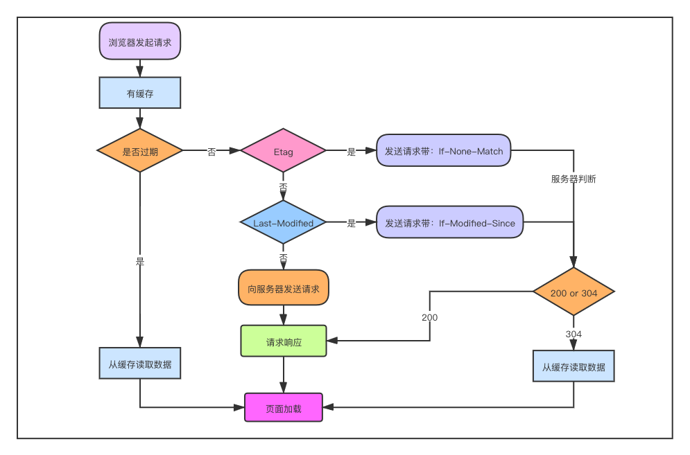

很多网站的资源后面都加了版本号，这样做的目的是：每次升级了 JS 或 CSS 文件后，为了防止浏览器进行缓存，强制改变版本号，客户端浏览器就会重新下载新的 JS 或 CSS 文件 ，以保证用户能够及时获得网站的最新更新。

### 2. 浏览器资源缓存的位置有哪些？

资源缓存的位置一共有 3 种，按优先级从高到低分别是：

1.**Service Worker：**Service Worker 运行在 JavaScript 主线程之外，虽然由于脱离了浏览器窗体无法直接访问 DOM，但是它可以完成离线缓存、消息推送、网络代理等功能。它可以让我们**自由控制**缓存哪些文件、如何匹配缓存、如何读取缓存，并且**缓存是持续性的**。当 Service Worker 没有命中缓存的时候，需要去调用 `fetch` 函数获取  数据。也就是说，如果没有在 Service Worker 命中缓存，会根据缓存查找优先级去查找数据。**但是不管是从 Memory Cache 中还是从网络请求中获取的数据，浏览器都会显示是从 Service Worker 中获取的内容。**

​		关于Service Worker 的解释：[Service Worker 从入门到出门](https://juejin.cn/post/6844903887296528398)

2.**Memory Cache：**Memory Cache 就是内存缓存，它的效率最快，**但是内存缓存虽然读取高效，可是缓存持续性很短，会随着进程的释放而释放。**一旦我们关闭 Tab 页面，内存中的缓存也就被释放了。

3.**Disk Cache：**Disk Cache 也就是存储在硬盘中的缓存，读取速度慢点，但是什么都能存储到磁盘中，比之 Memory Cache **胜在容量和存储时效性上。**在所有浏览器缓存中，Disk Cache 覆盖面基本是最大的。它会根据 HTTP Herder 中的字段判断哪些资源需要缓存，哪些资源可以不请求直接使用，哪些资源已经过期需要重新请求。**并且即使在跨站点的情况下，相同地址的资源一旦被硬盘缓存下来，就不会再次去请求数据。**

**Push Cache：**Push Cache 是 HTTP/2 中的内容，当以上三种缓存都没有命中时，它才会被使用。**并且缓存时间也很短暂，只在会话（Session）中存在，一旦会话结束就被释放。**其具有以下特点：

- 所有的资源都能被推送，但是 Edge 和 Safari 浏览器兼容性不怎么好
- 可以推送 `no-cache` 和 `no-store` 的资源
- 一旦连接被关闭，Push Cache 就被释放
- 多个页面可以使用相同的 HTTP/2 连接，也就是说能使用同样的缓存
- Push Cache 中的缓存只能被使用一次
- 浏览器可以拒绝接受已经存在的资源推送
- 可以给其他域名推送资源

### 3. 协商缓存和强缓存的区别（http缓存、缓存策略、缓存过程）

#### （1）强缓存

使用强缓存策略时，如果缓存资源有效，则直接使用缓存资源，不必再向服务器发起请求。

在Chrome的开发者工具中看到http的返回码是200，但是在Size列会显示为(from cache)。

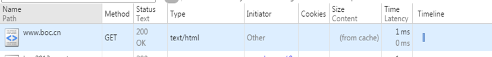

强缓存策略可以通过两种方式来设置，分别是 http 头信息中的 Expires 属性和 Cache-Control 属性。

##### Expires

（1）服务器通过在响应头中添加 Expires 属性，来指定资源的过期时间。在过期时间以内，该资源可以被缓存使用，不必再向服务器发送请求。这个时间是一个绝对时间，它是服务器的时间，因此可能存在这样的问题，就是客户端的时间和服务器端的时间不一致，或者用户可以对客户端时间进行修改的情况，这样就可能会影响缓存命中的结果。

（2）Expires 是 http1.0 中的方式，因为它的一些缺点，在 HTTP 1.1 中提出了一个新的头部属性就是 Cache-Control 属性，它提供了对资源的缓存的更精确的控制。它有很多不同的值，

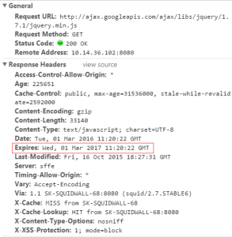

该字段会返回一个时间，比如Expires:Thu,31 Dec 2037 23:59:59 GMT。这个时间代表着这个资源的失效时间，也就是说在2037年12月31日23点59分59秒之前都是有效的，即命中缓存。这种方式有一个明显的缺点，由于失效时间是一个`绝对时间`，所以当客户端本地时间被修改以后，服务器与客户端时间偏差变大以后，就会导致缓存混乱。于是发展出了Cache-Control。

##### Cache-Comtrol

Cache-Control是一个`相对时间`，例如Cache-Control:3600，代表着资源的有效期是3600秒。由于是相对时间，并且都是与客户端时间比较，所以服务器与客户端时间偏差也不会导致问题。
Cache-Control与Expires可以在服务端配置同时启用或者启用任意一个，同时启用的时候Cache-Control优先级高。

`Cache-Control`可设置的字段：

- `public`：设置了该字段值的资源表示可以被任何对象（包括：发送请求的客户端、代理服务器等等）缓存。这个字段值不常用，一般还是使用max-age=来精确控制；
- `private`：设置了该字段值的资源只能被用户浏览器缓存，不允许任何代理服务器缓存。在实际开发当中，对于一些含有用户信息的HTML，通常都要设置这个字段值，避免代理服务器(CDN)缓存；
- `no-cache`：设置了该字段需要先和服务端确认返回的资源是否发生了变化，如果资源未发生变化，则直接使用缓存好的资源；
- `no-store`：设置了该字段表示禁止任何缓存，每次都会向服务端发起新的请求，拉取最新的资源；
- `max-age=`：设置缓存的最大有效期，单位为秒；指定一个时间长度，在这个时间段内缓存是有效的，单位是s。例如设置 Cache-Control:max-age=31536000，也就是说缓存有效期为（31536000 / 24 / 60 * 60）天，第一次访问这个资源的时候，服务器端也返回了 Expires 字段，并且过期时间是一年后。

​		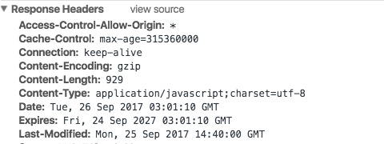

- `s-maxage=`：优先级高于max-age=，仅适用于共享缓存(CDN)，优先级高于max-age或者Expires头；
- `max-stale[=]`：设置了该字段表明客户端愿意接收已经过期的资源，但是不能超过给定的时间限制。

**一般来说只需要设置其中一种方式就可以实现强缓存策略，当两种方式一起使用时，Cache-Control 的优先级要高于 Expires。**

**no-cache和no-store很容易混淆：**

- no-cache 是指先要和服务器确认是否有资源更新，在进行判断。也就是说没有强缓存，但是会有协商缓存；
- no-store 是指不使用任何缓存，每次请求都直接从服务器获取资源。

#### （2）协商缓存

如果命中强制缓存，我们无需发起新的请求，直接使用缓存内容，如果没有命中强制缓存，如果设置了协商缓存，这个时候协商缓存就会发挥作用了。

上面已经说到了，命中协商缓存的条件有两个：

- `max-age=xxx` 过期了
- 值为`no-cache`

使用协商缓存策略时，会先向服务器发送一个请求，**如果资源没有发生修改，则返回一个 304 状态，让浏览器使用本地的缓存副本。如果资源发生了修改，则返回修改后的资源。**

##### Last-Modify/If-Modify-Since

浏览器第一次请求一个资源的时候，服务器返回的header中会加上Last-Modify，Last-modify是一个时间标识该资源的最后修改时间，例如`Last-Modify: Thu,31 Dec 2037 23:59:59 GMT`。

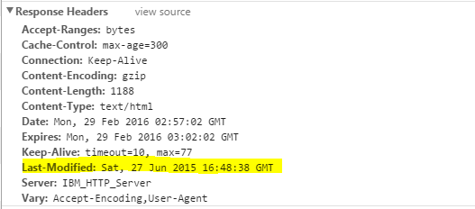

当浏览器再次请求该资源时，发送的请求头中会包含If-Modify-Since，该值为缓存之前返回的Last-Modify。服务器收到If-Modify-Since后，根据资源的最后修改时间判断是否命中缓存。

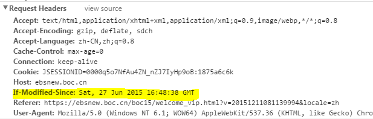

如果命中缓存，则返回http304，并且不会返回资源内容，并且不会返回Last-Modify。由于对比的服务端时间，所以客户端与服务端时间差距不会导致问题。但是有时候通过最后修改时间来判断资源是否修改还是不太准确（资源变化了最后修改时间也可以一致）。于是出现了ETag/If-None-Match。

##### ETag/If-None-Match

与Last-Modify/If-Modify-Since不同的是，Etag/If-None-Match返回的是一个校验码（ETag: entity tag）。ETag可以保证每一个资源是唯一的，资源变化都会导致ETag变化*。ETag值的变更则说明资源状态已经被修改。服务器根据浏览器上发送的If-None-Match值来判断是否命中缓存。

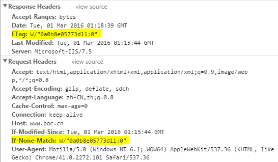

协商缓存也可以通过两种方式来设置，分别是 http 头信息中的 **Etag** 和 **Last-Modified** 属性。

（1）服务器通过在响应头中添加 Last-Modified 属性来指出资源最后一次修改的时间，当浏览器下一次发起请求时，会在请求头中添加一个 If-Modified-Since 的属性，属性值为上一次资源返回时的 Last-Modified 的值。当请求发送到服务器后服务器会通过这个属性来和资源的最后一次的修改时间来进行比较，以此来判断资源是否做了修改。如果资源没有修改，那么返回 304 状态，让客户端使用本地的缓存。如果资源已经被修改了，则返回修改后的资源。使用这种方法有一个缺点，就是 Last-Modified 标注的最后修改时间只能精确到秒级，如果某些文件在1秒钟以内，被修改多次的话，那么文件已将改变了但是 Last-Modified 却没有改变，这样会造成缓存命中的不准确。

（2）因为 Last-Modified 的这种可能发生的不准确性，http 中提供了另外一种方式，那就是 Etag 属性。服务器在返回资源的时候，在头信息中添加了 Etag 属性，这个属性是资源生成的唯一标识符，当资源发生改变的时候，这个值也会发生改变。在下一次资源请求时，浏览器会在请求头中添加一个 If-None-Match 属性，这个属性的值就是上次返回的资源的 Etag 的值。服务接收到请求后会根据这个值来和资源当前的 Etag 的值来进行比较，以此来判断资源是否发生改变，是否需要返回资源。通过这种方式，比 Last-Modified 的方式更加精确。

当 Last-Modified 和 Etag 属性同时出现的时候，Etag 的优先级更高。使用协商缓存的时候，服务器需要考虑负载平衡的问题，因此多个服务器上资源的 Last-Modified 应该保持一致，因为每个服务器上 Etag 的值都不一样，因此在考虑负载平衡时，最好不要设置 Etag 属性。

**总结：**

强缓存策略和协商缓存策略在缓存命中时都会直接使用本地的缓存副本，区别只在于协商缓存会向服务器发送一次请求。它们缓存不命中时，都会向服务器发送请求来获取资源。在实际的缓存机制中，强缓存策略和协商缓存策略是一起合作使用的。浏览器首先会根据请求的信息判断，强缓存是否命中，如果命中则直接使用资源。如果不命中则根据头信息向服务器发起请求，使用协商缓存，如果协商缓存命中的话，则服务器不返回资源，浏览器直接使用本地资源的副本，如果协商缓存不命中，则浏览器返回最新的资源给浏览器。

#### （3）既生Last-Modified何生Etag？

你可能会觉得使用Last-Modified已经足以让浏览器知道本地的缓存副本是否足够新，为什么还需要Etag（实体标识）呢？HTTP1.1中Etag的出现主要是为了解决几个Last-Modified比较难解决的问题：

1. Last-Modified标注的最后修改只能精确到秒级，如果某些文件在1秒钟以内，被修改多次的话，它将不能准确标注文件的修改时间

2. 如果某些文件会被定期生成，当有时内容并没有任何变化，但Last-Modified却改变了，导致文件没法使用缓存

3.有可能存在服务器没有准确获取文件修改时间，或者与代理服务器时间不一致等情形

Etag是服务器自动生成或者由开发者生成的对应资源在服务器端的唯一标识符，能够更加准确的控制缓存。Last-Modified与ETag是可以一起使用的，服务器会优先验证ETag，一致的情况下，才会继续比对Last-Modified，最后才决定是否返回304。

### 4. 为什么需要浏览器缓存？

#### 相关问题：

- 如果我们只有一台服务器，但我们向提高它的并发效率，可以怎样去实现呢？

- 强缓存：比如原来需要十台服务器，但通过缓存后，需要的服务器的数量减少

对于浏览器的缓存，主要针对的是前端的静态资源，最好的效果就是，在发起请求之后，拉取相应的静态资源，并保存在本地。如果服务器的静态资源没有更新，那么在下次请求的时候，就直接从本地读取即可，如果服务器的静态资源已经更新，那么我们再次请求的时候，就到服务器拉取新的资源，并保存在本地。这样就大大的减少了请求的次数，提高了网站的性能。这就要用到浏览器的缓存策略了。

所谓的**浏览器缓存**指的是浏览器将用户请求过的静态资源，存储到电脑本地磁盘中，当浏览器再次访问时，就可以直接从本地加载，不需要再去服务端请求了。

**http缓存能够帮助服务器提高并发性能，很多资源不需要重复请求直接从浏览器中拿缓存**

使用浏览器缓存，有以下优点：

- 减少了服务器的负担，提高了网站的性能
- 加快了客户端网页的加载速度
- 减少了多余网络数据传输

### 5. 点击刷新按钮或者按 F5、按 Ctrl+F5 （强制刷新）、地址栏回车有什么区别？

- **点击刷新按钮或者按 F5：**浏览器直接对本地的缓存文件过期，但是会带上If-Modifed-Since，If-None-Match，这就意味着服务器会对文件检查新鲜度，返回结果可能是 304，也有可能是 200。
- **用户按 Ctrl+F5（强制刷新）：**浏览器不仅会对本地文件过期，而且不会带上 If-Modifed-Since，If-None-Match，相当于之前从来没有请求过，返回结果是 200。
- 地址栏回车： 浏览器发起请求，按照正常流程，本地检查是否过期，然后服务器检查新鲜度，最后返回内容。

### 6.用户行为与缓存 浏览器缓存行为还有用户的行为有关

| **新开窗口**     | 有效                      | 有效                   |
| ---------------- | ------------------------- | ---------------------- |
| **用户操作**     | **Expires/Cache-Control** | **Last-Modified/Etag** |
| **地址栏回车**   | 有效                      | 有效                   |
| **页面链接跳转** | 有效                      | 有效                   |
| **前进、后退**   | 有效                      | 有效                   |
| **F5** 刷新      | 无效                      | 有效                   |
| **Ctrl+F5 **刷新 | 无效                      | 无效                   |

# 二、浏览器本地存储

### 1. Cookie

`Cookie`是一种存储机制，

当我们第一次请求网页内容的时候是没有任何cookie的，服务器在收到请求以后会在HTTP响应里添加头部Set-Cookie，并且在Set-cookie里进行标识，在下一次请求的时候浏览器就会在HTTP请求里添加头部Cookie，并且用上Set-Cookie里的标识，这样服务器就可以给不同用户匹配不同的内容了。

因为每一次浏览器请求都要带上Cookie，因此就把Cookie设计的很小，不能超过4KB，但大部分情况会更小。

通常，它用于判断两个请求是否来自于同一个浏览器，例如用户保持登录状态。

Cookie 主要用于下面三个目的

- `会话管理`

登陆、购物车、游戏得分或者服务器应该记住的其他内容

- `个性化`

用户偏好、主题或者其他设置

- `追踪`

记录和分析用户行为

**HTTP Cookie 机制是 HTTP 协议无状态的一种补充和改良**

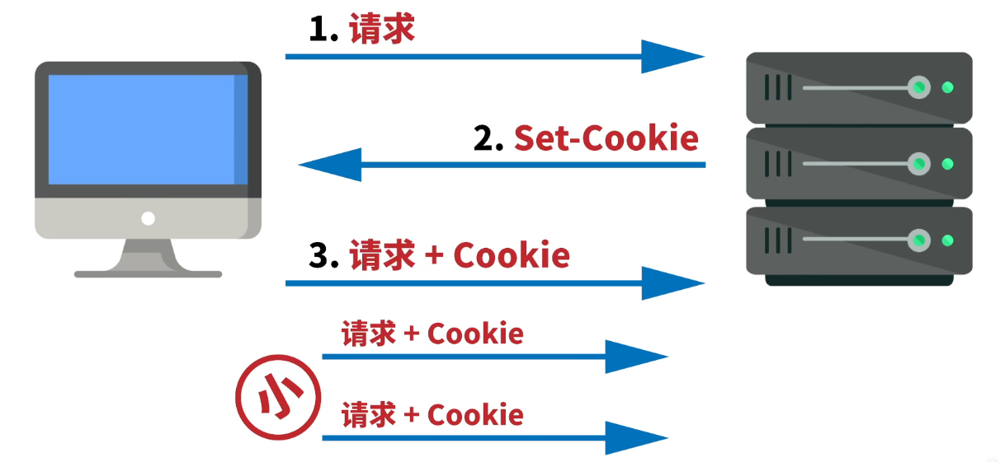

#### ① Cookie的特性：

- Cookie一旦创建成功，名称就无法修改
- Cookie是无法跨域名的，也就是说a域名和b域名下的cookie是无法共享的，这也是由Cookie的隐私安全性决定的，这样就能够阻止非法获取其他网站的Cookie
- 每个域名下Cookie的数量不能超过20个，每个Cookie的大小不能超过4kb
- 有安全问题，如果Cookie被拦截了，那就可获得session的所有信息，即使加密也于事无补，无需知道cookie的意义，只要转发cookie就能达到目的
- Cookie在请求一个新的页面的时候都会被发送过去

如果需要域名之间跨域共享Cookie，有两种方法：

1. 使用Nginx反向代理
2. 在一个站点登陆之后，往其他网站写Cookie。服务端的Session存储到一个节点，Cookie存储sessionId

#### ② Cookie的使用场景：

- 最常见的使用场景就是Cookie和session结合使用，我们将sessionId存储到Cookie中，每次发请求都会携带这个sessionId，这样服务端就知道是谁发起的请求，从而响应相应的信息。
- 可以用来统计页面的点击次数

#### ③ 设置 Cookie 的生存周期

首先，我们应该设置 Cookie 的生存周期，也就是它的有效期，让它只能在一段时间内可用，就像是食品的“保鲜期”，一旦超过这个期限浏览器就认为是 Cookie 失效，在存储里删除，也不会发送给服务器。

Cookie 的有效期可以使用 Expires 和 Max-Age 两个属性来设置。

“Expires”俗称“过期时间”，用的是绝对时间点，可以理解为“截止日期”（deadline）。

“Max-Age”用的是相对时间，单位是秒，浏览器用收到报文的时间点再加上 Max-Age，就可以得到失效的绝对时间。

Expires 和 Max-Age 可以同时出现，两者的失效时间可以一致，也可以不一致，但浏览器
会优先采用 Max-Age 计算失效期。

#### ④ 设置 Cookie 的作用域

其次，我们需要设置 Cookie 的作用域，让浏览器仅发送给特定的服务器和 URI，避免被其他网站盗用。

作用域的设置比较简单，“Domain”和“Path”指定了 Cookie 所属的域名和路径，浏览器在发送 Cookie 前会从 URI 中提取出 host 和 path 部分，对比 Cookie 的属性。如果不满足条件，就不会在请求头里发送 Cookie。

使用这两个属性可以为不同的域名和路径分别设置各自的 Cookie，比如“/19-1”用一个Cookie，“/19-2”再用另外一个 Cookie，两者互不干扰。不过现实中为了省事，通常Path 就用一个“/”或者直接省略，表示域名下的任意路径都允许使用 Cookie，让服务器自己去挑。

#### ⑤ Cookie 的安全性

在 JS 脚本里可以用 document.cookie 来读写 Cookie 数据，这就带来了安全隐患，有可能会导致“跨站脚本”（XSS）攻击窃取数据。

属性“HttpOnly”会告诉浏览器，此 Cookie 只能通过浏览器 HTTP 协议传输，禁止其他方式访问，浏览器的 JS 引擎就会禁用 document.cookie 等一切相关的 API，脚本攻击也就无从谈起了。

另一个属性“SameSite”可以防范“跨站请求伪造”（CSRF）攻击，设置成“SameSite=Strict”可以严格限定 Cookie 不能随着跳转链接跨站发送，而“SameSite=Lax”则略宽松一点，允许 GET/HEAD 等安全方法，但禁止 POST 跨站发送。

还有一个属性叫“Secure”，表示这个 Cookie 仅能用 HTTPS 协议加密传输，明文的HTTP 协议会禁止发送。但 Cookie 本身不是加密的，浏览器里还是以明文的形式存在。

关于XSS攻击和CSRF攻击[前端面试之浏览器安全](https://blog.csdn.net/weixin_52834435/article/details/122803636)

#### ⑥ Cookie 的应用

##### 身份识别

Cookie 最基本的一个用途就是身份识别，保存用户的登录信息，实现会话事务。

比如，你用账号和密码登录某电商，登录成功后网站服务器就会发给浏览器一个 Cookie，内容大概是“name=yourid”，这样就成功地把身份标签贴在了你身上。

之后你在网站里随便访问哪件商品的页面，浏览器都会自动把身份 Cookie 发给服务器，所以服务器总会知道你的身份，一方面免去了重复登录的麻烦，另一方面也能够自动记录你的浏览记录和购物下单（在后台数据库或者也用 Cookie），实现了“状态保持”。

##### 广告跟踪

Cookie 的另一个常见用途是广告跟踪。

你上网的时候肯定看过很多的广告图片，这些图片背后都是广告商网站（例如 Google），它会“偷偷地”给你贴上 Cookie 小纸条，这样你上其他的网站，别的广告就能用 Cookie读出你的身份，然后做行为分析，再推给你广告。

这种 Cookie 不是由访问的主站存储的，所以又叫“第三方 Cookie”（third-partycookie）。如果广告商势力很大，广告到处都是，那么就比较“恐怖”了，无论你走到哪里它都会通过 Cookie 认出你来，实现广告“精准打击”。

为了防止滥用 Cookie 搜集用户隐私，互联网组织相继提出了 DNT（Do Not Track）和P3P（Platform for Privacy Preferences Project），但实际作用不大。

注意：因为 Cookie 并不属于 HTTP 标准（RFC6265，而不是RFC2616/7230），所以语法上与其他字段不太一致，使用的分隔符是“;”，与 Accept等字段的“,”不同，小心不要弄错了。

#### ⑦ Cookie有哪些字段，作用分别是什么

**Cookie由以下字段组成：**

- **Name**：cookie的名称
- **Value**：cookie的值，对于认证cookie，value值包括web服务器所提供的访问令牌；
- **Size**： cookie的大小
- **Path**：可以访问此cookie的页面路径。 比如domain是abc.com，path是`/test`，那么只有`/test`路径下的页面可以读取此cookie。
- **Secure**： 指定是否使用HTTPS安全协议发送Cookie。使用HTTPS安全协议，可以保护Cookie在浏览器和Web服务器间的传输过程中不被窃取和篡改。该方法也可用于Web站点的身份鉴别，即在HTTPS的连接建立阶段，浏览器会检查Web网站的SSL证书的有效性。但是基于兼容性的原因（比如有些网站使用自签署的证书）在检测到SSL证书无效时，浏览器并不会立即终止用户的连接请求，而是显示安全风险信息，用户仍可以选择继续访问该站点。
- **Domain**：可以访问该cookie的域名，Cookie 机制并未遵循严格的同源策略，允许一个子域可以设置或获取其父域的 Cookie。当需要实现单点登录方案时，Cookie 的上述特性非常有用，然而也增加了 Cookie受攻击的危险，比如攻击者可以借此发动会话定置攻击。因而，浏览器禁止在 Domain 属性中设置.org、.com 等通用顶级域名、以及在国家及地区顶级域下注册的二级域名，以减小攻击发生的范围。
- **HTTP**： **该字段包含`HTTPOnly` 属性** ，该属性用来设置cookie能否通过脚本来访问，默认为空，即可以通过脚本访问。在客户端是不能通过js代码去设置一个httpOnly类型的cookie的，这种类型的cookie只能通过服务端来设置。该属性用于防止客户端脚本通过`document.cookie`属性访问Cookie，有助于保护Cookie不被跨站脚本攻击窃取或篡改。但是，HTTPOnly的应用仍存在局限性，一些浏览器可以阻止客户端脚本对Cookie的读操作，但允许写操作；此外大多数浏览器仍允许通过XMLHTTP对象读取HTTP响应中的Set-Cookie头。
- **Expires/Max-size** ： 此cookie的超时时间。若设置其值为一个时间，那么当到达此时间后，此cookie失效。不设置的话默认值是Session，意思是cookie会和session一起失效。当浏览器关闭(不是浏览器标签页，而是整个浏览器) 后，此cookie失效。

**总结：**

服务器端可以使用 Set-Cookie 的响应头部来配置 cookie 信息。一条cookie 包括了5个属性值 expires、domain、path、secure、HttpOnly。其中 expires 指定了 cookie 失效的时间，domain 是域名、path是路径，domain 和 path 一起限制了 cookie 能够被哪些 url 访问。secure 规定了 cookie 只能在确保安全的情况下传输，HttpOnly 规定了这个 cookie 只能被服务器访问，不能使用 js 脚本访问。

### 2. LocalStorage

LocalStorage是HTML5新引入的特性，由于有的时候我们存储的信息较大，Cookie就不能满足我们的需求，这时候LocalStorage就派上用场了。

**LocalStorage的优点：**

- 在大小方面，LocalStorage的大小一般为5MB，可以储存更多的信息
- LocalStorage是持久储存，并不会随着页面的关闭而消失，除非主动清理，不然会永久存在
- 仅储存在本地，不像Cookie那样每次HTTP请求都会被携带

**LocalStorage的缺点：**

- 存在浏览器兼容问题，IE8以下版本的浏览器不支持
- 如果浏览器设置为隐私模式，那我们将无法读取到LocalStorage
- LocalStorage受到同源策略的限制，即端口、协议、主机地址有任何一个不相同，都不会访问

**LocalStorage**的使用场景：

- 有些网站有换肤的功能，这时候就可以将换肤的信息存储在本地的LocalStorage中，当需要换肤的时候，直接操作LocalStorage即可
- 在网站中的用户浏览信息也会存储在LocalStorage中，还有网站的一些不常变动的个人信息等也可以存储在本地的LocalStorage中

### 3. SessionStorage

SessionStorage和LocalStorage都是在HTML5才提出来的存储方案，SessionStorage 主要用于临时保存同一窗口(或标签页)的数据，刷新页面时不会删除，关闭窗口或标签页之后将会删除这些数据。

**SessionStorage**与LocalStorage对比：

- SessionStorage和LocalStorage都在**本地进行数据存储**；
- SessionStorage也有同源策略的限制，但是SessionStorage有一条更加严格的限制，SessionStorage**只有在同一浏览器的同一窗口下才能够共享**；
- LocalStorage和SessionStorage**都不能被爬虫爬取**；

**SessionStorage**的使用场景

- 由于SessionStorage具有时效性，所以可以用来存储一些网站的游客登录的信息，还有临时的浏览记录的信息。当关闭网站之后，这些信息也就随之消除了。

### 4. Cookie、LocalStorage、SessionStorage区别

浏览器端常用的存储技术是 cookie 、localStorage 和 sessionStorage。

- **cookie：**其实最开始是服务器端用于记录用户状态的一种方式，由服务器设置，在客户端存储，然后每次发起同源请求时，发送给服务器端。cookie 最多能存储 4 k 数据，它的生存时间由 expires 属性指定，并且 cookie 只能被同源的页面访问共享。
- **sessionStorage：**html5 提供的一种浏览器本地存储的方法，它借鉴了服务器端 session 的概念，代表的是一次会话中所保存的数据。它一般能够存储 5M 或者更大的数据，它在当前窗口关闭后就失效了，并且 sessionStorage 只能被同一个窗口的同源页面所访问共享。
- **localStorage：**html5 提供的一种浏览器本地存储的方法，它一般也能够存储 5M 或者更大的数据。它和 sessionStorage 不同的是，除非手动删除它，否则它不会失效，并且 localStorage 也只能被同源页面所访问共享。

上面几种方式都是存储少量数据的时候的存储方式，当需要在本地存储大量数据的时候，我们可以使用浏览器的 indexDB 这是浏览器提供的一种本地的数据库存储机制。它不是关系型数据库，它内部采用对象仓库的形式存储数据，它更接近 NoSQL 数据库。

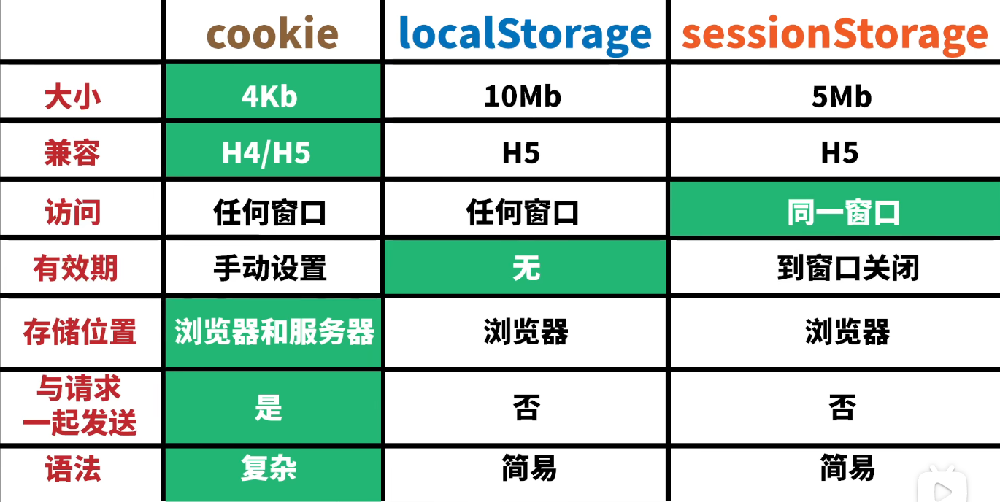

### 5. Session

实际上我们打开浏览器是可以看到保存了哪些Cookie，也就是说如果把用户名和密码放在Cookie是很不安全的，只要电脑被黑，在Cookie里的重要信息就会被泄漏，于是就有了Session（会话）。

浏览器访问服务器就是会话的开始，不同的网站对于每一个用户的会话都设置了时间（这里的时间是结束会话的时间）以及唯一的ID（这里的ID就是Session ID），因为时间和ID是服务器自己定义的东西，所以一般会保存在数据库里，Session ID 通常是一串没有规律的字符串。

当浏览器将用户名和密码发送给服务器后，服务器会把Session ID和会话结束时间发送给浏览器，这里就用到了Cookie，设置Cookie，并将Session ID加到Cookie中，再把会话结束时间对应设置为这个Cookie的有效期，浏览器拿到Cookie后进行保存，此时浏览器没有保存用户名和密码，保存的Session ID也是没有规律的字符串，Cookie里也就只有Session ID 最重要，（如果黑客入侵拿到了Session ID ，因为Session ID也是没有规律的字符串，所以黑客无法依据Session ID 推断出用户的密码。其次，服务器在发送Cookie之前，会对Session ID进行签名，回句话说，当黑客修改了Session ID，Session ID 就会变成服务器识别不了的字符串）。浏览器的以后的每次访问都会自动发送这个Session ID给服务器，直到Cookie 的有效期失效后，浏览器一般会自行删除这个Cookie，此时会话结束。那么在Cookie失效后，用户就得重新输入用户名和密码了。

**在每次请求时，服务器都会从会话  中读取 SessionId，如果服务端的数据和读取的 SessionId 相同，那么服务器就会发送响应给浏览器，允许用户登录。**

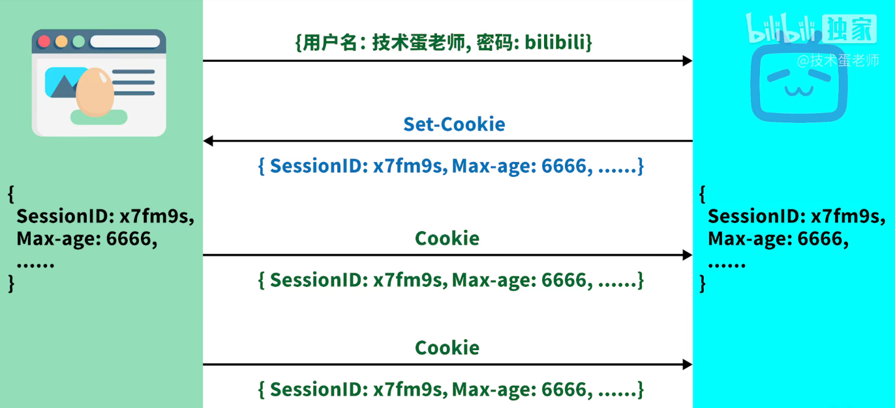

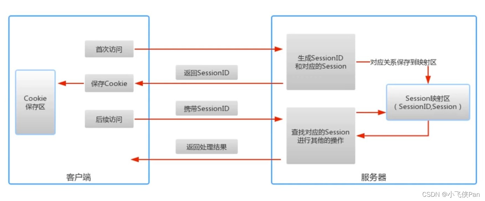

解释上图：

当客户访问到服务器，如果服务器启用Session，那么服务器就会为这个用户创建一个Session，在创建Session时，服务器首先会检查客户端浏览器发送过来的请求中是否包含SessionID，如果包含，那就证明这个用户此前登陆过并且已经创建过Session。然后服务器就会根据这个SessionID在映射区查找出来。如果查找不到，或者根本没有SessionID，那么服务器就会为该客户端创建一个Session，并且生成一个对应的SessionID，在这次的响应中，SessionID会返回给客户端，保存在Cookie中。

#### 保存SessionID的方法

- Cookie

- URL重写

  就是直接把SessionID附加在URL的后面

  

- 隐藏表单

#### Session的有效期

- Session超时失效
- 程序调用HttpSession.invalidate()
- 服务器进程被停止

#### Session 的缺点

Session 机制有个缺点，比如 A 服务器存储了 Session，就是做了负载均衡后，假如一段时间内 A 的访问量激增，会转发到 B 进行访问，但是 B 服务器并没有存储 A 的 Session，会导致 Session 的失效。

Cookie与Session

- 存放位置不同：Cookie是在客户端的，Session是在服务端的

- 安全性（隐私策略）不同：

   Cookie存储在浏览器中，对客户端是可见的，客户端的一些程序可能会窥探，修改Cookie里面的内容，而Session存储在服务器上，对客户端来说，是透明的（这里的透明与生活中的透明不同，这里的透明是指客户端看不见），不存在修改的风险。

- 有效期的不同
   Cookie可以在浏览器中保存很长时间（设置的保存时间很长），但是服务器端会定时清理SessionID，避免服务器出现过大的压力，一般来说，只要我们关闭了浏览器，也就是一次会话结束，这个SessionID就失效了。

- 对服务器压力不同
  

### 6. JWT

**JSON Web Token**

与普通Token一样，都是访问资源的令牌，都可以记录用户信息，都是只有验证成功后才可以获取信息。

不同的是普通Token服务端验证token信息要进行数据的查询操作；JWT验证token信息就不用，在服务器端使用秘钥校验就可以，不用数据库的查询。

流程：

当用户首次登录页面后，服务器就会生成一个JWT，服务器不需要保存这个JWT，只需要保存JWT签名的密文，接着把JWT发送给浏览器，浏览器将JWT用Cookie或Storage形式进行存储。然后用户每次发送请求都会把这个JWT发给服务器，用户就不需要重新输入账号密码了。

- 支持跨域访问：cookie是无法跨域的，而token由于没有用到cookie(前提是将token放到请求头中)，所以跨域后不会存在信息丢失问题
- 无状态：token机制在服务端不需要存储session信息，因为token自身包含了所有登录用户的信息，所以可以减轻服务端压力
- 更适用CDN：可以通过内容分发网络请求服务端的所有资料
- 更适用于移动端：当客户端是非浏览器平台时，cookie是不被支持的，此时采用token认证方式会简单很多
- 无需考虑CSRF：由于不再依赖cookie，所以采用token认证方式不会发生CSRF，所以也就无需考虑CSRF的防御

JWT 主要由三部分组成，每个部分用 `.` 进行分割，各个部分分别是

- `Header`：声明需要用什么算法来生成签名
- `Payload`：放一些特定的数据，比如有效期之类的
- `Signature`

一个简单的JWT的组成：`xxxx.yyyy.zzzz`。

`Signture`:header和payload两部分的内容会经由Base编码，另外在服务器端会保存一个密钥（secret），`header和payload两部分组成的密码` 和 `服务器端的密码`进行算法运算最终得到签名信息（signture）

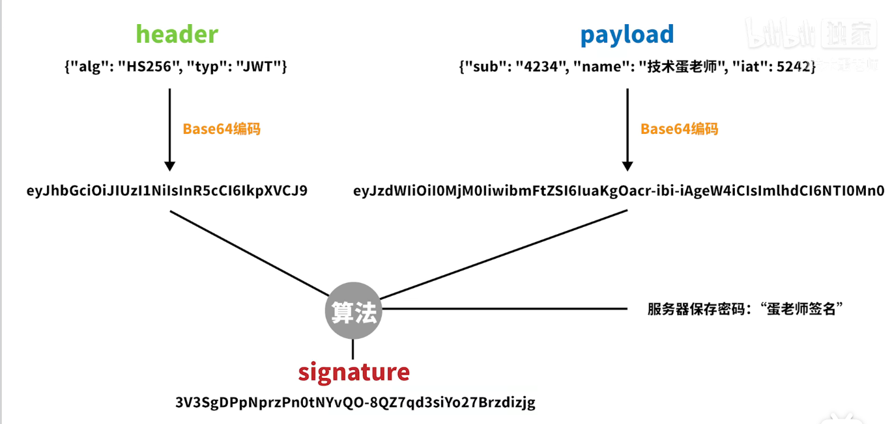

注意JWT每部分的作用，在服务端接收到客户端发送过来的JWT token之后：

header和payload可以直接利用base64解码出原文，从header中获取哈希签名的算法，从payload中获取有效数据
signature由于使用了不可逆的加密算法，无法解码出原文，它的作用是校验token有没有被篡改。服务端获取header中的加密算法之后，利用该算法加上secretKey对header、payload进行加密，比对加密后的数据和客户端发送过来的是否一致。注意secretKey只能保存在服务端，而且对于不同的加密算法其含义有所不同，一般对于MD5类型的摘要加密算法，secretKey实际上代表的是盐值