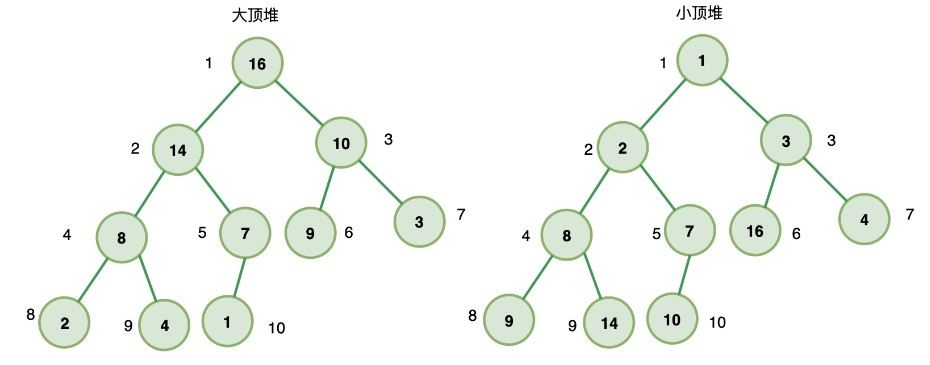

## 堆的建立&&堆排序

满足下面两个条件的就是堆：
堆是一个完全二叉树
堆上的任意节点值都必须大于等于（大顶堆）或小于等于（小顶堆）其左右子节点值

- 如果堆上的任意节点都大于等于子节点值，则称为 大顶堆
- 如果堆上的任意节点都小于等于子节点值，则称为 小顶堆

也就是说，在大顶堆中，根节点是堆中最大的元素；在小顶堆中，根节点是堆中最小的元素；





### 插入式建堆

插入节点：

- 将节点插入到队尾
- 自下往上堆化： 将插入节点与其父节点比较，如果插入节点大于父节点（大顶堆）或插入节点
  小于父节点（小顶堆），则插入节点与父节点调整位置
- 一直重复上一步，直到不需要交换或交换到根节点，此时插入完成

```js
// 插⼊式建堆: 小顶堆

class MinHeap {
  constructor() {
    this.heap = [];
  }
  //交换两个节点的值
  swap(i1, i2) {
    const temp = this.heap[i1];
    this.heap[i1] = this.heap[i2];
    this.heap[i2] = temp;
  }
  //得到父节点的值
  getParentIndex(i) {
    return (i-1) >> 1;
  }
  //上移操作
  shiftUp(index) {
    if(index == 0) {return;}
    const parentIndex = this.getParentIndex(index);
    if(this.heap[parentIndex] > this.heap[index]) {
      this.swap(parentIndex, index);
      this.shiftUp(parentIndex);
    }
  }

  //插入元素，将节点插⼊到队
  insert(value) {
    this.heap.push(value);
    //上移操作：
    //如果插⼊节点⼩于⽗节点（⼩顶堆），则插⼊节点与⽗节点调整位置
    this.shiftUp(this.heap.length - 1);
  }
}

const h = new MinHeap();
h.insert(5);
h.insert(2);
h.insert(1);

console.log(h);// MinHeap { heap: [ 1, 5, 2 ] }

```


### 删除堆顶

```js
// 用数组尾部元素替换堆顶（直接删除堆顶会破坏堆结构）
//然后下移：将新堆顶和它的子节点进行交换，直到子节点大于等于这个新堆顶

// # 删除堆顶

class MinHeap {
  constructor() {
    this.heap = [];
  }
  //交换两个节点的值
  swap(i1, i2) {
    const temp = this.heap[i1];
    this.heap[i1] = this.heap[i2];
    this.heap[i2] = temp;
  }
  //得到父节点的值
  getParentIndex(i) {
    return (i-1) >> 1;
  }
  //上移操作
  shiftUp(index) {
    if(index == 0) {return;}
    const parentIndex = this.getParentIndex(index);
    if(this.heap[parentIndex] > this.heap[index]) {
      this.swap(parentIndex, index);
      this.shiftUp(parentIndex);
    }
  }

  //#插入元素，将节点插⼊到队
  insert(value) {
    this.heap.push(value);
    //上移操作：
    //如果插⼊节点⼩于⽗节点（⼩顶堆），则插⼊节点与⽗节点调整位置
    this.shiftUp(this.heap.length - 1);
  }


  // ***************************************

  getLeftIndex(i){
    return i*2+1;
  }
  getRightIndex(i) {
    return i*2+2;
  }

  shiftDown(index) {
    const leftIndex = this.getLeftIndex(index);
    const rightIndex = this.getRightIndex(index);
    if(this.heap[leftIndex] < this.heap[index]) {
      this.swap(leftIndex, index);
      this.shiftDown(leftIndex);
    }
    if(this.heap[rightIndex] < this.heap[index]) {
      this.swap(rightIndex, index);
      this.shiftDown(rightIndex);
    }
  }

  //#删除堆顶
  pop() {
    //让堆顶元素等于最后一个元素
    this.heap[0] = this.heap.pop();
    //下移操作：将堆顶元素进行下移
    this.shiftDown(0);
  }
}

const h = new MinHeap();
h.insert(5);
h.insert(2);
h.insert(1);

console.log(h);// MinHeap { heap: [ 1, 5, 2 ] }

h.pop();
console.log(h);//MinHeap { heap: [ 2, 5 ] }

```


### 原地建堆（堆化）

假设一组序列：let arr = [,1, 9, 2, 8, 3, 7, 4, 6, 5]

原地建堆的方法有两种：一种是承袭上面插入的思想，即从前往后、自下而上式堆化建堆；与之对应的另一种是，从后往前、自上往下式堆化建堆。其中

- 自下而上式堆化 ：将节点与其父节点比较，如果节点大于父节点（大顶堆）或节点小于父节点
  （小顶堆），则节点与父节点调整位置

- 自上往下式堆化 ：将节点与其左右子节点比较，如果存在左右子节点大于该节点（大顶堆）或
  小于该节点（小顶堆），则将子节点的最大值（大顶堆）或最小值（小顶堆）与之交换
  所以，自下而上式堆是调整节点与父节点（往上走），自上往下式堆化是调整节点与其左右子节点（往下走）。

  

#### 从前往后、自下而上式堆化建堆

这里以小顶堆为例，let arr = [,1, 9, 2, 8, 3, 7, 4, 6, 5]

```js
//原地建堆
function buildHeap(items, heapSize) {
  while(heapSize < items.length-1) {
    heapSize++;
    heapify(items, heapSize);
  }
}

function heapify(items, i) {
  //自下而上式堆化
  //如果它的父节点存在，且父节点的值大于该节点的值，那么就交换这两个节点的值
  while(Math.floor(i/2) > 0 && items[i] <items[Math.floor(i/2)]) {
    swap(items, i, Math.floor(i/2));//交换
    i = Math.floor(i/2);
  }
}

function swap(items, i, j) {
  let temp = items[i];
  items[i] = items[j];
  items[j] = temp;
}

//测试
var items = [,5, 2, 3, 4, 1];
//初始化有序列表长度为1
buildHeap(items, 1);
console.log(items);//[ <1 empty item>, 1, 2, 3, 5, 4 ]

```


#### 从后往前、自上而下式堆化建堆

这里以小顶堆为例
注意：从后往前并不是从序列的最后一个元素开始，而是从**最后一个非叶子节点**开始，这是因为，叶子节点没有子节点，不需要自上而下式堆化。
最后一个子节点的父节点为 n/2 ，所以从 n/2 位置节点开始堆化：

```js
//原地建堆
//items: 原始序列
//heapSize: 初始有效序列长度
function buildHeap(items, heapSize) {
  //从最后一个非叶子节点开始，自上而下式堆化
  for(let i = Math.floor(heapSize/2);i >= 1; --i) {
    heapify(items, heapSize, i);
  }
}
function heapify(items, heapSize, i) {
  //自上而下式堆化
  while(true) {
    var minIndex = i;
    //如果它的左孩子存在且左孩子的值小于它的值
    if(2*i <= heapSize && items[i] > items[i*2]) {
      minIndex = i*2;
    }
    if(2*i+1 <= heapSize && items[minIndex] > items[i*2+1]) {
      minIndex = i*2+1;
    }
    if(minIndex === i) break;
    swap(items, i, minIndex);//交换
    i = minIndex;
  }
}
function swap(items, i, j) {
  let temp = items[i];
  items[i] = items[j];
  items[j] = temp;
}

//测试
var items = [,5, 2, 3, 4, 1];
//因为 items[0]不存在
//所以： heapSize = items.length - 1
buildHeap(items, items.length - 1);
console.log(items);//[ <1 empty item>, 1, 2, 3, 4, 5 ]

```


### 排序算法：堆排序
**原理**
堆是一棵完全二叉树，它可以使用数组存储，并且大顶堆的最大值存储在根节点（i=1），所以我们可以**每次取大顶堆的根结点与堆的最后一个节点交换**，此时最大值放入了有效序列的最后一位，
并且有效序列减1，有效堆依然保持完全二叉树的结构，然后堆化，成为新的大顶堆，重复此操作，直到有效堆的⻓度为 0，排序完成。
完整步骤为：

- 将原序列（n个）转化成一个大顶堆
- 设置堆的有效序列⻓度为 n
- 将堆顶元素（第一个有效序列）与最后一个子元素（最后一个有效序列）交换，并有效序列⻓度
  减1
- 堆化有效序列，使有效序列重新称为一个大顶堆
- 重复以上2步，直到有效序列的⻓度为 1，排序完成

```js
//堆排序(从小到大)
function heapSort(items) {
  //构建大顶堆,这里是items,length - 1，因为items[0]为空
  buildHeap(items, items.length - 1);
  //设置堆的初始化有效序列长度为 items.length - 1
  let heapSize = items.length - 1;
  for(var i = items.length - 1; i> 1; i--) {
    //#交换堆顶元素与最后一个有效子元素
    swap(items, 1, i);
    //有效序列长度减1
    heapSize--;
    //堆化有效序列（有效序列长度为 currentHeapSize, 抛除了最后一个元素
    heapify(items, heapSize, 1);
  }
  return items;
}

//原地建堆
//items: 原始序列
//heapSize: 有效序列长度
function buildHeap(item, heapSize) {
  //从最后一个非叶子节点开始，自上而下式堆化
  for(let i = Math.floor(heapSize/2); i >= 1; --i) {
    heapify(items, heapSize, i);
  }
}
function heapify(items, heapSize, i) {
  while(true) {
    //自上而下式堆化
    var maxIndex = i;
    if(2*i <= heapSize && items[i] < items[i*2]) {
      maxIndex = 2*i;
    }
    if(2*i+1 <= heapSize && items[maxIndex] <items[2*i+1]) {
      maxIndex = i*2+1;
    }
    if(maxIndex === i) break;
    swap(items, i, maxIndex);//交换
    i = maxIndex;
  }
}
function swap(items, i, j) {
  let temp = items[i];
  items[i] = items[j];
  items[j] = temp;
}

//测试
var items = [,1, 9, 2, 8, 3, 7, 4, 6, 5];
heapSort(items);
console.log(items);//[ <1 empty item>, 1, 2, 3, 4, 5, 6, 7, 8, 9 ]


```

