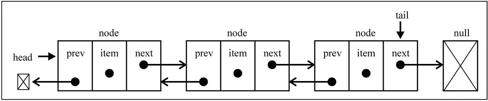
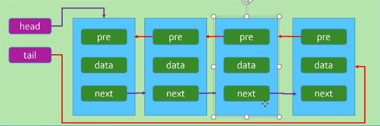

[TOC]


### 创建链表类

```js
//封装链表类
function LinkedList(){
    //内部的类：节点类
    function Node(data){
        this.data=data
        this.next=null
    }

    //属性
    this.head=null
    this.length=0
}
```

解释：

- 封装LinkedList的类, 用于表示我们的链表结构. 
- 在LinkedList类中有一个Node类, 用于封装每一个节点上的信息.
- 链表中我们保存两个属性, 一个是链表的长度, 一个是链表中第一个节点.


### 链表常见操作：增删改查

- `append(element)`：向列表尾部添加一个新的项
- `insert(position, element)`：向列表的特定位置插入一个新的项。
- `get(positon)`：获取对应位置的元素。
- `remove(element)`：从列表中移除一项。
- `indexOf(element)`：返回元素在列表中的索引。如果列表中没有该元素则返回`-1`。
- `updata(position,element)`: 修改某个位置的元素。
- `removeAt(position)`：从列表的特定位置移除一项。
- `isEmpty()`：如果链表中不包含任何元素，返回`true`，如果链表长度大于0则返回`false`。
- `size()`：返回链表包含的元素个数。与数组的`length`属性类似。
- `toString()`：由于列表项使用了`Node`类，就需要重写继承自JavaScript对象默认的`toString`方法，让其只输出元素的值。


#### append(element)：

- 向链表尾部追加数据可能有两种情况:

  - 链表本身为空, 新添加的数据时唯一的节点.
  - 链表不为空, 需要向其他节点后面追加节点.

  ```js
  // 链表尾部追加元素方法
  LinkedList.prototype.append = function (element) {
      // 1.根据新元素创建节点
      var newNode = new Node(element)
  
      // 2.判断原来链表是否为空
      if (this.head === null) { // 链表为空
          this.head = newNode
      } else { // 链表不为空
          // 2.1.定义变量, 保存当前找到的节点
          var current = this.head
          while (current.next) {
              current = current.next
          }
          //当退出while循环后，current指向最后一个节点
  
          // 2.2.找到最后一项, 将其next赋值为node
          current.next = newNode
      }
  
      // 3.链表长度增加1
      this.length++
  }
  ```


#### toString()

由于列表项使用了`Node`类，就需要重写继承自JavaScript对象默认的`toString`方法，让其只输出元素的值。

```js
// 链表的toString方法
LinkedList.prototype.toString = function () {
    // 1.定义两个变量
    var current = this.head
    var listString = ""

    // 2.循环获取链表中每一个节点
    while (current) {
        listString += current.element + " "
        current = current.next
    }

    // 3.返回最终结果
    return listString
}
```

**测试append()方法**:

```js
// 测试链表
// 1.创建链表
var list = new LinkedList()

// 2.追加元素
list.append(15)
list.append(10)
list.append(20)

// 3.打印链表的结果
alert(list)
```

完整代码：

注：下面的方法的完整代码与这个类似

```js
    //封装链表类
function LinkedList(){
        //内部的类：节点类
    function Node(data){
        this.data=data
        this.next=null
    }

    //属性
    this.head=null
    this.length=0

    //1.追加append()方法
    LinkedList.prototype.append = function (data){
        //1.创建新的节点
        var newNode = new Node(data)

        //2.判断是否添加的是第一个节点
        if(this.length==0){
            this.head = newNode
        }else{
            //找到最后一个节点
            var current = this.head
            while(current.next){
                current = current.next
            }

            //最后节点的next指向新的节点
            current.next = newNode
        }

            //3.length+1
            this.length+=1
    }
    
    // 链表的toString方法
	LinkedList.prototype.toString = function () {
    	// 1.定义两个变量
    	var current = this.head
    	var listString = ""

    	// 2.循环获取链表中每一个节点
    	while (current) {
        	listString += current.element + " "
       		current = current.next
    	}

    	// 3.返回最终结果
    	return listString
	}
}
```


#### insert(position, element)：

向列表的特定位置插入一个新的项。

```js
// 根据下标删除元素
LinkedList.prototype.insert = function (position, element) {
    // 1.检测越界问题: 越界插入失败
    if (position < 0 || position > this.length) return false

    // 2.找到正确的位置, 并且插入数据
    var newNode = new Node(element)
    var current = this.head
    var previous = null
    var index = 0

    // 3.判断是否列表是否在第一个位置插入
    if (position == 0) {
        newNode.next = current
        this.head = newNode
    } else {
        while (index++ < position) {
            previous = current
            current = current.next
        }
        
        newNode.next = current
        previous.next = newNode
    }
    
    // 4.length+1
    this.length++
    
    return true
}
```


#### indexOf(element)：

返回元素在列表中的索引。如果列表中没有该元素则返回`-1`。

```js
// 根据元素获取链表中的位置
LinkedList.prototype.indexOf = function (element) {
    // 1.定义变量, 保存信息
    var current = this.head
    index = 0
    
    // 2.找到元素所在的位置
    while (current) {
        if (current.element === element) {
            return index
        }
        index++
        current = current.next
    }
    
    // 3.来到这个位置, 说明没有找到, 则返回-1
    return -1
}
```


#### get(positon)：

获取对应位置的元素。

```js
//get()方法
LinkedList.prototype.get = function(position){
    //1.越界判断
    if(position < 0 || position >= this.length) return null;

    //2.获取对应位置的data
    var current = this.head
    var index = 0
    while(index++ < position){
        current = current.next
    }

    return current.data
}
```


#### updata(position,element): 

修改某个位置的元素。

```js
//updata()方法：
LinkedList.prototype.updata = function(position,element){
    //1.越界判断
    if(position < 0 || position >= this.length) return false;

    //2.查找正确的节点
    var current = this.head
    var index = 0
    while(index++ < position){
        current = current.next
    }

    //3.将position位置的node的data修改成newData
    current.data = element

    return true
}
```


#### removeAt(position)：

从列表的特定位置移除一项。

```js
// 根据位置移除节点
LinkedList.prototype.removeAt = function (position) {
    // 1.检测越界问题: 越界移除失败, 返回null
    if (position < 0 || position >= this.length) return null

    // 2.定义变量, 保存信息
    var current = this.head
    var previous = null
    var index = 0
    
    // 3.判断是否是移除第一项
    if (position === 0) {
        this.head = current.next
    } else {
        while (index++ < position) {
            previous = current
            current = current.next
        }
        
        previous.next = current.next
    }
    
    // 4.length-1
    this.length--
    
    // 5.返回移除的数据
    return current.element
}
```


#### remove(element)：

从列表中移除一项。

用上面的`indexOf()方法`和`removeAt()方法`实现。

indexOf()方法获取元素的位置，removeAt()方法根据位置删除元素。

```js
// 根据元素删除信息
LinkedList.prototype.remove = function (element) {
    var position = this.indexOf(element)
    return this.removeAt(position)
}
```


#### isEmpty()：

如果链表中不包含任何元素，返回`true`，如果链表长度大于0则返回`false`。

```js
// 判断链表是否为空
LinkedList.prototype.isEmpty = function () {
    return this.length == 0
}
```


#### size()：

返回链表包含的元素个数。与数组的`length`属性类似。

```js
// 获取链表的长度
LinkedList.prototype.size = function () {
    return this.length
}
```


### 双向链表

#### 双向链表介绍

- 单向链表:
  - 只能从头遍历到尾或者从尾遍历到头(一般从头到尾)
  - 也就是链表相连的过程是单向的. 实现的原理是上一个链表中有一个指向下一个的引用.
  - 单向链表有一个比较明显的缺点:
    - 我们可以轻松的到达下一个节点, 但是回到钱一个节点是很难的. 但是, 在实际开发中, 经常会遇到需要回到上一个节点的情况
    - 举个例子: 假设一个文本编辑用链表来存储文本. 每一行用一个String对象存储在链表的一个节点中. 当编辑器用户向下移动光标时, 链表直接操作到下一个节点即可. 但是当用于将光标向上移动呢? 这个时候为了回到上一个节点, 我们可能需要从first开始, 依次走到想要的节点上.
- 双向链表
  - 既可以从头遍历到尾, 又可以从尾遍历到头
  - 也就是链表相连的过程是双向的.
  - 一个节点既有向前连接的引用, 也有一个向后连接的引用.
  - 双向链表可以有效的解决单向链表中提到的问题.
  - 双向链表有什么缺点呢?
    - 每次在插入或删除某个节点时, 需要处理四个节点的引用, 而不是两个. 也就是实现起来要困难一些
    - 并且相当于单向链表, 必然占用内存空间更大一些.
    - 但是这些缺点和我们使用起来的方便程度相比, 是微不足道的.





#### 双向链表的封装

```js
// 创建双向链表的构造函数
function DoublyLinkedList() {
    // 创建节点构造函数
    function Node(element) {
        this.element = element
        this.next = null
        this.prev = null // 新添加的
    }

    // 定义属性
    this.length = 0
    this.head = null
    this.tail = null // 新添加的

}
```

代码解析:

- 基本思路和单向链表比较相似, 都是创建节点结构函数以及定义一些属性和方法.
- 只是Node中添加了一个this.prev属性, 该属性用于指向上一个节点.
- 另外属性中添加了一个this.tail属性, 该属性指向末尾的节点


### 双向链表常见操作：增删改查

- `append(element)`：向列表尾部添加一个新的项
- `insert(position, element)`：向列表的特定位置插入一个新的项。
- `get(positon)`：获取对应位置的元素。
- `remove(element)`：从列表中移除一项。
- `indexOf(element)`：返回元素在列表中的索引。如果列表中没有该元素则返回`-1`。
- `updata(position,element)`: 修改某个位置的元素。
- `removeAt(position)`：从列表的特定位置移除一项。
- `isEmpty()`：如果链表中不包含任何元素，返回`true`，如果链表长度大于0则返回`false`。
- `size()`：返回链表包含的元素个数。与数组的`length`属性类似。
- `toString()`：由于列表项使用了`Node`类，就需要重写继承自JavaScript对象默认的`toString`方法，让其只输出元素的值。
- `forwardString()`：返回正向遍历的节点字符串形式
- `backwardString()`：返回反向遍历的节点字符串形式


#### append(element)：

向列表尾部添加一个新的项

```js
// 在尾部追加数据
DoublyLinkedList.prototype.append = function (element) {
    // 1.根据元素创建节点
    var newNode = new Node(element)

    // 2.判断列表是否为空列表
    if (this.head == null) {
        this.head = newNode
        this.tail = newNode
    } else {
        this.tail.next = newNode
        newNode.prev = this.tail
        this.tail = newNode
    }
    
    // 3.length+1
    this.length++
}
```


#### forwardString()：

返回正向遍历的节点字符串形式

```js
 // 正向遍历的方法
DoublyLinkedList.prototype.forwardString = function () {
    var current = this.head
    var forwardStr = ""

    while (current) {
        forwardStr += current.element + " "
        current = current.next
    }

    return forwardStr
}
```


#### backwardString()：

返回反向遍历的节点字符串形式

```js
// 反向遍历的方法
DoublyLinkedList.prototype.backwardString = function () {
    var current = this.tail
    var backwardStr = ""

    while (current) {
         backwardStr += current.element + " "
         current = current.prev
    }

    return backwardStr
}
```


#### toString()：

由于列表项使用了`Node`类，就需要重写继承自JavaScript对象默认的`toString`方法，让其只输出元素的值。

```js
// 实现toString方法
DoublyLinkedList.prototype.toString = function () {
     return this.forwardString()
}
```


#### insert(position, element)：

向列表的特定位置插入一个新的项。

```js
// 在任意位置插入数据
    DoublyLinkedList.prototype.insert = function (position, element) {
        // 1.判断越界的问题
        if (position < 0 || position > this.length) return false

        // 2.创建新的节点
        var newNode = new Node(element)

        // 3.判断插入的位置
        if (position === 0) { // 在第一个位置插入数据
            // 判断链表是否为空
            if (this.head == null) {
                this.head = newNode
                this.tail = newNode
            } else {
                this.head.prev = newNode
                newNode.next = this.head
                this.head = newNode
            }
        } else if (position === this.length) { // 插入到最后的情况
            this.tail.next = newNode
            newNode.prev = this.tail
            this.tail = newNode
        } else { // 在中间位置插入数据
            // 定义属性
            var index = 0
            var current = this.head //要插入节点的位置
            var previous = null //previous是要插入节点的前一个位置

            // 查找正确的位置
            while (index++ < position) {
                previous = current
                current = current.next
            }

            // 交换节点的指向顺序
            newNode.next = current
            newNode.prev = previous
            current.prev = newNode
            previous.next = newNode
        }

        // 4.length+1
        this.length++

        return true
    }
```


#### get(positon)：

获取对应位置的元素。

```js
DoublyLinkedList.prototype.get = function (position){
	//1.越界判断
    if (position < 0 || pposition >= this.length) return null
    
    //2.获取元素
    var current = this.head
    var index = 0
    
    while (index++ < position){
		current = current.next
    }
    
    return current.element
}
```


#### indexOf(element)：

返回元素在列表中的索引。如果列表中没有该元素则返回`-1`。

```js
    // 根据元素获取在链表中的位置
    DoublyLinkedList.prototype.indexOf = function (element) {
        // 1.定义变量保存信息
        var current = this.head
        var index = 0

        // 2.查找正确的信息
        while (current) {
            if (current.element === element) {
                return index
            }
            index++
            current = current.next
        }

        // 3.来到这个位置, 说明没有找到, 则返回-1
        return -1
    }
```


#### updata(position,element): 

修改某个位置的元素。

```js
DoublyLinkedList.prototype.indexOf = function (position,element){
 	//1.越界的判断
    if (position < 0 || position >= this.length) return false
    
    //2.寻找正确的节点
    var current = this.head
    var index = 0
    while (index++ < position){
		current = current.next
    }
    
    //3.修改找到节点的值
    current.element = element
}
```


#### removeAt(position)：

从列表的特定位置移除一项。

```js
    // 根据位置删除对应的元素
    DoublyLinkedList.prototype.removeAt = function (position) {
        // 1.判断越界的问题
        if (position < 0 || position >= this.length) return null

        // 2.判断移除的位置
        if (position === 0) {
            if (this.length == 1) {
                this.head = null
                this.tail = null
            } else {
                this.head = this.head.next
                this.head.prev = null
            }
        } else if (position === this.length -1) {
            //让尾部节点的前一个节点的next指向null
            this.tail.prev.next = null
            this.tail = this.tail.prev
        } else {
            var index = 0
            var previous = null
            var current = this.head

            while (index++ < position) {
                previous = current 
                current = current.next
            }

            previous.next = current.next
            current.next.prev = previous
        }

        // 3.length-1
        this.length--

        return current.element
    }
```


#### remove(element)：

从列表中移除一项。

```js
    // 根据元素删除
    DoublyLinkedList.prototype.remove = function (element) {
        var index = this.indexOf(element)
        return this.removeAt(index)
    }
```


#### size()：

返回链表包含的元素个数。与数组的`length`属性类似。

```js
    // 获取链表长度
    DoublyLinkedList.prototype.size = function () {
        return this.length
    }
```


#### isEmpty()：

如果链表中不包含任何元素，返回`true`，如果链表长度大于0则返回`false`。

```js
    // 判断是否为空
    DoublyLinkedList.prototype.isEmpty = function () {
        return this.length === 0
    }
```

