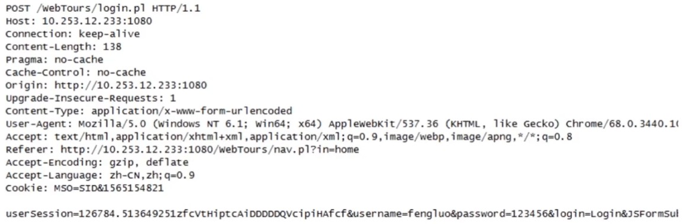
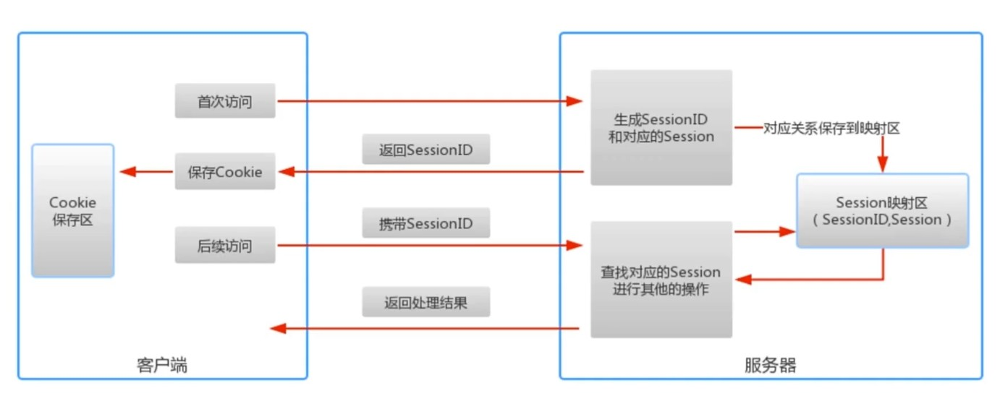

# HTTP传输协议

[TOC]

## 一、HTTP简介

- 是超文本传输协议（HTTP）是一种通信协议，它允许将超文本标记语言（HTML）文档从Web服务器传送到客户端的浏览器
- HTTP是一个属于应用层的面向对象的协议

### 透过TCP/IP看HTTP

HTTP协议是构建在TCP/IP协议之上的，是TCP/IP协议的一个子集

**TCP/IP协议族**

- TCP/IP协议其实是一系列与互联网相关联的协议集合起来的总称
- 分层管理是TCP/IP协议的重要特征

**TCP/IP协议族分层**

TCP/IP协议族是由一个四层协议组成的系统，

这四层分别为：应用层、传输层、网络层和数据链路层

**应用层**

应用层一般是我们编写的应用程序，决定了向用户提供的应用服务。应用层可以通过系统调用与传输层进行通信。如FTP、DNS、HTTP等。

**传输层**

传输层通过系统调用向应用层提供处于网络连接中的两台计算机之间的数据传输功能。

在传输层有两个性质不同的协议：TCP和UDP。

**网络层**

网络层用来处理在网络上流动的数据包，数据包时网络传输的最小数据单位。该层规定了通过怎样的路径（传输路线）到达对方计算机，并把数据包传输给对方。

**链路层**

链路层用来处理连接网络的硬件部分。

### 数据包的封装过程

### HTTP数据传输过程

发送端发送数据时，数据会从上层传输到下层，且每次过一层都会被打上该层的头部信息。而接收端接收数据时，数据会从下层传输到上层，传输层会把下层的头部信息删除。

### TCP三次握手

 **第一次握手**

客户端发送带有SYN标志的连接请求报文段，然后进入SYN_SEND状态，等待服务端的确认。

**第二次挥手**

服务端接收到客户端的SYN报文段后，徐娅发送ACK信息对这个SYN报文段进行确认。同时，还要发送自己的SYN请求信息。服务端会将上述的信息放到一个报文段（SYN+ACK报文段）中，一并发送给客户端，此时服务端将会进入SYN_RECV状态。

**第三次握手**

客户端接收到服务端的SYN+ACK报文段后，会想服务器发送ACK确认报文段，这个给报文段发送完毕后，客户端和服务端都进入ESTABLISHED状态，完成TCP三次握手。

**理解👇🏻：**

客户端和服务端要进行连接，要确认双方的收发能力都是正常的。

在第一次握手时，客户端发送网络包，服务端收到了。这样服务端就能得出一个结论：客户端的发送能力是正常的，而自己（即服务端）的接收能力是正常的。但此时客户端什么都不知道，因为它只发送了数据包。

所以服务端给了客户端一个确认，这就是第二次握手。所以服务端发送了一个包，客户端收到了，这里面带着确认和自己的请求，这样客户端就能得出一个结论：**服务端的接收能力是正常的**，因为它接收到了我上一次发送的数据，其次，**服务端的发送能力也是正常的**，因为它给我发来了一个新的数据，同时，我也知道了，**我自己（即客户端）的发送能力是正常的**，因为服务端是接收到了我给它发送的数据，才会给我返回数据， 然后，**我自己（客户端）的接收能力是正常**的，因为我接收到了服务端的数据。

在第三次握手前，服务端只知道客户端的发送能力和自己（服务端）的接收能力是正常的，进行第三次握手后，当客户端给服务端发送数据后，服务端得出结论：客户端的接收、发送能力，服务端的发送、接收能力都是正常的。因为服务端接收到了：客户端对于自己（服务端）发送的数据的回应后，给自己发送了数据。

三次握手之后，客户端和服务端都确认了自己的发送、接收能力正常。

### DNS服务

通常我们访问一个网站，使用的是主机名或者域名来进行访问的。因为相对于IP地址（一组纯数字），域名更容易让人记住。但TCP/IP协议使用的是IP地址进行访问的，所以必须有个机制或服务吧域名转换成IP地址。DNS服务就是用来解决这个问题的，它提供域名到IP地址之间的解析服务。

## 二、HTTP协议结构和通讯原理

### ⅠHTTP协议特点

#### ①支持客户/服务器模式

客户/服务器模式工作的方式是由客户端向服务器发出请求，服务器端响应请求，并进行相应服务。

#### ②简单快速

- 客户向服务器请求服务时，只需传送请求方法和路径
- 请求方法常用的有GET、HEAD、POST。每种方法规定了客户与服务器联系的类型不同
- 由于HTTP协议简单，使得HTTP服务器的程序规模小，因而通讯速度很快

#### ③灵活

- HTTP允许传输任意类型的数据对象
- 正在传输的类型由Content-Type（Content-Type是HTTP包中用来表示内容类型的标识）加以标记

#### ④无连接

- 无连接的含义是限制每次连接只处理一个请求
- 服务器处理完客户的请求，并收到客户的应答后，即断开连接
- 采用这种方法可以节省传输时间

#### ⑤无状态

- HTTP协议是无状态协议
- 无状态是指协议对于事务处理没有记忆能力。缺少状态意味着如果后序处理需要前面的信息，则它必须重传，这样可能导致每次连接传送的数据量增大
- 另一方面，在服务器不需要先前信息时它的应答就较快

### Ⅱ HTTP报文结构分析-请求报文

#### HTTP报文头

- HTTP的报文头大体可以分为四类，分别是：

​			通用报文头、请求报文头、响应报文头和实体报文头

- 在HTTP/1.1里一共规范了47种报文头字段

##### ①通用报文头

这些字段可以用在请求报文上，也可以用在响应报文上。

##### ②请求报文头

##### ③响应报文头

##### ④实体报文头

### Ⅲ HTTP报文结构分析-响应报文

### Ⅳ HTTP请求方法剖析

HTTP/1.1常用方法

- GET
- POST
- PUT
- HEAD
- DELETE
- TRACE
- CONNECT

#### ① GET获取资源

GET方法用来请求访问已被URI识别的资源

指定的资源经服务器端解析后返回响应内容

 因为GET方法所提交的数据是作为URL的一部分，所以提交的数据量不能过大

#### ② POST

- POST方法与GET功能类似，一般用来传输实体的主体
- POST方法的主要目的不是获取响应主体的内容

POST的提交的数据量大，且可以保密

#### ③ PUT

- 从客户端向服务器传送的数据取代指定的文档的内容

- PUT方法与POST方法最大的不同是：PUT是幂等的，而POST不是幂等的

  **幂等**：不管实现多少次重复的操作，都是实现相同的结果

#### ④ HEAD

类似于GET请求，只不过返回的响应中没有具体的内容，用于获取报头。

**返回回来的数据只有报文头**

#### ⑤ DELETE

请求服务器删除指定的资源

#### ⑥ OPTIONS

用来查询针对请求URI指定的资源支持的方法

当客户端不知道对方支持什么样的方法，此时就可以用OPTIONS方法 

#### ⑦ TRACE/CONNECT

TRACE：

​	回显服务器收到的请求，主要用于测试或诊断

CONNECT：

​	开启一个客户端与所请求资源之间的双向沟通的通道，它可以用来创建隧道

### Ⅴ 状态码

是用以表示网页服务器超文本传输协议响应状态的3位数字代码

#### 常用HTTP状态码

浏览器会自动跳转到指定的链接上

### Ⅵ HTTP状态管理：Cookie与Session

#### Cookie

Cookie是在客户端的，Session是在服务端的

- 客户端请求服务器，如果服务器需要记录该用户状态，就向客户端浏览器颁发一个Cookie
- 客户端浏览器会把Cookie保存起来。当浏览器再请求该网站时，浏览器把请求的网址连同该Cookie一同提交给服务器。服务器检查该Cookie，以此来辨认用户状态

#### Session

Session是另一种记录客户状态的机制，保存在服务器上。客户端浏览器访问服务器的时候，服务器把客户端信息以某种形式记录在服务器上

客户端浏览器再次访问时只需要从该Session中查找该客户的状态就可以了

解释上图：

当客户访问到服务器，如果服务器启用Session，那么服务器就会为这个用户创建一个Session，在创建Session时，服务器首先会检查客户端浏览器发送过来的请求中是否包含SessionID，如果包含，那就证明这个用户此前登陆过并且已经创建过Session。然后服务器就会根据这个SessionID在映射区查找出来。如果查找不到，或者根本没有SessionID，那么服务器就会为该客户端创建一个Session，并且生成一个对应的SessionID，在这次的响应中，SessionID会返回给客户端，保存在Cookie中。

##### 保存SessionID的方法

- Cookie

- URL重写

  就是直接把SessionID附加在URL的后面

  

- 隐藏表单

##### Session的有效期

- Session超时失效
- 程序调用HttpSession.invalidate()
- 服务器进程被停止

##### Cookie与Session

- 存放位置不同：Cookie是在客户端的，Session是在服务端的
- 安全性（隐私策略）不同：

​		Cookie存储在浏览器中，对客户端是可见的，客户端的一些程序可能会窥探，修改Cookie里面的内容，而Session存储在服务器上，对客户端来说，是透明的，不存在修改的风险。

- 有效期的不同

​		Cookie可以在浏览器中保存很长时间（设置的保存时间很长），但是服务器端会定时清理SessionID，避免服务器出现过大的压力，一般来说，只要我们关闭了浏览器，也就是一次会话结束，这个SessionID就失效了。

- 对服务器压力不同

​	 

## 三、HTTP协议之身份认证

常见认证方式

- BASIC认证（基本认证）
- DIGEST认证（摘要认证）
- SSL客户端认证
- FormBase认证（基于表单认证）

### BASIC认证

BASIC认证没有加密处理，如果在传输过程值被窃听，数据将会泄漏。

### DIGEST认证

为弥补BASIC认证存在的弱点，从HTTP/1.1起就有了DIGEST认证

DIGEST认证同样使用质询/响应的方式，但不会像BASIC认证那样直接发送明文密码

**质询/响应方式**：一方会先发送认证要求给另一方，接着使用从另一方接收到的质询码，计算生成响应码，最后将响应码返回给对方进行认证。

因为发送给对方的只是响应摘要以及由质询码产生的响应结果，所以比BASIC认证多了一层保护。密码泄漏的可能性降低。

DIGEST认证无法识别用户身份，只要用户名和密码输入正确即可。

### SSL客户端认证

SSL客户端认证是借由HTTPS的客户端证书完成认证的方式。凭借客户端证书认证，服务器可确认访问是否来自已登录的客户端。 

### 基于表单的认证

- 基于表单的认证方式并不是在HTTP协议中定义的
- 使用由Web应用程序各自实现基于表单的认证方式
- 通过Cookie和Session的方式来保持用户的状态

## 四、HTTP的长连接与短连接

- HTTP协议是基于请求/响应模式的，因此只要服务端给了响应，本次HTTP请求就结束了
- **HTTP的长连接和短连接本质上是TCP长连接和短连接**

- HTTP/1.0中，默认使用的是短连接。也就是说，浏览器和服务器每进行一次HTTP操作，就建立一次连接，结束就中断
- HTTP/1.1起，默认使用长连接，用以保持连接特性

## 五、HTTP中介之代理

代理的作用：

- 抓包
- FQ
- 匿名访问
- 过滤器

## 六、HTTP中介之网关

- 网关可以作为某种翻译器使用，它抽象出了一种能够到达资源的地方。网关是资源和应用程序之间的粘合剂
- 网关扮演的是"协议转换器"的角色

## 七、HTTP缓存

### ① HTTP缓存头部字段

**Cache-Control**

**Expires**

响应头，代表资源过期时间，由服务器返回提供，是http1.0的属性，在于max-age共存的情况下，优先级要低。

**Last-Modified**

响应头，资源最新修改时间，由服务器告诉浏览器

**if-Modified-Since**

请求头，资源最新修改时间，由浏览器告诉服务器，和Last-Modified是一对，它两会进行对比。

**Etag**

响应头，资源表示，由服务器告诉浏览器

**if-None-Match**

请求头，缓存资源标识，由浏览器告诉服务器（其实就是上次服务器给的Etag），和Etag是一对，它两会进行对比。

### ② HTTP缓存工作方式

#### 场景一：Expires

#### 场景二：If-Modified-Since && Last-Modified

#### 场景三：Etag && If-None-Match

### ③ 缓存改进方案

### ④ 浏览器操作对HTTP缓存的影响

## 八、内容协商机制

指客户端和服务器端就响应的资源内容进行交涉，然后提供给客户端最为合适的资源。内容协商会以响应资源的语言，字符集，编码方式等作为判断的基准。

## 九、断点续传和多线程下载

HTTP是通过在Header里两个参数实现的，客户端发送请求时对应的是Range，服务器端响应时对应的是Content-Range。

**Range**

Range: bytes=0-499

Range:bytes=500-999

**Content-Range**

用于响应头中，在发出带Range的请求后，服务器会在Content-Range头部返回当前接收的范围和文件总大小。

而在响应完成后，返回的响应头内容也不同：

HTTP/1.1 200 OK（不使用断点续传方式）

HTTP/1.1 206 Partial Content （使用断点续传方式）

## 十、HTTPS协议

HTTP使用明文进行传输，会有安全性问题，可以对明文进行加密。

HTTPS可以认为是 HTTP+TLS

TLS是传输层加密协议，它的前身是SSL协议

## 十一、WebSocket与HTTP

## 十二、Web安全威胁

三次安全防御机制：

验证机制：登录、注销操作

会话管理：Cookie和Session

访问控制：用户具有什么样的权限，能够看到什么页面，看到哪些功能

### ① 验证机制安全

1.验证机制是Web应用程序中最简单的一种安全机制

一般来说，应用程序必须核实用户提交的用户名和密码是否正确。正确则允许登录，否则禁止登录。

 2.验证机制是应用程序防御恶意攻击的核心机制

- 它处在安全防御的最前沿，如果被用户轻易突破，通常应用程序的全部功能、数据都会被其控制。
- 缺乏安全有效的验证机制，其他核心安全机制都无法实施（会话管理和访问控制）

