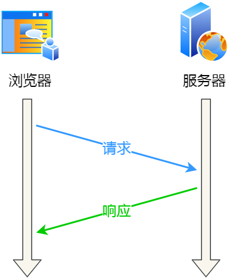
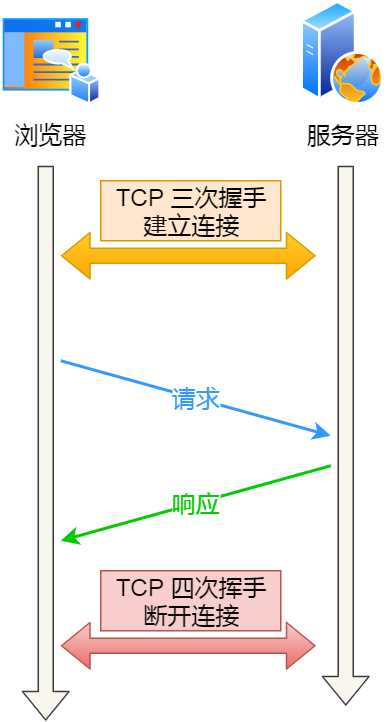
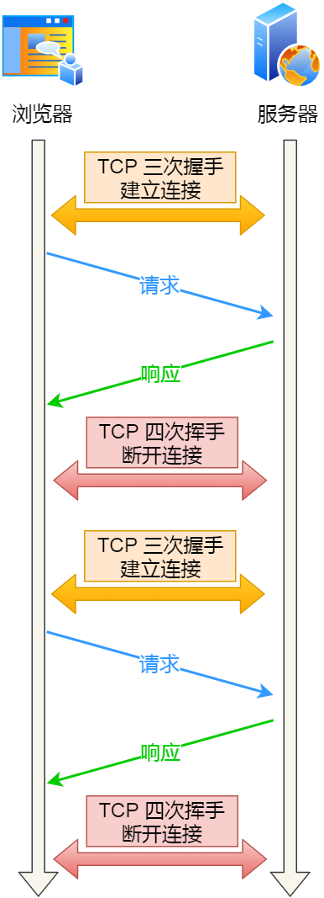
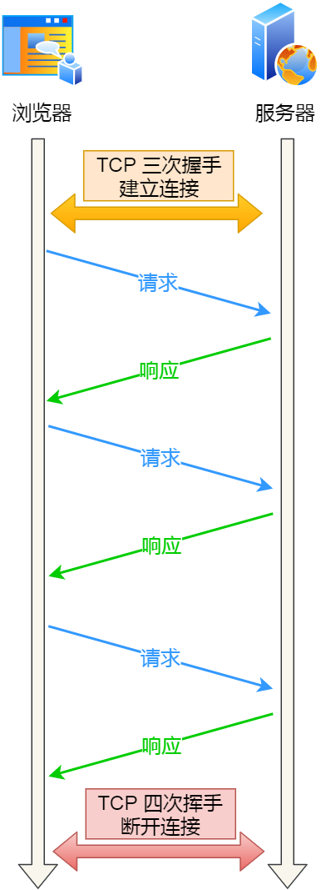
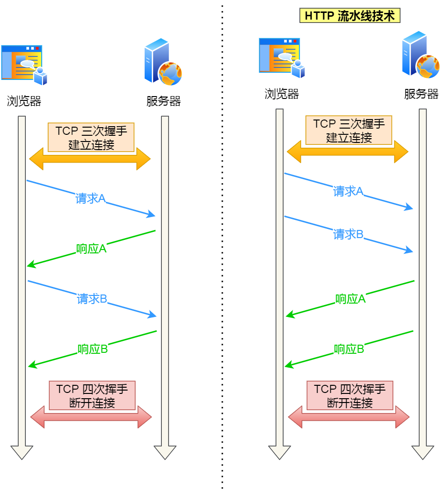
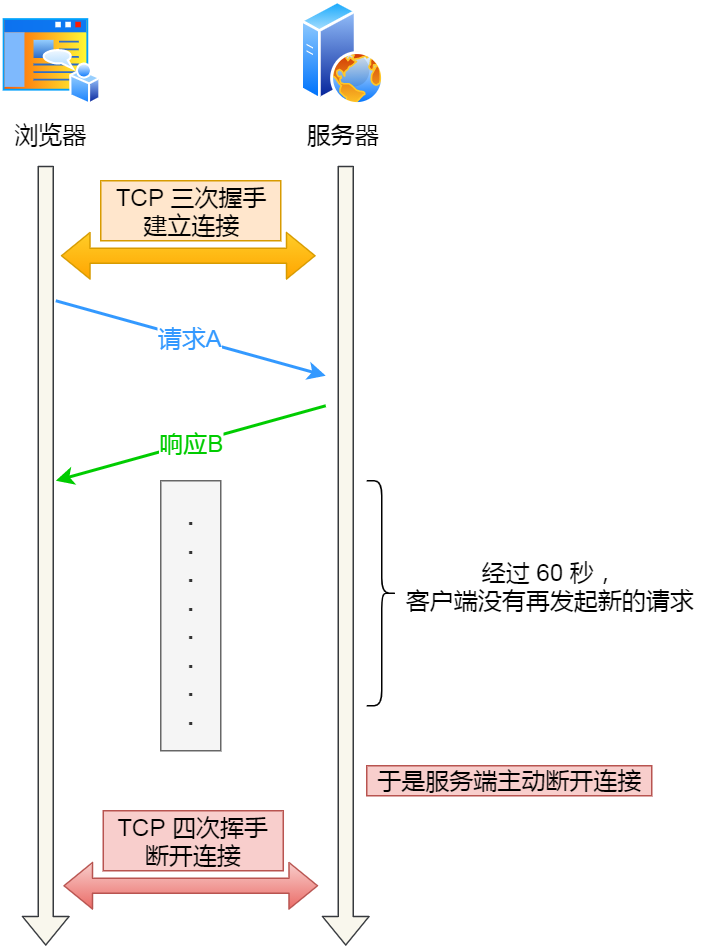
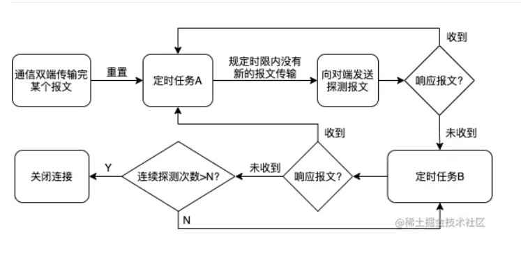
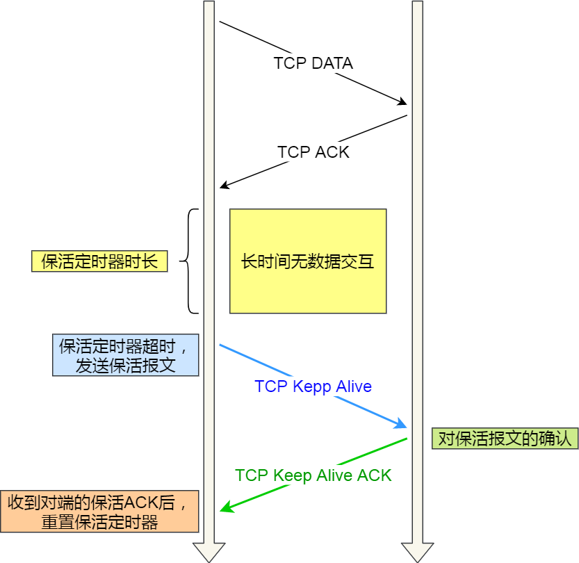

# TCP 的 Keepalive 和 HTTP 的 Keep-Alive 是一个东西吗？

[TOC]


事实上，**这两个完全是两样不同东西**，实现的层面也不同：

- HTTP 的 Keep-Alive，是由**应用层（用户态）** 实现的，称为 HTTP 长连接；
- TCP 的 Keepalive，是由 **TCP 层（内核态）** 实现的，称为 TCP 保活机制；


## HTPP的Keep-Alive

> HTTP keepalive指的是持久连接，强调复用TCP连接。（类似场景：挂电话之前总会问句，没啥事就先挂了，延长通话时长来确认没有新话题）

### 作用

延长TCP连接的时长，一次TCP连接从创建到关闭期间能传输更多的数据。


HTTP 协议采用的是「请求-应答」的模式，也就是客户端发起了请求，服务端才会返回响应，一来一回这样子。



由于 HTTP 是基于 TCP 传输协议实现的，客户端与服务端要进行 HTTP 通信前，需要先建立 TCP 连接，然后客户端发送 HTTP  请求，服务端收到后就返回响应，至此「请求-应答」的模式就完成了，随后就会释放 TCP 连接。



如果每次请求都要经历这样的过程：建立 TCP -> 请求资源 -> 响应资源 -> 释放连接，那么此方式就是 **HTTP 短连接**，如下图：



这样实在太累人了，一次连接只能请求一次资源。

能不能在第一个 HTTP 请求完后，先不断开 TCP 连接，让后续的 HTTP 请求继续使用此连接？

当然可以，HTTP 的 Keep-Alive 就是实现了这个功能，可以使用同一个 TCP 连接来发送和接收多个 HTTP 请求/应答，避免了连接建立和释放的开销，这个方法称为 **HTTP 长连接**。



HTTP 长连接的特点是，只要任意一端没有明确提出断开连接，则保持 TCP 连接状态。

怎么才能使用 HTTP 的 Keep-Alive 功能？

在 HTTP 1.0 中默认是关闭的，如果浏览器要开启 Keep-Alive，它必须在请求的包头中添加：

```
Connection: Keep-Alive
```

然后当服务器收到请求，作出回应的时候，它也添加一个头在响应中：

```
Connection: Keep-Alive
```

这样做，连接就不会中断，而是保持连接。当客户端发送另一个请求时，它会使用同一个连接。这一直继续到客户端或服务器端提出断开连接。

**从 HTTP 1.1 开始， 就默认是开启了 Keep-Alive**，如果要关闭 Keep-Alive，需要在 HTTP 请求的包头里添加：

```
Connection:close
```

现在大多数浏览器都默认是使用 HTTP/1.1，所以 Keep-Alive 都是默认打开的。一旦客户端和服务端达成协议，那么长连接就建立好了。

HTTP 长连接不仅仅减少了 TCP 连接资源的开销，而且这给 **HTTP 流水线**技术提供了可实现的基础。

所谓的 HTTP 流水线，是**客户端可以先一次性发送多个请求，而在发送过程中不需先等待服务器的回应**，可以减少整体的响应时间。

举例来说，客户端需要请求两个资源。以前的做法是，在同一个 TCP 连接里面，先发送 A 请求，然后等待服务器做出回应，收到后再发出 B 请求。HTTP 流水线机制则允许客户端同时发出 A 请求和 B 请求。



但是**服务器还是按照顺序响应**，先回应 A 请求，完成后再回应 B 请求。

而且要等服务器响应完客户端第一批发送的请求后，客户端才能发出下一批的请求，也就说如果服务器响应的过程发生了阻塞，那么客户端就无法发出下一批的请求，此时就造成了「队头阻塞」的问题。

可能有的同学会问，如果使用了 HTTP 长连接，如果客户端完成一个 HTTP 请求后，就不再发起新的请求，此时这个 TCP 连接一直占用着不是挺浪费资源的吗？

对没错，所以为了避免资源浪费的情况，web 服务软件一般都会提供 `keepalive_timeout` 参数，用来指定 HTTP 长连接的超时时间。

比如设置了 HTTP 长连接的超时时间是 60 秒，web 服务软件就会**启动一个定时器**，如果客户端在完后一个 HTTP 请求后，在 60 秒内都没有再发起新的请求，**定时器的时间一到，就会触发回调函数来释放该连接。**




### 开启Keep-Alive的优缺点：

优点：Keep-Alive模式更加高效，因为避免了连接建立和释放的开销。
缺点：长时间的Tcp连接容易导致系统资源无效占用，浪费系统资源。


### 当保持长连接时，如何判断一次请求已经完成？

**Content-Length**
Content-Length表示实体内容的长度。浏览器通过这个字段来判断当前请求的数据是否已经全部接收。
所以，当浏览器请求的是一个静态资源时，即服务器能明确知道返回内容的长度时，可以设置Content-Length来控制请求的结束。但当服务器并不知道请求结果的长度时，如一个动态的页面或者数据，Content-Length就无法解决上面的问题，这个时候就需要用到Transfer-Encoding字段。

**Transfer-Encoding**
Transfer-Encoding是指传输编码，在上面的问题中，当服务端无法知道实体内容的长度时，就可以通过指定Transfer-Encoding: chunked来告知浏览器当前的编码是将数据分成一块一块传递的。当然, 还可以指定Transfer-Encoding: gzip, chunked表明实体内容不仅是gzip压缩的，还是分块传递的。最后，当浏览器接收到一个长度为0的chunked时， 知道当前请求内容已全部接收。

**Keep-Alive_timeout**
Httpd守护进程，一般都提供了keep-alive timeout时间设置参数。比如nginx的keepalive_timeout，和Apache的KeepAliveTimeout。这个keepalive_timout时间值意味着：一个http产生的tcp连接在传送完最后一个响应后，还需要hold住keepalive_timeout秒后，才开始关闭这个连接。
当httpd守护进程发送完一个响应后，理应马上主动关闭相应的tcp连接，设置 keepalive_timeout后，httpd守护进程会想说：”再等等吧，看看浏览器还有没有请求过来”，这一等，便是keepalive_timeout时间。如果守护进程在这个等待的时间里，一直没有收到浏览器发过来http请求，则关闭这个http连接。


### 我们平时用的是不是长连接？

这个也毫无疑问，当然是的。（现在用的基本上都是HTTP1.1协议，你观察一下就会发现，基本上Connection都是keep-alive。而且HTTP协议文档上也提到了，HTTP1.1默认是长连接，也就是默认Connection的值就是keep-alive）


### 我们这种普通的Web应用（比如博客园，我的个人博客这种）用长连接有啥好处？需不需要关掉长连接而使用短连接？

首先，长连接是为了复用。长连接是指的复用一个TCP连接，也就是说，长连接情况下，多个HTTP请求可以复用同一个TCP连接，这就节省了很多TCP连接建立和断开的消耗。

比如你请求了博客园的一个网页，这个网页里肯定还包含了CSS、JS等等一系列资源，如果你是短连接（也就是每次都要重新建立TCP连接）的话，那你每打开一个网页，基本要建立几个甚至几十个TCP连接，这浪费了很多资源。

但如果是长连接的话，那么这么多次HTTP请求（这些请求包括请求网页内容，CSS文件，JS文件，图片等等），其实使用的都是一个TCP连接，很显然是可以节省很多消耗的。


## TCP的KeepAlive

连接建立之后，如果客户端一直不发送数据，或者隔很长时间才发送一次数据，当连接很久没有数据报文传输时如何去确定对方还在线，到底是掉线了还是确实没有数据传输，连接还需不需要保持，这种情况在TCP协议设计中是需要考虑到的。
TCP协议通过一种巧妙的方式去解决这个问题，当超过一段时间之后，TCP自动发送一个数据为空的报文（侦测包）给对方，如果对方回应了这个报文，说明对方还在线，连接可以继续保持，如果对方没有报文返回，并且重试了多次之后则认为链接丢失，没有必要保持连接。

TCP 的 Keepalive 其实就是 **TCP 的保活机制**.

TCP keepalive是TCP的保活定时器。通俗地说，就是TCP有一个定时任务做倒计时，超时后会触发任务，内容是发送一个探测报文给对端，用来判断对端是否存活。

### 作用

正如概念中说的，用于探测对端是否存活，从而防止连接处于“半打开”状态。

所谓半打开，就是网络连接的双端中，有一端已经断开，而另一端仍然处于连接状态。


### 机制



建立连接的双端在通信的同时，存在一个定时任务A，每当传输完一个报文，都会重置定时任务A。如果在定时任务的时限`tcp_keepalive_time`内不再有新的报文传输，便会触发定时任务A，向对端发送存活探测报文。根据响应报文的不同情况，有不同的操作分支，如上图所示。

定时任务B会被循环执行，具体逻辑是：定时任务A的探测报文没有得到响应报文，开始执行定时任务B。任务B的内容同样是发送探测报文，但不同的是，B会被执行`tcp_keepalive_probes`次，时间间隔为`tcp_keepalive_intvl`。B的探测报文同样也是在收到响应报文后，重置定时任务A，维持连接状态。


对上述流程总结：
当网络两端建立了TCP连接之后，闲置（双方没有任何数据流发送往来）了`tcp_keepalive_time`后，服务器就会尝试向客户端发送侦测包，来判断TCP连接状况(有可能客户端崩溃、强制关闭了应用、主机不可达等等)。如果没有收到对方的回答(ack包)，则会在 `tcp_keepalive_intvl`后再次尝试发送侦测包，直到收到对方的ack,如果一直没有收到对方的ack,一共会尝试 `tcp_keepalive_probes`次。如果尝试`tcp_keepalive_probes`次,依然没有收到对方的ack包，则会丢弃该TCP连接。TCP连接默认闲置时间是2小时，一般设置为30分钟足够了。

在Linux内核可以有对应的参数可以设置保活时间、保活探测的次数、保活探测的时间间隔，以下为默认值：

```
net.ipv4.tcp_keepalive_intvl = 75
net.ipv4.tcp_keepalive_probes = 9
net.ipv4.tcp_keepalive_time = 7200
```

- `tcp_keepalive_time=7200`: 表示保活时间是7200s（2小时），也就是2小时内如果没有任何连接相关的活动，则会启动保活机制
- `tcp_keepalive_intvl=75`: 表示每次检测时间间隔75s
- `tcp_keepalive_probes=9`: 表示检测9次无响应，认为对方是不可达的，从而中断本次的连接

也就是说在Linux系统中，最少需要经过2小时11分15秒才可以发现一个死亡连接

```
tcp_keepalive_time + ( tcp_keepalive_intvl * tcp_keepalive_probes)
												↓↓↓
		     7200 + ( 75 * 9 ) = 7872秒(2小时11分15秒)									
```

如果两端的 TCP 连接一直没有数据交互，达到了触发 TCP 保活机制的条件，那么内核里的 TCP 协议栈就会发送探测报文。

- 如果对端程序是正常工作的。当 TCP 保活的探测报文发送给对端, 对端会正常响应，这样 **TCP 保活时间会被重置**，等待下一个 TCP 保活时间的到来。
- 如果对端主机崩溃，或对端由于其他原因导致报文不可达。当 TCP 保活的探测报文发送给对端后，石沉大海，没有响应，连续几次，达到保活探测次数后，**TCP 会报告该 TCP 连接已经死亡**。

所以，TCP 保活机制可以在双方没有数据交互的情况，通过探测报文，来确定对方的 TCP 连接是否存活，这个工作是在内核完成的。



注意，应用程序若想使用 TCP 保活机制需要通过 socket 接口设置 `SO_KEEPALIVE` 选项才能够生效，如果没有设置，那么就无法使用 TCP 保活机制。

### 总结

HTTP 的 Keep-Alive 也叫 HTTP 长连接，该功能是由「应用程序」实现的，可以使得用同一个 TCP 连接来发送和接收多个 HTTP 请求/应答，减少了 HTTP 短连接带来的多次 TCP 连接建立和释放的开销。

TCP 的 Keepalive 也叫 TCP 保活机制，该功能是由「内核」实现的，当客户端和服务端长达一定时间没有进行数据交互时，内核为了确保该连接是否还有效，就会发送探测报文，来检测对方是否还在线，然后来决定是否要关闭该连接。


参考文章：

[别搞混了！](https://mp.weixin.qq.com/s/25atTs4b-vORIx525ur_aw)

[浅谈Http长连接和Keep-Alive以及Tcp的Keepalive](https://blog.csdn.net/weixin_37672169/article/details/80283935)