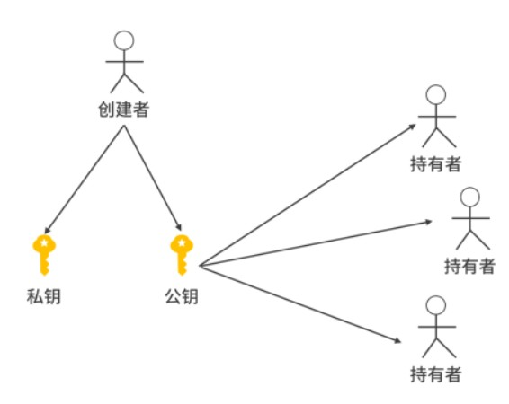
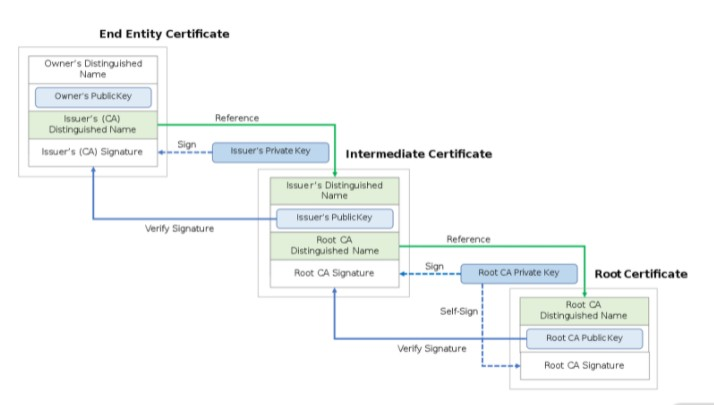

# 【HTTPS协议】对称加密与非对称加密

[TOC]


## 对称加密

双方加密解密都用相同密钥的算法，我们称为**对称加密算法**。


#### 最简单的加密算法

假设你要加密数字 1234，假设 x 的补是 10-x，那么取补就是得到 9876。单单看这个操作太容易被破解，这个时候我们将操作复杂化。假设有 3 种取补操作：

前两个数字取补，后两个不变得到：9834。记作 1 号方案；

后两个数字取补，前两个不变，得到：1276。记作 2 号方案；

全部取补，得到：9876，记作3 号方案。

然后我们再增加两种换序操作，以 1234 为例：

相邻数字交换，得到 2143， 记作4 号方案；

数据对半交换，得到 3412，记作5 号方案。

这样，我们可以设计一个加密过程是这样的，取补和换序操作交替进行，一共进行 4 次。那么如果是 1-4-2-5 就代表一种加密顺序，以 1234 为例：

前两个数字取补，得到 9834；

相邻数据交换，得到 8943；

后两个数字取补，得到 8967；

数据对半交换得到：6789。

于是 1234 被加密成了 6789。解密的时候，需要知道加密的顺序 1-4-2-5。那么解密的时候就逆着上述操作即可：

数据对半交换得到：8967；

后两个数字取补：8943；

相邻数据交换：9834；

前两个数字取补：1234。

在上面的过程中，对 5 种加密方案的定义、以及约定进行 4 次交替取补、换序操作，我们称为“**加密算法**”。

1-4-2-5 ，描述的是在过程中的具体方案，是**密钥**。


## 非对称加密

当我们开发一个网站，我们的用户之间的通信用非对称加密。用户发送请求时，用户用一把钥匙加密数据，网站用另一把钥匙解密。在这个过程中，网站拥有的钥匙称为**私钥**，用户拥有的钥匙称为**公钥**。之所以这样称呼，是因为**很多用户可以共用一把公钥，而只有网站才拥有私钥**。

公钥发送的数据必须用私钥解密， 私钥发送的数据必须用公钥解密。网站发送数据加密用私钥，用户用公钥解密。用户发送数据用公钥，网站用私钥解密。而如果用户公钥不小心被盗，黑客也无法通过这把钥匙看其他用户的数据，因为黑客拿不到私钥。另外，当一个数据用公钥加密后，黑客也不可能查阅、篡改数据，因为黑客拿不到私钥。


### 密钥的创建



在非对称加密中，密钥通常由提供服务的一方创建。每次创建是一对公私钥对，然后提供者将公钥给用户，自己保留私钥。


### 常见的应用场景

非对称加密算法目前广泛应用到各个领域，比如 HTTPS 协议的握手和交换密钥过程需要非对称加密算法；SSH 的通信需要非对称加密算法。另外，证书的生程，比如利用证书实现 git 账号的免密操作也是基于非对称加密算法。在线合同、数字货币的签名等都需要非对称加密算法。


## 摘要

如果想阻止一份合同被修改，最容易想到的方式是加密。合同一旦被加密了，要修改就必须原文和密文一起修改。虽然这没有解决最本质的问题——谁来提供信用。但是这样的种做法解决了一个最基础的问题。如果有人想修改合同，就必须知道密钥。


### 摘要算法

给计算机一篇文章，计算机用摘要算法（主要是哈希类算法）生成一个字符串，如果文章内容改变，哪怕是一个字，一个标点符号，摘要也会完全改变。和完全加密一篇文章相比，摘要的体积很小，因此非常有利于存储和传输。

**通常对于一个给定的摘要算法，无论你的文章多大，有多少字节，最终生成摘要的字节数是固定的。**


### 摘要的价值

**摘要是对原文的证明，从原文到摘要是一个不可逆的过程**。

通过原文可以计算出摘要，一旦原文发生变化，哪怕是一个标点符号，摘要也会发生变化。而已知一个摘要，想要反推出原文，几乎是不可能的。因为摘要和原文并不是一对一的关系，是多个原文对应一个摘要。而且，想要找到两个摘要碰撞的原文是非常困难的发生概率相当于买彩票中大奖 。而且就算黑客找到了碰撞的原文，也未必可以起到作用。

摘要碰撞的危害，举个具体的例子：目前多数网站用户的密码是以摘要的形式保存的。你可能会问，为什么不以原文形式保存呢？这是因为程序员会经常接触到数据库，而黑客也有可能黑进公司的数据库，因此密码以摘要显示保存更加安全，可以有效防止用户敏感数据被盗。因此，网站的设计，一般不存储用户的密码，只存储用户密码的摘要。如果网站的数据库被攻破，黑客拿到的是用户密码的摘要。拥有摘要什么也做不了，因为通过摘要找不到用户密码的原文，仍然不能登录这个网站。


## 签名

**摘要的另一个非常重要的用途就是签名**。

如果张三将合同生成摘要，再用自己的私钥加密摘要，得到一个密文串，那么这个串就是张三对合同的**数字签名**（DIgital Sign）。

张三生成好数字签名，将自己的公钥、合同原文以及数字签名交给李四保管，就基本上达成了今天我们签约双方交换合同的效果。

如果原文没有被修改，那么

```
公钥解密（数字签名） == 签订合同时的原文摘要 == 摘要算法（当前原文） == 当前摘要
```

比如原文被修改，那么可以通过重新计算摘要，对比解密后的数字签名（其实就是早先的摘要）。对张三而言，李四不知道张三的私钥，因此他篡改不了张三签名的这份合同。对李四而言，张三无法抵赖自己没有签署过这份合同，因为李四可以拿着张三的公钥对数字签名解密得到摘要，然后再对比合同原文的摘要。因为是张三私钥加密，如果张三的公钥能解开，那说明就是张三签署的合同。


## 证书

这里还存在着一个重要的缺陷，就是谁来证明，张三给李四的公钥，就是张三的公钥；李四给张三的公钥，就是李四的公钥。而谁又来证明张三和李四，是合法的两个个人，具有签署合同的权利。


### 信用的提供

**信用必须有人提供**。只有权威机构（比如公安局）可以证明张三是张三，李四是李四。同理，互联网世界也需要机构提供证书，由机构证明他们的公钥。这并不是说，张三自己不能制作自己的证书，只不过张三做的证书没有公信力。互联网中，加密算法、签名算法都是公开的，只不过张三自己制作的证书背后没有信用的支持。


### 证书制作

证书是一个身份证明文件，比如互联网中，经常会为一个域名制作证书。通常的一个域名证书会有一些基础信息：

- 覆盖的域名
- 证书的用途
- 签发时间
- 到期时间
- 域名方的公钥


**除了证明身份，证书还有一个重要的作用就是让其他人可以使用自己的公钥**。

最重要的，就是要有权威机构对证书的签名。权威机构用自己的私钥对证书进行签名，于是证书上还需要增加 3 个信息：

- 权威机构的名称
- 权威机构的签名
- 权威机构的网址

最后这步签名操作就好像护照上要盖个章一样，有了这个权威机构的签名，证书就合法了。


### 信用链的验证

现在问题来了，张三把证书给了李四，李四拿到张三的证书，并看到某权威机构的签名。李四的第一反应就是——这个签名是权威机构的吗？当你打开拉勾教育的时候，你相信这个证书是 GlobalSign 签发的吗？大部分同学都不知道 GlobalSign吧？ 其实我也不知道这家机构。但是这不重要，用户甚至不需要理解 GlobalSign，计算机产业的底层建筑帮助大家解决了这个问题——这个被称作**信用链**。

当我们用 HTTPS 协议打开拉勾教育的页面时，这个证书会随着 HTTPS 的握手被下载到本地。浏览器打开证书，发现提供方式 GlobalSign。GlobalSign（Certificate Authority，CA）是一家证书颁发机构。

浏览器并不需要理解 GlobalSign 是谁，在验证过程中，浏览器会查找操作系统中，是否已经安装了 GlobalSign 的证书。如果已经安装了，浏览器就会相信这个证书。操作系统的提供商，比如微软、苹果、谷歌总不会恶意安装非法证书砸自己的招牌。只要用户本机安装了 GlobalSign 证书，那么 GlobalSign 证书的公钥就应该可以解密网站证书的签名，得到网站证书的摘要，那么就可以信任 GlobalSign 签发的这张拉勾的证书。

如果操作系统中没有安装 GlobalSign 的证书该怎么办呢？不要着急，这个时候，浏览器会去 GlobalSign 的网站下载证书，拿到 GlobalSign 证书后，浏览器也不确定 GlobalSign 是一个权威机构，这个时候浏览器会看 GlobalSign 证书上有没有签发方。如果有，递归进行检查签发方的证书是否安装在操作系统本地，直到找到根证书。根证书的特点是，这个机构的证书没有其他机构为它签名。只要操作系统中有根证书，那么 GlobalSign 就值得信任，因此拉勾值得信任。

在上述过程中，操作系统的提供商起到重要的作用。操作系统安装的时候，会预装一些证书。这些证书我们称为**根证书**，能签发根证书的机构就是**根证书提供商**。根证书提供商在全球很少，通常只有信誉非常棒的机构才能担当。而且成为根证书要得到很多资质，如果中间出现问题，还会被取消资格，特别是还需要和多家操作系统提供商达成合作，比如微软、苹果、谷歌等。


### 信任链的具体形式

一般的，信任链有 3 层。最顶层是根证书和根证书机构（Root Certificate，Root CA）。前面我们提到，根证书往往是随着操作系统安装的，特殊情况需要用户自己安装。比如说一些抓包工具，会要求用户自己安装一个根证书。

中间的是中间证书机构，它们自己的证书是由 Root CA 签名颁发的，同时它们向最底层的终端机构提供证书。



根证书是自签名，中间证书是根证机构书签名，终端证书（比如拉勾网）是中间证书机构签名。这样就构成了一个信任链，并且也增加了犯罪的成本。犯罪分子如果想要冒充证书，那么它的证书就需要获得中间证书提供商的签名，而获得签名需要购买证书。犯罪分子就算购买了证书，也只能购买自己域名的证书，因此无法伪装成其他网站。**但要特别注意的是，如果犯罪分子设法在你的个人电脑上安装了它的根证书，那后果就严重了，它可以冒充成任何网站**。


## 面试题：为什么可以相信一个 HTTPS 网站？

当用户用浏览器打开一个 HTTPS 网站时，会到目标网站下载目标网站的证书。接下来，浏览器会去验证证书上的签名，一直验证到根证书。如果根证书被预装，那么就会信任这个网站。也就是说，**网站的信用是由操作系统的提供商、根证书机构、中间证书机构一起在担保**。