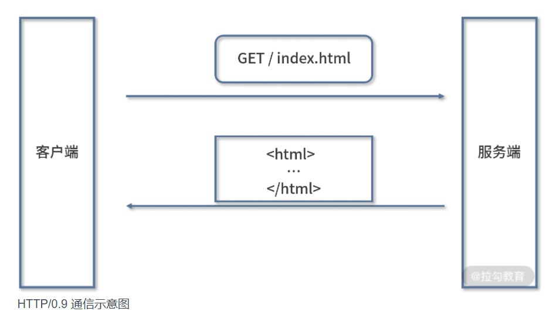
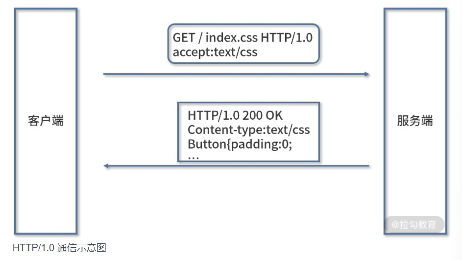
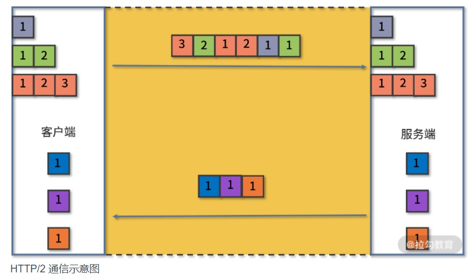
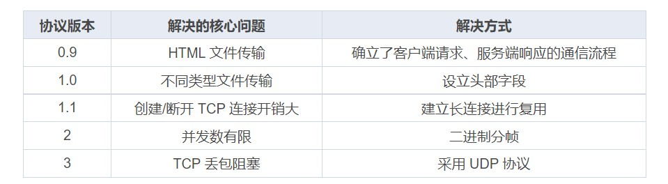

# 【HTTP协议】发展历程

[TOC]

## HTTP/0.9

协议定义了客户端发起请求、服务端响应请求的通信模式。请求报文内容只有 1 行，为 GET 加上请求的文件路径。服务端收到请求后返回一个以 ASCII 字符流编码的 HTML 文档。

只允许用“GET”动作从服务器上获取 HTML 文档，并且在响应请求之后立即关闭连接，功能非常有限。

## HTTP/1.0

1. 增加了 HEAD、POST 等新方法；
2. 增加了响应状态码，标记可能的错误原因；
3. 引入了协议版本号概念；
4. 引入了 HTTP Header（头部）的概念，让 HTTP 处理请求和响应更加灵活；
5. 传输的数据不再仅限于文本。

最核心的改变是**增加了头部设定**，头部内容以键值对的形式设置。请求头部通过 Accept 字段来告诉服务端可以接收的文件类型，响应头部再通过 Content-Type 字段来告诉浏览器返回文件的类型。

## HTTP/1.1

HTTP/1.0 每进行一次通信，都需要经历**建立连接、传输数据和断开连接**三个阶段。当一个页面引用了较多的外部文件时，这个建立连接和断开连接的过程就会增加大量网络开销。

为了解决这个问题，1999 年推出的 HTTP/1.1 版本增加了一个**创建持久连接**的方法。主要实现是当一个连接传输完成时，并不是马上进行关闭，而是继续复用它传输其他请求的数据，这个连接保持到浏览器或者服务器要求断开连接为止。

HTTP/1.1 是对 HTTP/1.0 的小幅度修正。

HTTP/1.1 主要的变更点有：

1. 增加了 PUT、DELETE 等新的方法；
2. 增加了缓存管理和控制；
3. 明确了连接管理，允许持久连接；
4. 允许响应数据分块（chunked），利于传输大文件；
5. 强制要求 Host 头，让互联网主机托管成为可能。

### 延伸 ：TCP 是怎样建立/断开连接的？

因为 HTTP 是基于 TCP 实现的，所以这里扩展一下 TCP 建立连接以及断开连接的过程，也就是常常被提的“三次握手”和“四次挥手”。

点击这里👉[【TCP协议】TCP 为什么握手是 3 次、挥手是 4 次？](https://blog.csdn.net/weixin_52834435/article/details/123778742?spm=1001.2014.3001.5501)

## HTTP/2

HTTP/1.1 虽然通过长连接减少了大量创建/断开连接造成的性能消耗，但由于它的并发能力受到限制，所以传输性能还有很大提升空间。

为什么说 HTTP/1.1 的并发能力受限呢？主要表现在两个方面：

- **浏览器为了减轻服务器的压力**，限制了同一个域下的 HTTP 连接数，即 6 ~ 8 个，所以在 HTTP/1.1 下很容易看到资源文件等待加载的情况，对应优化的方式就是使用多个域名来加载图片资源；

- **HTTP/1.1 本身的问题**，虽然 HTTP/1.1 中使用持久连接时，多个请求能共用一个 TCP 连接，但在一个连接中同一时刻只能处理一个请求，在当前的请求没有结束之前，其他的请求只能处于阻塞状态，这种情况被称为 “**队头阻塞**” 。

在 2015 年正式发布的 **HTTP/2 中新增了一个二进制分帧的机制来提升传输效率**。

HTTP/2 将默认不再使用 ASCII 编码传输，而是改为二进制数据。客户端在发送请求时会将每个请求的内容封装成不同的带有编号的二进制帧，然后将这些帧同时发送给服务端。服务端接收到数据之后，会将相同编号的帧合并为完整的请求信息。同样，服务端返回结果、客户端接收结果也遵循这个帧的拆分与组合的过程。

受益于二进制分帧，对于同一个域，客户端只需要与服务端建立一个连接即可完成通信需求，自然也不再受限于浏览器的连接数限制了，这种利用一个连接来发送多个请求的方式称为“**多路复用**”。

HTTP/2 的制定充分考虑了现今互联网的现状：宽带、移动、不安全，在高度兼容HTTP/1.1 的同时在性能改善方面做了很大努力，主要的特点有：

1. 二进制协议，不再是纯文本；
2. 可发起多个请求，废弃了 1.1 里的管道；
3. 使用专用算法压缩头部，减少数据传输量；
4. 允许服务器主动向客户端推送数据；
5. 增强了安全性，“事实上”要求加密通信。

## HTTP/3

HTTP/2 也并非完美，考虑一种情况，如果客户端或服务端在通信时出现数据包丢失，或者任何一方的网络出现中断，那么整个 TCP 连接就会暂停。

HTTP/2 由于采用二进制分帧进行多路复用，通常只使用一个 TCP 连接进行传输，在丢包或网络中断的情况下后面的所有数据都被阻塞。但对于 HTTP/1.1 来说，可以开启多个 TCP 连接，任何一个 TCP 出现问题都不会影响其他 TCP 连接，剩余的 TCP 连接还可以正常传输数据。这种情况下 HTTP/2 的表现就不如 HTTP/1 了。

2018 年 HTTP/3 将底层依赖的 TCP 改成 UDP，从而彻底解决了这个问题。UDP 相对于 TCP 而言最大的特点是传输数据时不需要建立连接，可以同时发送多个数据包，所以传输效率很高，缺点就是没有确认机制来保证对方一定能收到数据。

## 总结

