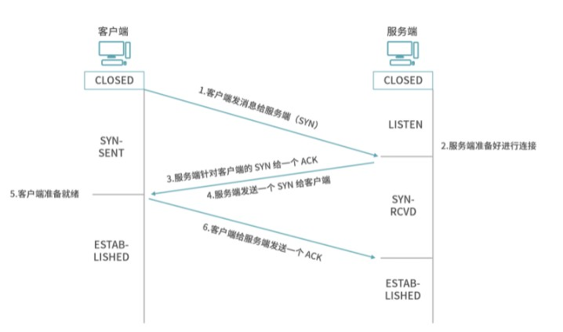
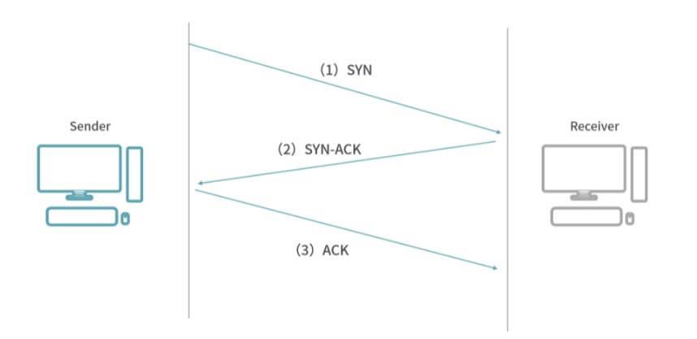
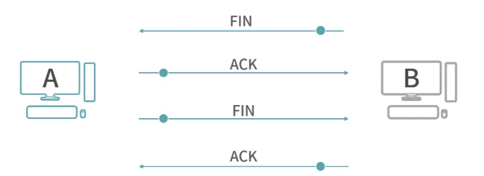

# 【TCP协议】TCP 为什么握手是 3 次、挥手是 4 次？

[TOC]

## TCP 协议

> TCP（Transport Control Protocol）是一个传输层协议，提供 Host-To-Host 数据的可靠传输，支持全双工，是一个连接导向的协议。

### ① 主机到主机（Host-To-Host）

TCP 提供的是 Host-To-Host 传输，一台主机通过 TCP 发送数据给另一台主机。

这里的主机（Host）是一个抽象的概念，可以是手机、平板、手表等。收发数据的设备都是主机，所以双方是平等的。

> **端口号**：
>
> 端口号用于区分应用，TCP 上层有太多的应用，不仅仅有微信，还有QQ、抖音、网易云音乐……因此 TCP 上层的应用层协议使用 TCP 能力的时候，需要告知 TCP 是哪个应用

### ② 相关概念解释

> **IP协议**：
>
> 位于网络层，提供地址到地址的通信（Address-To-Address），但是不负责信号在具体两个设备间传递。
>
> 
>
> **数据链路层**：
>
> 链路层在两个相邻设备间传递信息。
>
> 
>
> **物理层**：
>
> 当信号在两个设备间传递的时候，科学家设计出了物理层封装最底层的物理设备、传输介质等，由最下方的物理层提供最底层的传输能力。

>**连接（Connection）**:
>
>连接是通信双方的一个约定，目标是让两个在通信的程序之间产生一个默契，保证两个程序都在线，而且尽快地响应对方的请求。
>
>
>
>**会话（Session）**：
>
>会话是应用的行为，比如微信里张三和你聊天，那么张三和你建立一个会话。你要和张三聊天，你们创建一个聊天窗口，这个就是会话。你开始 Typing，开始传输数据，你和微信服务器间建立一个连接。如果你们聊一段时间，各自休息了，约定先不要关微信，1 个小时后再回来。那么连接会断开，因为聊天窗口没关，所以会话还在。
>
>在有些系统设计中，会话会自动重连（也就是重新创建连接），或者帮助创建连接。 此外，会话也负责在多次连接中保存状态，比如 HTTP Session 在多次 HTTP 请求（连接）间保持状态（如用户信息）。
>
>
>
>#### 会话是应用层的概念，连接是传输层的概念
>
>

### ③ 双工/单工问题

在任何一个时刻，如果数据只能单向发送，就是**单工**，所以单工需要至少一条线路。如果在某个时刻数据可以向一个方向传输，也可以向另一个方向反方向传输，而且交替进行，叫作**半双工**；半双工需要至少 1 条线路。最后，如果任何时刻数据都可以双向收发，这就是**全双工**，全双工需要大于 1 条线路。

**TCP 是一个双工协议，数据任何时候都可以双向传输**。这就意味着客户端和服务端可以平等地发送、接收信息。正因为如此，客户端和服务端在 TCP 协议中有一个平等的名词——**Host（主机）**。

#### 什么是可靠性？

可靠性指数据保证无损传输。如果发送方按照顺序发送，然后数据无序地在网络间传递，就必须有一种算法在接收方将数据恢复原有的顺序。

### ④ TCP 协议的基本操作

#### SYN、ACK、PSH 常见的标识位（Flag）

TCP 协议有这样几个基本操作：

如果一个 Host 主动向另一个 Host 发起连接，称为 **SYN（Synchronization），请求同步**；

如果一个 Host 主动断开请求，称为 **FIN（Finish），请求完成**；

如果一个 Host 给另一个 Host 发送数据，称为 **PSH（Push），数据推送**。

以上 3 种情况，接收方收到数据后，都需要给发送方一个 **ACK（Acknowledgement）响应**。请求/响应的模型是可靠性的要求，如果一个请求没有响应，发送方可能会认为自己需要重发这个请求。

### ⑤ 建立连接的过程（三次握手）

**步骤**：

1.客户端发消息给服务端（SYN），即请求同步

2.服务端准备好进行连接

3.服务端针对客户端的 SYN 给一个 ACK

4.服务端发送一个 SYN 给客户端

5.客户端准备就绪

6.客户端给服务端发送一个 ACK

#### 三次握手：

- 步骤 1 是 1 次握手；

- 步骤 2 是服务端的准备，不是数据传输，因此不算握手；

- 步骤 3 和步骤 4，因为是同时发生的，可以合并成一个 SYN-ACK 响应，作为一条数据传递给客户端，因此是第 2 次握手；

- 步骤 5 不算握手；

- 步骤 6 是第 3 次握手。

从上面的例子中，可以进一步看出 SYN、ACK、PSH 这些常见的标识位（Flag）在传输中如何表示。

一种思路是为 TCP 协议增加协议头。在协议头中取多个位（bit），其中 SYN、ACK、PSH 都占有 1 个位。比如 SYN 位，1 表示 SYN 开启，0 表示关闭。因此，SYN-ACK 就是 SYN 位和 ACK 位都置 1。这种设计，我们也称为**标识（Flag）**。标识位是放在 TCP 头部的。

#### 为什么是三次握手？

**理解👇🏻：**

客户端和服务端要进行连接，要确认双方的收发能力都是正常的。

在第一次握手时，客户端发送网络包，服务端收到了。这样服务端就能得出一个结论：客户端的发送能力是正常的，而自己（即服务端）的接收能力是正常的。但此时客户端什么都不知道，因为它只发送了数据包。

所以服务端给了客户端一个确认，这就是第二次握手。所以服务端发送了一个包，客户端收到了，这里面带着确认和自己的请求，这样客户端就能得出一个结论：**服务端的接收能力是正常的**，因为它接收到了我上一次发送的数据，其次，**服务端的发送能力也是正常的**，因为它给我发来了一个新的数据，同时，我也知道了，**我自己（即客户端）的发送能力是正常的**，因为服务端是接收到了我给它发送的数据，才会给我返回数据， 然后，**我自己（客户端）的接收能力是正常**的，因为我接收到了服务端的数据。

在第三次握手前，服务端只知道客户端的发送能力和自己（服务端）的接收能力是正常的，进行第三次握手后，当客户端给服务端发送数据后，服务端得出结论：客户端的接收、发送能力，服务端的发送、接收能力都是正常的。因为服务端接收到了：客户端对于自己（服务端）发送的数据的回应后，给自己发送了数据。

三次握手之后，客户端和服务端都确认了自己的发送、接收能力正常。

### ⑥ 断开连接的过程（4 次挥手）

1.客户端要求断开连接，发送一个断开的请求，这个叫作（FIN）。

2.服务端收到请求，然后给客户端一个 ACK，作为 FIN 的响应。

3.这里你需要思考一个问题，可不可以像握手那样马上传 FIN 回去？
其实这个时候服务端不能马上传 FIN，因为断开连接要处理的问题比较多，比如说服务端可能还有发送出去的消息没有得到 ACK；也有可能服务端自己有资源要释放。因此断开连接不能像握手那样操作——将两条消息合并。所以，服务端经过一个等待，确定可以关闭连接了，再发一条 FIN 给客户端。

4.客户端收到服务端的 FIN，同时客户端也可能有自己的事情需要处理完，比如客户端有发送给服务端没有收到 ACK 的请求，客户端自己处理完成后，再给服务端发送一个 ACK。

### ⑦ 总结：TCP 为什么是 3 次握手，4 次挥手？

TCP 是一个双工协议，为了让双方都保证，建立连接的时候，连接双方都需要向对方发送 SYC（同步请求）和 ACK（响应）。

握手阶段双方都没有烦琐的工作，因此一方向另一方发起同步（SYN）之后，另一方可以将自己的 ACK 和 SYN 打包作为一条消息回复，因此是 3 次握手——需要 3 次数据传输。

到了挥手阶段，双方都可能有未完成的工作。收到挥手请求的一方，必须马上响应（ACK），表示接收到了挥手请求。类比现实世界中，你收到一个 Offer，出于礼貌你先回复考虑一下，然后思考一段时间再回复 HR 最后的结果。最后等所有工作结束，再发送请求中断连接（FIN），因此是 4 次挥手。