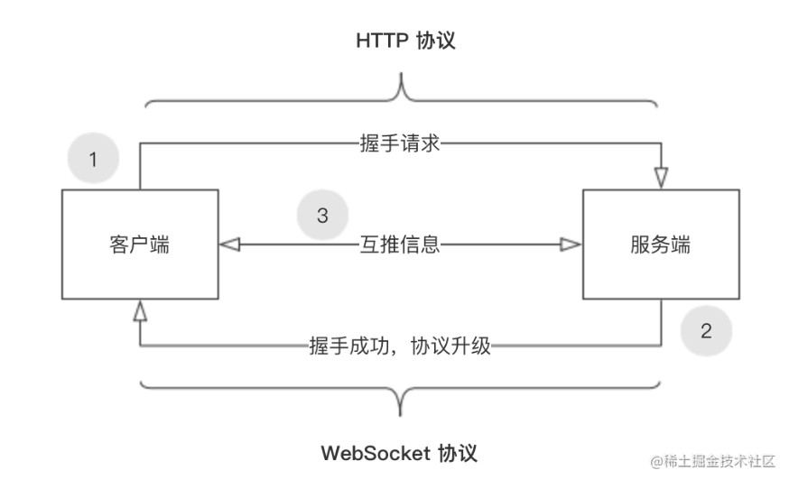
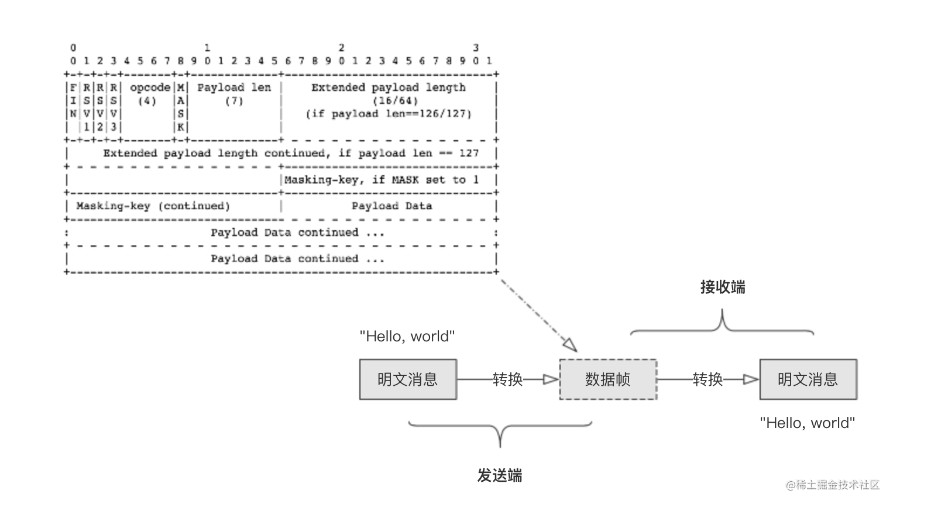
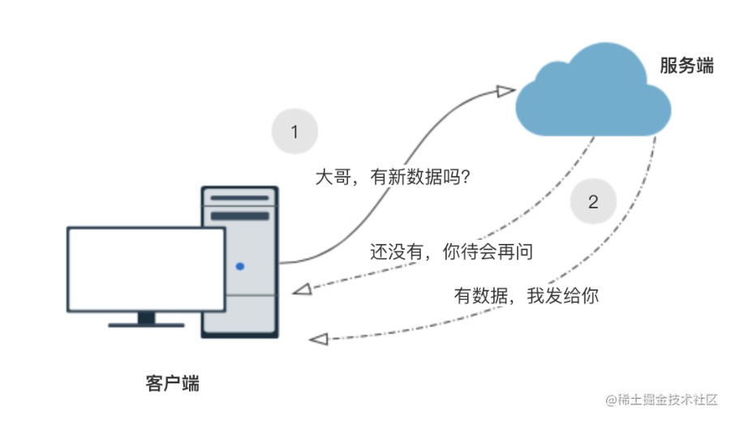
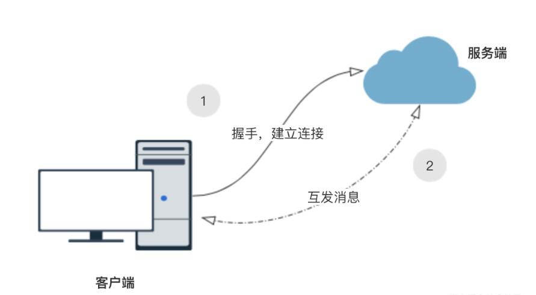
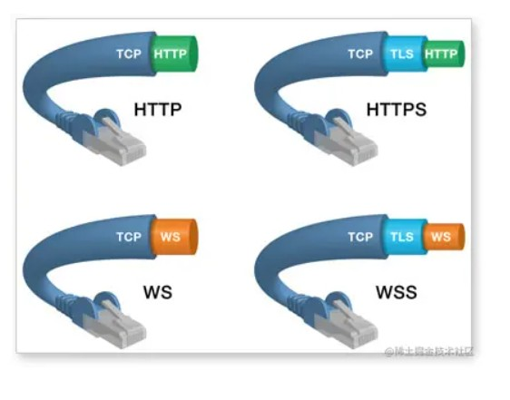

# 初探WebSocket

[TOC]


## 什么是WebSocket

> websocket是HTML5的一个新协议， 是一种在单个 TCP 连接上进行全双工通信的协议，它允许服务端向客户端传递信息，实现浏览器和客户端双工通信
>
> WebSocket 通常被应用在**实时性要求较高**的场景，例如赛事数据、股票证券、网页聊天和在线绘图等。

举例：因为 HTTP 协议有一个缺陷：通信只能由客户端发起。 举例来说，我们想了解今天的天气，只能是客户端向服务器发出请求，服务器返回查询结果。HTTP 协议做不到服务器主动向客户端推送信息。这种单向请求的特点，注定了如果服务器有连续的状态变化，客户端要获知就非常麻烦。我们只能使用"轮询"：每隔一段时候，就发出一个询问,轮询的效率低，非常浪费资源（因为必须不停连接，或者 HTTP 连接始终打开）。因此，工程师们一直在思考，有没有更好的方法。WebSocket 就是这样发明的。


### WebSocket的特点

> 服务器可以主动向客户端推送信息，客户端也可以主动向服务器发送信息，是真正的双向平等对话，属于服务器推送技术的一种。

- 与 HTTP 协议有着良好的兼容性。默认端口也是 80 和 443 ，并且握手阶段采用 HTTP 协议，因此握手时不容易屏蔽，能通过各种 HTTP 代理服务器。 

- 建立在TCP协议基础之上，和http协议同属于应用层

- 数据格式比较轻量，性能开销小，通信高效。 

- 可以发送文本，也可以发送二进制数据。 

- 没有同源限制，客户端可以与任意服务器通信

- 协议标识符是ws（如果加密，则为wss），服务器网址就是 URL,如ws://localhost:8023


### WebSocket的优点

相对于 HTTP 协议来说，WebSocket 具有开销少、实时性高、支持二进制消息传输、支持扩展和更好的压缩等优点。这些优点如下所述：

**较少的开销**

WebSocket 只需要一次握手，在每次传输数据时只传输数据帧即可。而 HTTP 协议下，每次请求都需要携带完整的请求头信息，例如 User-Agent、Referer 和 Host 等。所以 WebSocket 的开销相对于 HTTP 来说会少很多。

**更强的实时性**

由于协议是全双工的，所以服务器可以随时主动给客户端下发数据。相对于一问一答的 HTTP 来说，WebSocket 协议下的数据传输的延迟明显更少。

**支持二进制消息传输**

WebSocket 定义了二进制帧，可以更轻松地处理二进制内容。

**支持扩展**

开发者可以扩展协议，或者实现部分自定义的子协议。

**更好的压缩**

Websocket 在适当的扩展支持下，可以沿用之前内容的上下文。这样在传递类似结构的数据时，可以显著地提高压缩率。


## WebSocket 的握手

和`TCP`类似,WebSocket同样需要一个握手的过程,才可以正常的收发数据。

对于`WebSocket` 握手来说: 是一个标准的`HTTP GET`请求,但是这里需要带上两个字段

- `Connection: Upgrade`  表示的含义是: 协议要升级
- `Upgrade: WebSocket`   表示要`升级`成 `WebSocket`

当然为了避免一些问题的出现: 一些普通的`HTTP`请求会被`意外`识别成 `WebSocket` 又增加了两个额外的认证头的字段:

- Sec-WebSocket-Key: 一个Base64编码的16字节随机数，作为简单的认证密匙
- Sec-WebSocket-Version: 协议的版本号

下面我们来看一下 握手的具体细节：


### 请求与响应报文

**请求报文**

```yaml
//请求消息
GET wss://webchat-bj-test5.clink.cn&province= HTTP/1.1 //请求地址
Host: webchat-bj-test5.clink.cn  //域名
Connection: Upgrade //表示要升级协议
Pragma: no-cache  
Cache-Control: no-cache  //缓存相关
User-Agent: Mozilla/5.0 (Windows NT 10.0; WOW64) AppleWebKit/537.36 (KHTML, like Gecko) Chrome/81.0.4044.9 Safari/537.36 //ua
Upgrade: websocket  //要升级协议到websocket协议，下面这些就是websocket这些东西了
Origin: http://clink2.clink.cn:5050
Sec-WebSocket-Protocol: chat, superchat //是一个列出的客户端请求的子协议,服务端应按照优先顺序排列
Sec-WebSocket-Version: 13 // 表示websocket的版本。如果服务端不支持该版本，需要返回一个
Accept-Encoding: gzip, deflate, br
Accept-Language: zh-CN,zh;q=0.9
Sec-WebSocket-Key: O5GLCYKZVQi2jTLENobvtg== //对应服务端响应头的Sec-WebSocket-Accept，由于没有同源限制，
Sec-WebSocket-Extensions: permessage-deflate; client_max_window_bits
```

重点字段是这些：

- Connection: Upgrade 表示要升级协议
- Upgrade: websocket 要升级协议到websocket协议
- Sec-WebSocket-Version 表示websocket的版本。如果服务端不支持该版本，需要返回一个Sec-WebSocket-Versionheader，里面包含服务端支持的版本号。
- Sec-WebSocket-Key 对应服务端响应头的Sec-WebSocket-Accept，由于没有同源限制，websocket客户端可任意连接支持websocket的服务。这个就相当于一个钥匙一把锁，避免多余的，无意义的连接，防止攻击者恶意欺骗服务端。
- Sec—WebSocket-Protocol 是一个列出的客户端请求的子协议,服务端应按照优先顺序排列


**响应报文**

```yaml
//响应消息
HTTP/1.1 101 // 响应行，告诉你版本相关
Server: nginx/1.13.9  //服务器用的啥
Date: Mon, 30 Mar 2020 09:21:00 GMT   
Connection: upgrade
Vary: Origin
Vary: Access-Control-Request-Method  //跨域相关
Vary: Access-Control-Request-Headers
Access-Control-Allow-Origin: *
Access-Control-Allow-Credentials: true
Upgrade: websocket    //下面这些就是websocket的东西了
Sec-WebSocket-Accept: uZpmP+PDDvSeKsEg9vkAsWcqPzE= //这个是经过服务器确认，并且加密过后的 Sec-WebSocket-Key
Sec-WebSocket-Extensions: permessage-deflate;client_max_window_bits=15
```

关键是这个字段

- Sec-WebSocket-Accept: 验证客户端的请求报文, 同样也是为了防止**误连接**，用来告知：服务器愿意发起一个websocket连接， 值根据客户端请求头的Sec-WebSocket-Key计算出来

- `Connection` 和 `Upgrade` 表示已经切换成 websocket 协议。
- `Sec-WebSocket-Accept` 则是经过服务器确认，并且加密过后的 `Sec-WebSocket-Key`，这个值根据客户端发送的 `Sec-WebSocket-Key` 生成。

这样，客户端与服务端就完成了握手操作。双端达成一致，通信协议将由 HTTP 协议切换成 WebSocket 协议。


### Sec-WebSocket-Key/Accept的作用

前面提到了，`Sec-WebSocket-Key/Sec-WebSocket-Accept`在主要作用在于提供基础的防护，减少恶意连接、意外连接。

作用大致归纳如下：

1. 避免服务端收到非法的websocket连接（比如http客户端不小心请求连接websocket服务，此时服务端可以直接拒绝连接）
2. 确保服务端理解websocket连接。因为ws握手阶段采用的是http协议，因此可能ws连接是被一个http服务器处理并返回的，此时客户端可以通过Sec-WebSocket-Key来确保服务端认识ws协议。（并非百分百保险，比如总是存在那么些无聊的http服务器，光处理Sec-WebSocket-Key，但并没有实现ws协议。。。）
3. 用浏览器里发起ajax请求，设置header时，Sec-WebSocket-Key以及其他相关的header是被禁止的。这样可以避免客户端发送ajax请求时，意外请求协议升级（websocket upgrade）
4. 可以防止反向代理（不理解ws协议）返回错误的数据。比如反向代理前后收到两次ws连接的升级请求，反向代理把第一次请求的返回给cache住，然后第二次请求到来时直接把cache住的请求给返回（无意义的返回）。
5. Sec-WebSocket-Key主要目的并不是确保数据的安全性，因为Sec-WebSocket-Key、Sec-WebSocket-Accept的转换计算公式是公开的，而且非常简单，最主要的作用是预防一些常见的意外情况（非故意的）。


### 双端交互流程

客户端与服务端连接成功之前，使用的通信协议是 HTTP。连接成功后，使用的才是 WebSocket 协议。下图描述了双端交互的流程：



首先，客户端向服务端发出一个 HTTP 请求，请求中携带了服务端规定的信息，并在信息中表明希望将协议升级为 WebSocket。这个请求被称为升级请求，双端升级协议的整个过程叫做握手。然后服务端验证客户端发送的信息，如果符合规范则将协议替换成 WebSocket，并将升级成功的信息响应给客户端。最后，双方就可以基于 WebSocket 协议互相推送信息了。


### 数据收发流程

在双端建立 WebSocket 连接后，任何一端都可以给另一端发送消息，这里的消息指的就是数据帧。但平时我们输入或输出的信息都是“明文”，所以在消息发送前需要将“明文”通过一定的方法转换成数据帧。而在接收端，拿到数据帧后需要按照一定的规则将数据帧转换为”明文“。下图描述了双端收发 `Hello, world` 的主要流程：



### 保持连接和关闭连接

WebSocket 双端的连接可以保持长期不断开，但实际应用中却不会这么做。如果保持所有连接不断开，但连接中有很多不活跃的成员，那么就会造成严重的资源浪费。

服务端如何判断客户端是否活跃呢？

服务端会定期给所有的客户端发送一个 opcode 为 `%x9` 的数据帧，这个数据帧被称为 Ping 帧。客户端在收到 Ping 帧时，必须回复一个 opcode 为 `%xA` 的数据帧（又称为 Pong 帧），否则服务端就可以主动断开连接。反之，如果服务端在发送 Ping 帧后能够得到客户端 Pong 帧的回应，就代表这个客户端是活跃的，不要断开连接。

如果需要关闭连接，那么一端向另一端发送 opcode 为 `%x8` 的数据帧即可，这个数据帧被称为关闭帧。


## 🌰WebSocket

### WebSocket API

**事件**

```csharp
//创建WebSocket实例，可以使用ws和wss。第二个参数可以选填自定义协议，如果多协议，可以以数组方式
var socket = new WebSocket('ws://demos.kaazing.com/echo');
```

- **onopen**：连接成功后的回调

  服务器相应WebSocket连接请求触发

  ```ini
  socket.onopen = (event) => {
    socket.send('Hello Server!');
  };
    
  socket.addEventListener('open', function (event) {
    ws.send('Hello Server!');
  });
  ```

- **onmessage**：客户端接收到服务器端数据的回调

  服务器有 响应数据 触发

  ```ini
  socket.onmessage = (event) => {
     debugger;
     console.log(event.data);
  };
    
  socket.addEventListener("message", function(event) {
    var data = event.data;
    // 处理数据
  });
  ```

- **onerror**: 连接失败后的回调

  出错时触发，并且会关闭连接。这时可以根据错误信息进行按需处理

  ```javascript
  socket.onerror = (event) => {
    console.log('error');
  }
  ```

- **onclose**：连接关闭后的回调

  ```javascript
   连接关闭时触发，这在两端都可以关闭。另外如果连接失败也是会触发的。
   针对关闭一般我们会做一些异常处理,关于异常参数：
  
   1. socket.readyState  
   		2 正在关闭  3 已经关闭
   2. event.wasClean [Boolean]  
   		true  客户端或者服务器端调用close主动关闭
    	false 反之
   3. event.code [Number] 关闭连接的状态码。socket.close(code, reason)
   4. event.reason [String] 
   		关闭连接的原因。socket.close(code, reason)
           
       
  
  socket.onclose = function(event) {
    var code = event.code;
    var reason = event.reason;
    var wasClean = event.wasClean;
    // handle close event
  };
  
  socket.addEventListener("close", function(event) {
    var code = event.code;
    var reason = event.reason;
    var wasClean = event.wasClean;
    // handle close event
  });
  ```

**方法**

- **send**：向服务器发送数据

  send(data) 发送方法 data 可以是String/Blob/ArrayBuffer/ByteBuffer等

  需要注意,使用send发送数据，必须是连接建立之后。一般会在onopen事件触发后发送：

  ```ini
  socket.onopen = (event) => {
     socket.send('Hello Server!');
  };
  ```

  如果是需要去响应别的事件再发送消息，也就是将WebSocket实例socket交给别的方法使用，因为在发送时你不一定知道socket是否还连接着，所以可以检查readyState属性的值是否等于OPEN常量，也就是查看socket是否还连接着。

  ```ini
  btn.onclick = function startSocket(){
        //判断是否连接是否还存在
        if(socket.readyState == WebSocket.OPEN){
            var message = document.getElementById("message").value;
            if(message != "") socket.send(message);
        }
  }
  ```

- **close**：关闭当前连接

  使用close([code[,reason]])方法可以关闭连接。code和reason均为选填

  ```go
    // 正常关闭
    socket.close(1000, "closing normally");
  ```

**常量**：webSocket.readyState**

| 常量名     | 值   | 描述             |
| ---------- | ---- | ---------------- |
| CONNECTING | 0    | 连接还未开启     |
| OPEN       | 1    | 连接开启可以通信 |
| CLOSING    | 2    | 连接正在关闭中   |
| CLOSED     | 3    | 连接已经关闭     |

**属性**

| 属性名         | 值类型       | 描述                                                         |
| -------------- | ------------ | ------------------------------------------------------------ |
| binaryType     | String       | 表示连接传输的二进制数据类型的字符串。默认为"blob"。         |
| bufferedAmount | Number       | 只读。如果使用send()方法发送的数据过大，虽然send()方法会马上执行，但数据并不是马上传输。浏览器会缓存应用流出的数据，你可以使用bufferedAmount属性检查已经进入队列但还未被传输的数据大小。在一定程度上可以避免网络饱和。 |
| protocol       | String/Array | 在构造函数中，protocol参数让服务端知道客户端使用的WebSocket协议。而在实例socket中就是连接建立前为空，连接建立后为客户端和服务器端确定下来的协议名称。 |
| readyState     | String       | 只读。连接当前状态，这些状态是与常量相对应的。               |
| extensions     | String       | 服务器选择的扩展。目前，这只是一个空字符串或通过连接协商的扩展列表。 |


### demo

```js
//首先new一个websocket对象，
var ws = new WebSocket("wss://webchat-bj-test5.clink.cn");
//实例对象的onopen属性，用于指定连接成功后的回调函数。
ws.onopen = function(evt) { 
  console.log("Connection open ..."); 
  //实例对象的send()方法用于向服务器发送数据。
  ws.send("Hello WebSockets!");
};
//实例对象的onmessage属性，用于指定收到服务器数据后的回调函数。
ws.onmessage = function(evt) {
  console.log( "Received Message: " + evt.data);
  ws.close();
};
//实例对象的onclose属性，用于指定连接关闭后的回调函数。
ws.onclose = function(evt) {
  console.log("Connection closed.");
};     
```

当然，原生的东西是相当不好用的，因为你虽然建立了链接，后端处理器起来却不是那么得心应手，所以出现了库：socketIO


### 跨平台的WebSocket通信库socket.io

> SocketIO将WebSocket、AJAX和其它的通信方式全部封装成了统一的通信接口，也就是说，我们在使用SocketIO时，不用担心兼容问题，底层会自动选用最佳的通信方式。因此说，WebSocket是SocketIO的一个子集。
>
> 跨平台的WebSocket通信库，具有前后端一致的API，可以触发和响应自定义的事件。socket.io最核心的两个api就是emit 和 on了 ，服务端和客户端都有这两个api。通过 emit 和 on可以实现服务器与客户端之间的双向通信。
>
> - emit ：发射一个事件，第一个参数为事件名，第二个参数为要发送的数据，第三个参数为回调函数（如需对方接受到信息后立即得到确认时，则需要用到回调函数）。 
> - on ：监听一个 emit 发射的事件，第一个参数为要监听的事件名，第二个参数为回调函数，用来接收对方发来的数据，该函数的第一个参数为接收的数据。

**服务端**

```javascript
var app = require('express')();
var http = require('http');
var socketio  = require("socket.io");
const server = http.createServer(app)
const io = socketio(server)
var count = 0;
// WebSocket 连接服务器
io.on('connection', (socket)=> {
    //// 所有的事件触发响应都写在这里
    setInterval(()=>{
        count++
        //向建立该连接的客户端发送消息
        socket.emit('mynameEv', { name:"你我贷"+count})
    },1000)
    //监听客户端发送信息
    socket.on('yournameEv', function (data) {
        console.log(data)
    })
})

app.get('/', function (req, res) {
    res.sendfile(__dirname + '/index.html');
});
// 启用3000端口
server.listen(3000)
```

**客户端**

```js
<body>
   <div id="myname"></div>
    <script src="http://localhost:3000/socket.io/socket.io.js"></script>
   <script>
      var count = 0;
      const socket = io.connect('http://localhost:3000')
      socket.on('mynameEv', (data)=>{
          document.getElementById("myname").innerHTML = data.name;
         console.log(data.name)
         setInterval(()=>{
                count++
                socket.emit('yournameEv', { name:"飞旋"+count})
         },1000)

      })
   </script>
</body>
```


## 长轮询和短轮询

### 轮询

**轮询** 就是不断地向服务端发起请求，询问现在还有没有数据啊，有数据的话服务端就会用响应报文来回应。其实,前端可能会有类似的场景,需要不停查询某个阶段的计算结果；当然需要你去设置一个很小的查询间隔去增加查询的频率, 似乎就是处于一种`实时通信`的状态。

但是,由此会带来一系列的问题:

- 服务端：大量`TCP`潜在的连接交互;既要接收数据;又要处理数据返回
- 应用层(HTTP)开销过大
- 客户端：需要对发送和接收的数据处理如何处理也同样是一个问题




首先，客户端会向服务端发出一个 HTTP 请求，这个请求的意图就是向服务器询问“大哥，有新数据吗？”。服务器在接收到请求后，根据实际情况（有数据或无数据）做出响应：

- 有数据，我发给你；
- 无数据，你待会再问；

这种一问一答的方式有着明显的缺点，即浏览器需要不断的向服务器发出请求。由于 HTTP 请求包含较长的头部信息（例如 User-Agent、Referer 和 Host 等），其中真正有效的数据可能只是很小的一部分，所以这样会浪费很多的带宽资源。


在 WebSocket 协议下，客户端和服务端只需要完成一次握手，就直接可以创建持久性的连接，并进行双向数据传输。下图描述了 WebSocket 协议中，双端通信的过程：




### 长/短轮询

**短轮询的基本思路：** 浏览器每隔一段时间向浏览器发送 http 请求，服务器端在收到请求后，不论是否有数据更新，都直接进行响应。这种方式实现的即时通信，本质上还是浏览器发送请求，服务器接受请求的一个过程，通过让客户端不断的进行请求，使得客户端能够模拟实时地收到服务器端的数据的变化。这种方式的优点是比较简单，易于理解。缺点是这种方式由于需要不断的建立 http 连接，严重浪费了服务器端和客户端的资源。当用户增加时，服务器端的压力就会变大，这是很不合理的。具体比如在一个电商场景，商品的库存可能会变化，所以需要及时反映给用户，所以客户端会不停的发请求，然后服务器端会不停的去查变化，不管变不变，都返回，这个是短轮询。

**长轮询的基本思路：** 首先由客户端向服务器发起请求，当服务器收到客户端发来的请求后，服务器端不会直接进行响应，而是先将这个请求挂起，然后判断服务器端数据是否有更新。如果有更新，则进行响应，如果一直没有数据，则到达一定的时间限制才返回。客户端 JavaScript 响应处理函数会在处理完服务器返回的信息后，再次发出请求，重新建立连接。长轮询和短轮询比起来，它的优点是明显减少了很多不必要的 http 请求次数，相比之下节约了资源。长轮询的缺点在于，连接挂起也会导致资源的浪费。总结：长轮询则表现为如果没有变，就不返回，而是等待变或者超时（一般是十几秒）才返回，如果没有返回，客户端也不需要一直发请求，所以减少了双方的压力。


> WebSocket 是长轮询。


### 拓展：长短轮询和长短连接的区别

如果不了解长连接，👉[关于keep-alive](https://blog.csdn.net/weixin_52834435/article/details/127353264?spm=1001.2014.3001.5502)

第一个区别是决定的方式，一个HTTP连接是否为长连接，是通过设置HTTP的Connection Header来决定的，而且是需要两边都设置才有效。而一种轮询方式是否为长轮询，是根据服务端的处理方式来决定的，与客户端没有关系。

第二个区别就是实现的方式，连接的长短是通过协议来规定和实现的。而轮询的长短，是服务器通过编程的方式手动挂起请求来实现的。


## WebSocket和Socket的区别

### Socket

- TPC/IP协议是传输层协议，主要解决数据如何在网络中传输；
- Socket是对TCP/IP协议的封装和应用(程序员层面上)；
- 而HTTP是应用层协议，主要解决如何包装数据。

1. socket也被称为`套接字`，与HTTP和WebSocket不一样，socket不是协议，它是在程序层面上对传输层协议（可以主要理解为TCP/IP）的接口封装。可以理解为一个能够提供端对端的通信的调用接口（API）
2. 对于程序员而言，其需要在 A 端创建一个 socket 实例，并为这个实例提供其所要连接的 B 端的 IP 地址和端口号，而在 B 端创建另一个 socket 实例，并且绑定本地端口号来进行监听。当 A 和 B 建立连接后，双方就建立了一个端对端的 TCP 连接，从而可以进行双向通信。WebSocekt借鉴了 socket 的思想，为 client 和 server 之间提供了类似的双向通信机制

Socket是什么呢，实际上socket是对TCP/IP协议的封装，Socket本身并不是协议，而是一个调用接口(API)。通过Socket，我们才能使用TCP/IP协议。
**Socket跟TCP/IP协议关系**是：“TCP/IP只是一个协议栈，就像操作系统的运行机制一样，必须要具体实现，同时还要提供对外的操作接口。这个就像操作系统会提供标准的编程接口，比如win32编程接口一样，TCP/IP也要提供可供程序员做网络开发所用的接口，这就是Socket编程接口。”


### 区别

两者没什么关系，就像雷锋跟雷锋塔一样。


## WebSocket和HTTP有什么区别



**相同点**

- 都是一样基于TCP的，都是可靠性传输协议

- 都是应用层协议
- 都使用Request/Response模型进行连接的建立
- 在连接的建立过程中对错误的处理方式相同，在这个阶段WS可能返回和HTTP相同的返回码
- 都可以在网络中传输数据


**不同点**

- WebSocket是双向通信协议，模拟Socket协议，可以双向发送或接受信息。HTTP是单向的。

- WebSocket是需要握手进行建立连接的(相对HTTP来说，WebSocket是一种持久化的协议。它会基于HTTP协议，来完成一部分握手，HTTP握手部分完成，协议升级为WebSocket)。

- WS的连接不能通过中间人来转发，它必须是一个直接连接
- WS连接建立之后，数据的传输使用帧来传递，不再需要Request消息

- WS的数据帧有序
- WS使用HTTP来建立连接，但是定义了一系列新的header域，这些域在HTTP中并不会使用


## 连接保持+心跳

**websocket心跳机制：顾名思义，就是客户端每隔一段时间向服务端发送一个特有的心跳消息，每次服务端收到消息后只需将消息返回，此时，若二者还保持连接，则客户端就会收到消息，若没收到，则说明连接断开，此时，客户端就要主动重连，完成一个周期**

但不排除有些场景，客户端、服务端虽然长时间没有数据往来，但仍需要保持连接。这个时候，可以采用心跳来实现。

- 发送方->接收方：ping
- 接收方->发送方：pong

ping、pong的操作，对应的是WebSocket的两个控制帧，`opcode`分别是`0x9`、`0xA`。

举例，WebSocket服务端向客户端发送ping，只需要如下代码（采用`ws`模块）

```javascript
ws.ping('', false, true);
```

**对于前端：**

如果设备网络断开，不会立刻触发 Websocket 的任何事件，前端也就无法得知当前连接是否已经断开。这个时候如果调用 `Websocket.send` 方法，浏览器才会发现链接断开了，便会立刻或者一定时间后（不同浏览器或者浏览器版本可能表现不同）触发 onclose 函数。

**对于后端：**

后端 Websocket 服务也可能出现异常，造成连接断开，这时前端也并没有收到断开通知，因此需要前端定时发送心跳消息 ping，后端收到 ping 类型的消息，立马返回消息，告知前端连接正常。如果一定时间没收到消息，就说明连接不正常，前端便会执行重连。

**保证连接状态，连接断开时让客户端与服务端都能知道，进而重连。**


## 即时通讯的 4 种实现方案

### 概览

**即时通讯的实现：短轮询、长轮询、SSE 和 WebSocket**

短轮询和长轮询的目的都是用于实现客户端和服务器端的一个即时通讯。

**短轮询的基本思路(ajax轮询)：** 浏览器每隔一段时间向浏览器发送 http 请求，服务器端在收到请求后，不论是否有数据更新，都直接进行响应。这种方式实现的即时通信，本质上还是浏览器发送请求，服务器接受请求的一个过程，通过让客户端不断的进行请求，使得客户端能够模拟实时地收到服务器端的数据的变化。这种方式的优点是比较简单，易于理解。缺点是这种方式由于需要不断的建立 http 连接，严重浪费了服务器端和客户端的资源。当用户增加时，服务器端的压力就会变大，这是很不合理的。

**长轮询的基本思路：** 首先由客户端向服务器发起请求，当服务器收到客户端发来的请求后，服务器端不会直接进行响应，而是先将这个请求挂起，然后判断服务器端数据是否有更新。如果有更新，则进行响应，如果一直没有数据，则到达一定的时间限制才返回。客户端 JavaScript 响应处理函数会在处理完服务器返回的信息后，再次发出请求，重新建立连接。长轮询和短轮询比起来，它的优点是明显减少了很多不必要的 http 请求次数，相比之下节约了资源。长轮询的缺点在于，连接挂起也会导致资源的浪费。

**SSE 的基本思想：** 服务器使用流信息向服务器推送信息。严格地说，http 协议无法做到服务器主动推送信息。但是，有一种变通方法，就是服务器向客户端声明，接下来要发送的是流信息。也就是说，发送的不是一次性的数据包，而是一个数据流，会连续不断地发送过来。这时，客户端不会关闭连接，会一直等着服务器发过来的新的数据流，视频播放就是这样的例子。SSE 就是利用这种机制，使用流信息向浏览器推送信息。它基于 http 协议，目前除了 IE/Edge，其他浏览器都支持。它相对于前面两种方式来说，不需要建立过多的 http 请求，相比之下节约了资源。

**WebSocket** 是 HTML5 定义的一个新协议议，与传统的 http 协议不同，该协议允许由服务器主动的向客户端推送信息。使用 WebSocket 协议的缺点是在服务器端的配置比较复杂。WebSocket 是一个全双工的协议，也就是通信双方是平等的，可以相互发送消息，而 SSE 的方式是单向通信的，只能由服务器端向客户端推送信息，如果客户端需要发送信息就是属于下一个 http 请求了。

**上面的四个通信协议，前三个都是基于HTTP协议的。**

对于这四种即使通信协议，从性能的角度来看： **WebSocket > 长连接（SEE） > 长轮询 > 短轮询** 但是，我们如果考虑浏览器的兼容性问题，顺序就恰恰相反了： **短轮询 > 长轮询 > 长连接（SEE） > WebSocket** 所以，还是要根据具体的使用场景来判断使用哪种方式。


### 短轮询

```js
// 缓存前端已经获取的最新id
let id = 0;

function poll() {
  $.ajax({
    url: '/api/polling',
    data: { id },
    }).done(res => {
      id += res.length;
    }).always(() => {
      // 10s后再次请求
      setTimeout(poll, 10000);
    });
}

poll();
```


### SSE

轮询、长轮询都是一问一答式的，一次请求，无法推送多次消息到前端。而SSE就厉害了，**一次请求，N次推送**。

其原理，或者说类比，**个人认为可以理解为下载一个巨大的文件，文件的内容分块传给前端，每块就是一次消息推送**。

> `SSE` 只能服务器向浏览器发送数据

HTTP 协议无法做到服务器主动推送信息。但是，有一种变通方法，就是服务器向客户端声明，接下来要发送的是流信息（streaming）。

也就是说，发送的不是一次性的数据包，而是一个数据流，会连续不断地发送过来。这时，客户端不会关闭连接，会一直等着服务器发过来的新的数据流，视频播放就是这样的例子。本质上，这种通信就是以流信息的方式，完成一次用时很长的下载。

> 所谓SSE（Sever-Sent Event），就是浏览器向服务器发送一个HTTP请求，保持长连接，服务器不断单向地向浏览器推送“信息”（message），这么做是为了节约网络资源，不用一直发请求，建立新连接。

看了概念你就会发现，他其实就是类似长轮询，他有一个浏览器内置EventSource对象来操作

```go
//进建立链接
var source = new EventSource();
//关闭链接
source.close();
```


**完整代码**

客户端

`H5`端使用`EventSource`对象，填入要请求的`url`地址就可以了。

```javascript
var source = new EventSource('/api', {
    withCredentials: true
});
source.onopen = function () {
    console.log('链接已建立', this.readyState);
}
source.onmessage = function (event) {
    console.log('实时获取的数据', event.data);
}
source.onerror = function () {
    console.log('发生错误');
}
// 关闭
// source.close();
```

服务端

服务器向浏览器发送的 `SSE` 数据，首先必须设置响应头的`Content-type`为`text/event-stream`，且编码格式为`utf-8`。返回的数据格式必须为`data: xxxx\n\n`。除了`data`还有`event`，`id`，以及`retry`.

```javascript
const http = require('http');
const fs = require('fs');

const app = http.createServer((req, res) => {
    res.setHeader('Content-type', 'text/event-stream; charset=utf-8'); //核心：要让前端知道这是SSE
    res.setHeader('Cache-Control', 'max-age=0'); // 清楚缓存
    res.setHeader('Access-Control-Allow-Origin', 'http:127.0.0.1/');
    let num = 0;
    const send = () => {
        if (num > 20) {
            res.end();
            return;
        }
        num++;
        const data = Math.random() + '';
        res.write(`data: ${data}\n\n`, 'utf8');
        setTimeout(send, 1000);
    }
    send();
});

app.listen(8081, () => {
    console.log('127.0.0.1:8081');
})
```


### Websocket

前端代码如下:

```js
const sock = io.connect('ws://127.0.0.1:8080/api');
sock.on('connect', () => {
    console.log('已链接');
    sock.emit('aaa', 12, 5,8);
    sock.on('time', (ts) => {
        console.loh(ts);
    })
});
sock.on('disconnect', () => {
    console.log('已断开');
});
```

服务端代码如下：

```js
const http = require('http');
const io = require('socket.io');

// 创建http服务，开启8080端口号
const httpServer = http.createServer().listen(8080);
// socket监听http服务
const wsServer = io.listen(httpServer);

// 当有链接的时候
wsServer.on('connection', sock => {
    // 发送
    // sock.emit
    sock.emit('time', Date.now());
    // 接收
    sock.on('aaa', (a, b, c) => {
        console.loh(a, b, c);
    })
})
```


参考文章：

[前端面试题:你知道websocket吗?](https://juejin.cn/post/6844903815913668621#heading-8)

[【严选-高质量文章】开发者必知必会的 WebSocket 协议](https://juejin.cn/post/6844903909148868621#heading-4)

[带你揭开WebSocket的神秘面纱！](https://juejin.cn/post/6844903972835164173#heading-9)

[这是即时通讯的 4 种实现方案](https://juejin.cn/post/7057687288154685470#heading-2)

[面试官：服务端推送到Web前端有哪几种方式？](https://juejin.cn/post/7113813187727720461)