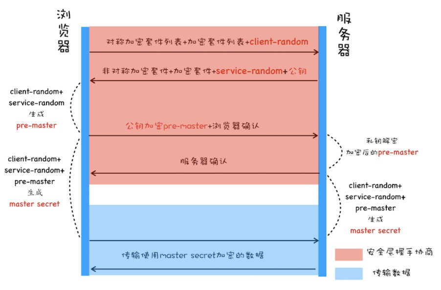
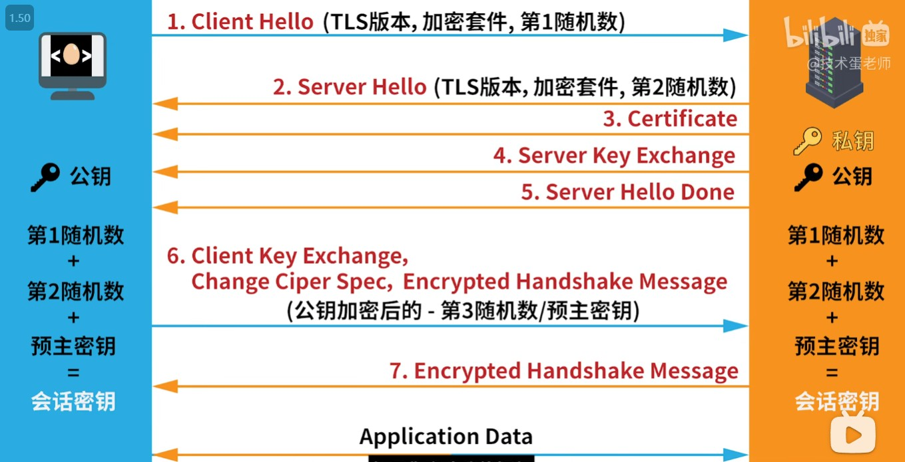
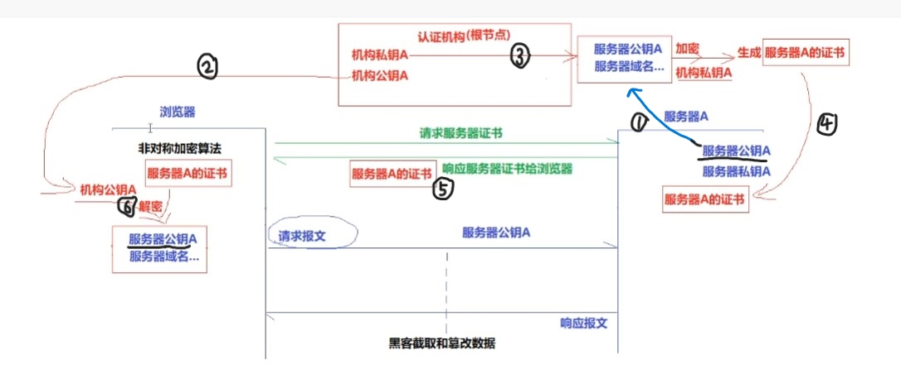

# 对称加密与非对称加密再理解

[TOC]

## 一、对称加密与非对称加密

HTTPS 的安全性是由 TLS 来保证的。

加密可以分为两大类：**对称加密和非对称加密**。

### 对称加密

**对称加密的方法是，双方使用同一个秘钥对数据进行加密和解密**。但是对称加密的存在一个问题，就是如何保证秘钥传输的安全性，因为秘钥还是会通过网络传输的，一旦秘钥被其他人获取到，那么整个加密过程就毫无作用了。 这就要用到非对称加密的方法。速度要比非对称加密快。

### 非对称加密

非对称加密的方法是，我们拥有两个秘钥，一个是**公钥**，一个是**私钥**。公钥是公开的，私钥是保密的。**用私钥加密的数据，只有对应的公钥才能解密，用公钥加密的数据，只有对应的私钥才能解密**。我们可以将公钥公布出去，任何想和我们通信的客户， 都可以使用我们提供的公钥对数据进行加密，这样我们就可以使用私钥进行解密，这样就能保证数据的安全了。但是非对称加密有一个缺点就是加密的过程很慢，因此如果每次通信都使用非对称加密的方式的话，反而会造成等待时间过长的问题。

## 二、混合加密

对称加密和非对称加密搭配使用。

基于以上两点原因，最终选择了一个更加完美的方案，那就是**在传输数据阶段依然使用对称加密，但是对称加密的密钥我们采用非对称加密来传输**。

> https使用混合加密，并且还要配合数字证书来实现安全性。

**从图中可以看出，改造后的流程是这样的：**

- 首先浏览器向服务器发送对称加密套件列表、非对称加密套件列表和随机数 client-random；
- 服务器保存随机数 client-random，选择对称加密和非对称加密的套件，然后生成随机数 service-random，向浏览器发送选择的加密套件、service-random 和公钥；
- 浏览器保存公钥，并利用 client-random 和 service-random 计算出来 pre-master，然后利用公钥对 pre-master 加密，并向服务器发送加密后的数据；
- 最后服务器拿出自己的私钥，解密出 pre-master 数据，并返回确认消息。

到此为止，服务器和浏览器就有了共同的 client-random、service-random 和 pre-master，然后服务器和浏览器会使用这三组随机数生成**对称密钥**，因为服务器和浏览器使用同一套方法来生成密钥，所以最终生成的密钥也是相同的。

有了对称加密的密钥之后，双方就可以使用对称加密的方式来传输数据了。

需要特别注意的一点，**pre-master 是经过公钥加密之后传输的，所以黑客无法获取到 pre-master，这样黑客就无法生成密钥，也就保证了黑客无法破解传输过程中的数据了**

> 注：什么是加密套件？
>
> 加密套件（CipherList）是指在[ssl](https://so.csdn.net/so/search?q=ssl&spm=1001.2101.3001.7020)通信中，服务器和客户端所使用的加密算法的组合。在ssl握手初期，客户端将自身支持的加密套件列表发送给服务器；在握手阶段，服务器根据自己的配置从中尽可能的选出一个套件，作为之后所要使用的加密方式。
>
> 其实就是服务器选择一个双方要使用的加密方法。

## 三、添加数字证书 + 混合加密

对称加密和非对称加密，以及两者结合起来的混合加密，实现了机密性。
但仅有机密性，离安全还差的很远。

黑客虽然拿不到会话密钥，无法破解密文，但可以通过窃听收集到足够多的密文，再尝试着修改、重组后发给网站。因为没有完整性保证，服务器只能“照单全收”，然后他就可以通过服务器的响应获取进一步的线索，最终就会破解出明文。

另外，黑客也可以伪造身份发布公钥。如果你拿到了假的公钥，混合加密就完全失效了。你以为自己是在和“某宝”通信，实际上网线的另一端却是黑客，银行卡号、密码等敏感信息就在“安全”的通信过程中被窃取了。

所以，在机密性的基础上还必须加上完整性、身份认证等特性，才能实现真正的安全。

### https的真正请求流程

> https使用混合加密，并且还要配合数字证书来实现安全性。

- 客户端向服务器发起请求，请求中包含使用的TLS版本号、生成的一个随机数、以及客户端支持的加密方法。
- 服务器端接收到请求后，确认双方使用的加密方法和TLS版本号、并给出服务器的证书、以及一个服务器生成的随机数。
- 客户端确认服务器证书有效后，生成一个新的随机数，并使用数字证书中解密拿到的服务器公钥，加密这个随机数，然后发给服务器。
- 服务器使用自己的私钥，来解密客户端发送过来的随机数。这样服务器就拿到了第三个随机数。而且只有客户端和服务器端知道这第三个随机数，因为第三个随机数是通过加密传输的。
- 客户端和服务器端根据约定的加密方法使用前面的三个随机数，生成会话秘钥，以后的对话过程都使用这个秘钥（即会话秘钥）来加密信息。
- 以后客户端和服务器端都使用这个会话秘钥来加密。

## 四、数字证书

### 服务器获取证书？

- 首先，服务器先用Hash算法将自己的**公钥**和其他信息(例如认证时长，服务器域名...)进行加密，生成一个**信息摘要**，传递给认证机构，并且认证机构也会有自己的公钥和私钥，并且认证机构会将自己的公钥给了浏览器。
- 然后认证机构会用自己的**私钥**对已经拿到的浏览器摘要进行**加密**，生成**签名**，签名和信息摘要合在一起称为**数字证书**，（认证机构生成的签名是证书的关键，有了这个认证机构的签名，证书就合法了）。
- 然后再把这个**证书**传递给服务器，服务器会保存自己的证书，服务器并且也会把证书传递给浏览器。
- 浏览器用认证机构传给自己的**公钥**对证书进行**解密**拿到**摘要A**，并读取证书中相关的明文信息，采用 CA 签名时相同的 Hash 函数来计算并得到**摘要B**，对比信息摘要 A 和信息摘要 B，如果一致，则可以确认证书是合法的，同时在摘要A中也拿到了服务器的**公钥**。

### 摘要

给计算机一篇文章，计算机用摘要算法（主要是哈希类算法）生成一个字符串，如果文章内容改变，哪怕是一个字，一个标点符号，摘要也会完全改变。和完全加密一篇文章相比，摘要的体积很小，因此非常有利于存储和传输。

通常对于一个给定的摘要算法，无论你的文章多大，有多少字节，最终生成摘要的字节数是固定的。

**摘要是对原文的证明，从原文到摘要是一个不可逆的过程**。

通过原文可以计算出摘要，一旦原文发生变化，哪怕是一个标点符号，摘要也会发生变化。而已知一个摘要，想要反推出原文，几乎是不可能的。因为摘要和原文并不是一对一的关系，是多个原文对应一个摘要。而且，想要找到两个摘要碰撞的原文是非常困难的发生概率相当于买彩票中大奖 。而且就算黑客找到了碰撞的原文，也未必可以起到作用。

### 签名

如果张三将合同生成摘要，再用自己的私钥加密摘要，得到一个密文串，那么这个串就是张三对合同的**数字签名**