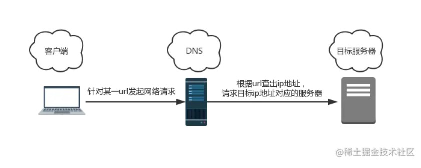
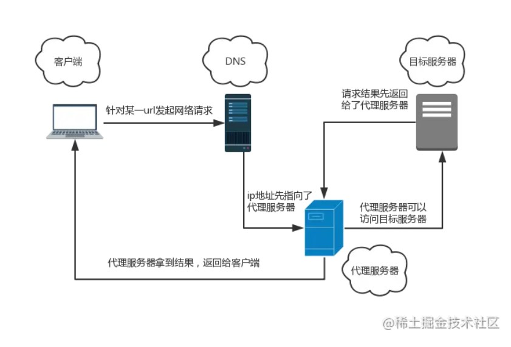

# 代理模式

代理模式，式如其名——在某些情况下，出于种种考虑/限制，一个对象**不能直接访问**另一个对象，需要一个**第三者**（代理）牵线搭桥从而间接达到访问目的，这样的模式就是代理模式。

关于科学上网：

一般情况下，当我们访问一个 url 的时候，会发生下图的过程：



为了屏蔽某些网站，一股神秘的东方力量会作用于你的 DNS 解析过程，告诉它：“你不能解析出xxx.xxx.xxx.xxx（某个特殊ip）的地址”。而我们的 Google.com，不幸地出现在了这串被诅咒的 ip 地址里，于是你的 DNS 会告诉你：“对不起，我查不到”。

但有时候，一部分人为了搞学习，通过访问VPN，是可以间接访问到 Google.com 的。这背后，就是**代理模式**在给力。在使用VPN时，我们的访问过程是这样的：



没错，比起常规的访问过程，多出了一个第三方 —— **代理服务器**。这个第三方的 ip 地址，不在被禁用的那批 ip 地址之列，我们可以顺利访问到这台服务器。而这台服务器的 DNS 解析过程，没有被施加咒语，所以它是可以顺利访问 Google.com 的。代理服务器在请求到 Google.com 后，将响应体转发给你，使你得以间接地访问到目标网址 —— 像这种第三方代替我们访问目标对象的模式，就是代理模式。


业务开发中最常见的四种代理类型：事件代理、虚拟代理、缓存代理和保护代理

**事件代理**

一个父元素下有多个子元素:

```html
<!DOCTYPE html>
<html lang="en">
<head>
  <meta charset="UTF-8">
  <meta name="viewport" content="width=device-width, initial-scale=1.0">
  <meta http-equiv="X-UA-Compatible" content="ie=edge">
  <title>事件代理</title>
</head>
<body>
  <div id="father">
    <a href="#">链接1号</a>
    <a href="#">链接2号</a>
    <a href="#">链接3号</a>
    <a href="#">链接4号</a>
    <a href="#">链接5号</a>
    <a href="#">链接6号</a>
  </div>
</body>
</html>
```

我们现在的需求是，希望鼠标点击每个 a 标签，都可以弹出“我是xxx”这样的提示。比如点击第一个 a 标签，弹出“我是链接1号”这样的提示。

考虑到事件本身具有“冒泡”的特性，当我们点击 a 元素时，点击事件会“冒泡”到父元素 div 上，从而被监听到。如此一来，点击事件的监听函数只需要在 div 元素上被绑定一次即可，而不需要在子元素上被绑定 N 次——这种做法就是事件代理，它可以很大程度上提高我们代码的性能。

```js
// 获取父元素
const father = document.getElementById('father')

// 给父元素安装一次监听函数
father.addEventListener('click', function(e) {
    // 识别是否是目标子元素
    if(e.target.tagName === 'A') {
        // 以下是监听函数的函数体
        e.preventDefault()
        alert(`我是${e.target.innerText}`)
    }
} )
```


**虚拟代理**

**图片懒加载**的方式：先通过一张loading图占位，然后通过异步的方式加载图片，等图片加载好了再把请求成功的图片加载到img标签上

```js
const imgFunc = (() => {
    const imgNode = document.createElement('img')
    document.body.appendChild(imgNode)
    return{
        setSrc: function(src){
            imgNode.src = src
        }
    }
})()
const proxyImage = (() => {
    let img = new Image()
    img.onload = function(){ // http 图片加载完毕后才会执行
        imgFunc.setSrc(this.src)
    }
    return {
        setSrc: function(src){
            imgFunc.setSrc('./loading.gif') // 本地 loading 图片
            img.src = src
        }
    }
})()
proxyImage.setSrc('http://pic.png')
```


我们进行实际模拟，为了延长真正显示的图片的加载时间，我们可以使用setTimeout.

```js
    const imgFunc = (() => {
      const imgNode = document.createElement('img')
      document.body.appendChild(imgNode)
      return{
          setSrc: function(src){
              imgNode.src = src
          }
      }
    })()

    const proxyImage = (() => {
      let img = new Image()
      img.onload = function(){
        setTimeout(() => {
          imgFunc.setSrc('./1.jpg')  // http 图片加载完毕后才会执行
        }, 1000);
      }
      return {
          setSrc: function(src){
            imgFunc.setSrc(src) // 本地 loading 图片
            img.src = src
          }
      }
    })()

    proxyImage.setSrc('./占位.jpg')
```

上面的栗子实现了加载图片时，在图片加载成功前，指定特定的图片，加载完成后替换成真是的数据

> 在我们生活中常用的事件代理、节流防抖函数其实都是代理模式的实现

tip:

```js
const fn = (() => {
  console.log('1');
  return {
    setFn: function(){
      console.log('return')
    }
  }
})()
fn;
console.log(fn)
fn.setFn();
console.log(fn.setFn)
/**
 * fn 会立即执行
 * fn.setFn 输出返回的函数，并且该函数不会立即执行
 * fn.setFn() 立即执行fn函数内部的语句，然后执行返回的函数
 */
```


**缓存代理**

缓存代理比较好理解，它应用于一些计算量较大的场景里。在这种场景下，我们需要“用空间换时间”——当我们需要用到某个已经计算过的值的时候，不想再耗时进行二次计算，而是希望能从内存里去取出现成的计算结果。这种场景下，就需要一个代理来帮我们在进行计算的同时，进行计算结果的缓存了。

一个比较典型的例子，是对传入的参数进行求和：

```js
// addAll方法会对你传入的所有参数做求和操作
const addAll = function() {
    console.log('进行了一次新计算')
    let result = 0
    const len = arguments.length
    for(let i = 0; i < len; i++) {
        result += arguments[i]
    }
    return result
}

// 为求和方法创建代理
const proxyAddAll = (function(){
    // 求和结果的缓存池
    const resultCache = {}
    return function() {
        // 将入参转化为一个唯一的入参字符串
        const args = Array.prototype.join.call(arguments, ',')
        
        // 检查本次入参是否有对应的计算结果
        if(args in resultCache) {
            // 如果有，则返回缓存池里现成的结果
            return resultCache[args]
        }
        return resultCache[args] = addAll(...arguments)
    }
})()
```


**保护代理**

上面的科学上网的例子就是一个保护代理的例子。

