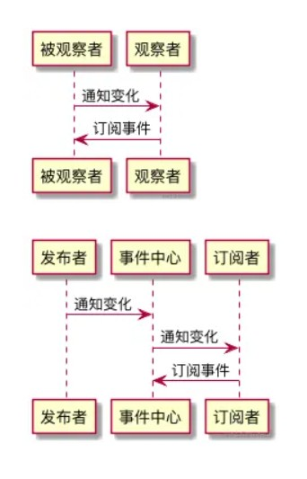
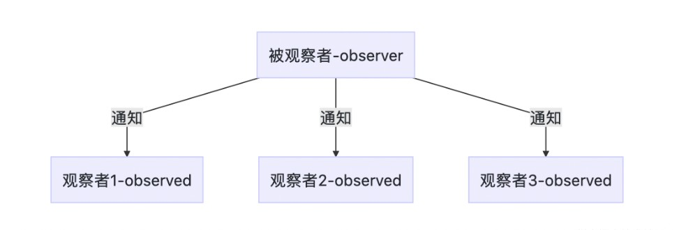
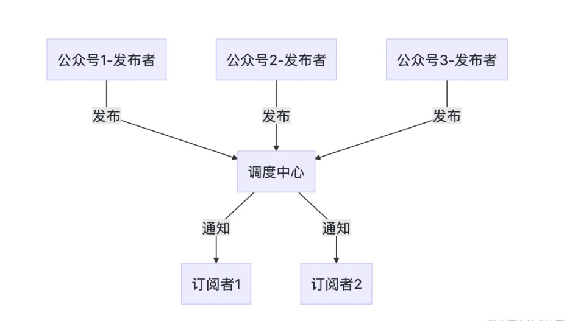

# 观察者模式

[TOC]


观察者模式有一个“别名”，叫`发布 - 订阅模式`（之所以别名加了引号，是因为两者之间存在着细微的差异），这个别名非常形象地诠释了观察者模式里两个核心的角色要素——**“发布者”与“订阅者”**。

> 观察者模式定义了一种一对多的依赖关系，让多个观察者对象同时监听某一个目标对象，当这个目标对象的状态发生变化时，会通知所有观察者对象，使它们能够自动更新。


## 🌰：理解观察者模式

周一刚上班，前端开发李雷就被产品经理韩梅梅拉进了一个钉钉群——“员工管理系统需求第99次变更群”。这个群里不仅有李雷，还有后端开发 A，测试同学 B。三位技术同学看到这简单直白的群名便立刻做好了接受变更的准备、打算撸起袖子开始干了。此时韩梅梅却说：“别急，这个需求有问题，我需要和业务方再确认一下，大家先各忙各的吧”。这种情况下三位技术同学不必立刻投入工作，但他们都已经做好了**本周需要做一个新需求**的准备，时刻等待着产品经理的号召。

一天过去了，两天过去了。周三下午，韩梅梅终于和业务方确认了所有的需求细节，于是在“员工管理系统需求第99次变更群”里大吼一声：“需求文档来了！”，随后甩出了"需求文档.zip"文件，同时@所有人。三位技术同学听到熟悉的“有人@我”提示音，立刻点开群进行群消息和群文件查收，随后根据群消息和群文件提供的需求信息，投入到了各自的开发里。上述这个过程，就是一个典型的**观察者模式**。

**发布者**：产品经理韩梅梅

**订阅者(观察者)**：前端开发，后端开发，测试

在我们上文这个钉钉群里，一个需求信息对象对应了多个观察者（技术同学），当需求信息对象的状态发生**变化**（从无到有）时，产品经理通知了群里的所有同学，以便这些同学接收信息进而开展工作：角色划分 --> 状态变化 --> 发布者通知到订阅者，这就是观察者模式的“套路”。


## 手写观察者模式

在观察者模式里，至少应该有两个关键角色是一定要出现的——发布者和订阅者。用面向对象的方式表达的话，那就是要有**两个类**。

首先来看这个代表发布者的类，给它起名叫Publisher。这个类应该具备哪些“基本技能”呢？大家回忆一下上文中的韩梅梅，韩梅梅的基本操作是什么？首先是拉群（增加订阅者），然后是@所有人（通知订阅者），这俩是最明显的了。此外作为群主&产品经理，韩梅梅还具有踢走项目组成员（移除订阅者）的能力。

```js
// 定义发布者类
class Publisher {
  constructor() {
    this.observers = []
    console.log('Publisher created')
  }
  // 增加订阅者
  add(observer) {
    console.log('Publisher.add invoked')
    this.observers.push(observer)
  }
  // 移除订阅者
  remove(observer) {
    console.log('Publisher.remove invoked')
    this.observers.forEach((item, i) => {
      if (item === observer) {
        this.observers.splice(i, 1)
      }
    })
  }
  // 通知所有订阅者
  notify() {
    console.log('Publisher.notify invoked')
    this.observers.forEach((observer) => {
      observer.update(this)
    })
  }
}
```


订阅者的能力非常简单，作为被动的一方，它的行为只有两个——被通知、去执行（本质上是接受发布者的调用，这步我们在Publisher中已经做掉了）。既然我们在Publisher中做的是方法调用，那么我们在订阅者类里要做的就是**方法的定义**：

```javascript
// 定义订阅者类
class Observer {
    constructor() {
        console.log('Observer created')
    }

    update() {
        console.log('Observer.update invoked')
    }
}
```

以上，我们就完成了最基本的发布者和订阅者类的设计和编写。

测试代码：

```js
// 创建订阅者
const p1 = new Observer()
const p2 = new Observer()
const p3 = new Observer()

//创建发布者
const publisher = new Publisher()

//发布者 增加 订阅者
publisher.add(p1)
publisher.add(p2)
publisher.add(p3)

//发布者 通知 订阅者
publisher.notify()

/*
Observer created
Observer created
Observer created
Publisher created
Publisher.add invoked
Publisher.add invoked
Publisher.add invoked
Publisher.notify invoked
Observer.update invoked
Observer.update invoked
Observer.update invoked
*/
```


## 必须先订阅再发布吗

我们所了解到的发布—订阅模式，都是订阅者必须先订阅一个消息，随后才能接收到发布者发布的消息。如果把顺序反过来，发布者先发布一条消息，而在此之前并没有对象来订阅它，这条消息无疑将消失在宇宙中。

在某些情况下，我们需要先将这条消息保存下来，等到有对象来订阅它的时候，再重新把消息发布给订阅者。就如同QQ中的离线消息一样，离线消息被保存在服务器中，接收人下次登录上线之后，可以重新收到这条消息。

这种需求在实际项目中是存在的，比如在之前的商城网站中，获取到用户信息之后才能渲染用户导航模块，而获取用户信息的操作是一个ajax异步请求。当ajax请求成功返回之后会发布一个事件，在此之前订阅了此事件的用户导航模块可以接收到这些用户信息。

但是这只是理想的状况，因为异步的原因，我们不能保证ajax请求返回的时间，有时候它返回得比较快，而此时用户导航模块的代码还没有加载好（还没有订阅相应事件），特别是在用了一些模块化惰性加载的技术后，这是很可能发生的事情。也许我们还需要一个方案，使得我们的发布—订阅对象拥有先发布后订阅的能力。

为了满足这个需求，我们要建立一个存放离线事件的堆栈，当事件发布的时候，如果此时还没有订阅者来订阅这个事件，我们暂时把发布事件的动作包裹在一个函数里，这些包装函数将被存入堆栈中，等到终于有对象来订阅此事件的时候，我们将遍历堆栈并且依次执行这些包装函数，也就是重新发布里面的事件。当然离线事件的生命周期只有一次，就像QQ的未读消息只会被重新阅读一次，所以刚才的操作我们只能进行一次。


## Vue数据双向绑定（响应式系统）的实现原理

👉 [vue2响应式原理](https://blog.csdn.net/weixin_52834435/article/details/127339760?spm=1001.2014.3001.5501)


## 实现一个Event Bus/ Event Emitter

Event Bus（Vue、Flutter 等前端框架中有出镜）和 Event Emitter（Node中有出镜）出场的“剧组”不同，但是它们都对应一个共同的角色——**全局事件总线**。
全局事件总线，严格来说不能说是观察者模式，而是**发布-订阅模式**。它在我们日常的业务开发中应用非常广。


### 在Vue中使用Event Bus来实现组件间的通讯

Event Bus/Event Emitter 作为全局事件总线，它起到的是一个**沟通桥梁**的作用。我们可以把它理解为一个事件中心，我们所有事件的订阅/发布都不能由订阅方和发布方“私下沟通”，必须要委托这个事件中心帮我们实现。
在Vue中，有时候 A 组件和 B 组件中间隔了很远，看似没什么关系，但我们希望它们之间能够通信。这种情况下除了求助于 Vuex 之外，我们还可以通过 Event Bus 来实现我们的需求。

创建一个 Event Bus（本质上也是 Vue 实例）并导出：

```javascript
const EventBus = new Vue()
export default EventBus
```

在主文件里引入EventBus，并挂载到全局：

```javascript
import bus from 'EventBus的文件路径'
Vue.prototype.bus = bus
```

订阅事件：

```javascript
// 这里func指someEvent这个事件的监听函数
this.bus.$on('someEvent', func)
```

发布（触发）事件：

```javascript
// 这里params指someEvent这个事件被触发时回调函数接收的入参
this.bus.$emit('someEvent', params)
```

大家会发现，整个调用过程中，没有出现具体的发布者和订阅者（比如上节的PrdPublisher和DeveloperObserver），全程只有bus这个东西一个人在疯狂刷存在感。这就是全局事件总线的特点——所有事件的发布/订阅操作，必须经由事件中心，禁止一切“私下交易”！

下面,就来实现一个Event Bus：

```javascript
class EventEmitter {
  constructor() {
    // handlers是一个map，用于存储事件与回调之间的对应关系
    this.handlers = {}
  }

  // on方法用于安装事件监听器，它接受目标事件名和回调函数作为参数
  on(eventName, cb) {
    // 先检查一下目标事件名有没有对应的监听函数队列
    if (!this.handlers[eventName]) {
      // 如果没有，那么首先初始化一个监听函数队列
      this.handlers[eventName] = []
    }

    // 把回调函数推入目标事件的监听函数队列里去
    this.handlers[eventName].push(cb)
  }

  // emit方法用于触发目标事件，它接受事件名和监听函数入参作为参数
  emit(eventName, ...args) {
    // 检查目标事件是否有监听函数队列
    if (this.handlers[eventName]) {
      // 这里需要对 this.handlers[eventName] 做一次浅拷贝，主要目的是为了避免通过 once 安装的监听器在移除的过程中出现顺序问题
      const handlers = this.handlers[eventName].slice()
      // 如果有，则逐个调用队列里的回调函数
      handlers.forEach((callback) => {
        callback(...args)
      })
    }
  }

  // 移除某个事件回调队列里的指定回调函数
  off(eventName, cb) {
    const callbacks = this.handlers[eventName]
    const index = callbacks.indexOf(cb)
    if (index !== -1) {
      callbacks.splice(index, 1)
    }
  }

  // 为事件注册单次监听器
  once(eventName, cb) {
    // 对回调函数进行包装，使其执行完毕自动被移除
    const wrapper = (...args) => {
      cb(...args)
      this.off(eventName, wrapper)
    }
    this.on(eventName, wrapper)
  }
}
```


## 观察者模式与发布-订阅模式的区别是什么？

回到我们上文的例子里。韩梅梅把所有的开发者拉了一个群，直接把需求文档丢给每一位群成员，这种**发布者直接触及到订阅者**的操作，叫观察者模式。但如果韩梅梅没有拉群，而是把需求文档上传到了公司统一的需求平台上，需求平台感知到文件的变化、自动通知了每一位订阅了该文件的开发者，这种**发布者不直接触及到订阅者、而是由统一的第三方来完成实际的通信的操作，叫做发布-订阅模式**。

观察者模式和发布-订阅模式之间的区别，在于是否存在第三方、发布者能否直接感知订阅者。



韩梅梅拉钉钉群的操作，就是典型的观察者模式；而通过EventBus去实现事件监听/发布，则属于发布-订阅模式。

为什么要有观察者模式？观察者模式，解决的其实是模块间的耦合问题，有它在，即便是两个分离的、毫不相关的模块，也可以实现数据通信。但观察者模式仅仅是减少了耦合，**并没有完全地解决耦合问题**——被观察者必须去维护一套观察者的集合，这些观察者必须实现统一的方法供被观察者调用，两者之间还是有着说不清、道不明的关系。

而发布-订阅模式，则是快刀斩乱麻了——发布者完全不用感知订阅者，不用关心它怎么实现回调方法，事件的注册和触发都发生在独立于双方的第三方平台（事件总线）上。发布-订阅模式下，实现了完全地解耦。

但这并不意味着，发布-订阅模式就比观察者模式“高级”。在实际开发中，我们的模块解耦诉求**并非总是需要它们完全解耦**。如果两个模块之间本身存在关联，且这种关联是稳定的、必要的，那么我们使用观察者模式就足够了。而在模块与模块之间独立性较强、且没有必要单纯为了数据通信而强行为两者制造依赖的情况下，我们往往会倾向于使用发布-订阅模式。


观察者模式：



发布-订阅者模式：




参考文章：

[JavaScript 设计模式核⼼原理与应⽤实践](https://juejin.cn/book/6844733790204461070/section)